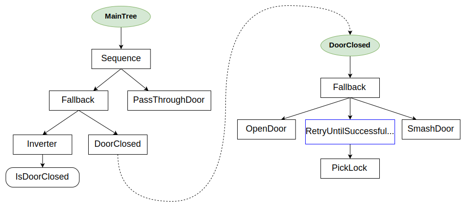
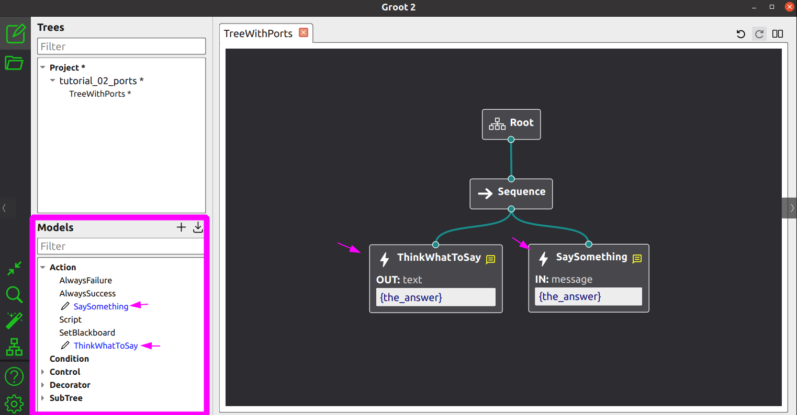

# Tutorials (Basic)

用 5 分钟时间来了解 Docusaurus 中最重要的核心概念。

## 01. Your first Behavior Tree

行为树（Behavior Trees）与状态机（State Machines）类似，本质上只是一种在合适的时间、满足特定条件时调用**回调函数**的机制。至于这些回调内部执行什么操作，则完全由你决定。

在本系列教程中，我们将交替使用 **“调用回调（to invoke the callback）”** 和 **“tick”** 这两个表达，它们的含义相同。

在教程的大多数示例中，我们的示例性动作（dummy Actions）只是简单地在控制台打印一些信息，但请记住，真正的“生产级”代码通常会执行更复杂的操作。

接下来，我们将创建这样一棵简单的树：


### How to create your own ActionNodes

创建 TreeNode 的默认方式（也是推荐方式）是通过继承（inheritance）来实现。

```c++
// Example of custom SyncActionNode (synchronous action)
// without ports.
class ApproachObject : public BT::SyncActionNode
{
public:
  ApproachObject(const std::string& name) :
      BT::SyncActionNode(name, {})
  {}

  // You must override the virtual function tick()
  BT::NodeStatus tick() override
  {
    std::cout << "ApproachObject: " << this->name() << std::endl;
    return BT::NodeStatus::SUCCESS;
  }
};
```

如你所见：

- 每个 TreeNode 实例都有一个 `name`。这个标识符是供人类阅读的，**不**需要是唯一的。
- 方法 `tick()` 是执行实际 Action 的地方。它必须始终返回一个 `NodeStatus`，即 RUNNING、SUCCESS 或 FAILURE。

或者，我们也可以通过**依赖注入**（dependency injection）的方式，使用函数指针（即 “functor”）来创建一个 **TreeNode**。

该 functor 必须具有以下函数签名：

```c++
BT::NodeStatus myFunction(BT::TreeNode& self) 
```

例如：

```c++
using namespace BT;

// Simple function that return a NodeStatus
BT::NodeStatus CheckBattery()
{
  std::cout << "[ Battery: OK ]" << std::endl;
  return BT::NodeStatus::SUCCESS;
}

// We want to wrap into an ActionNode the methods open() and close()
class GripperInterface
{
public:
  GripperInterface(): _open(true) {}
    
  NodeStatus open() 
  {
    _open = true;
    std::cout << "GripperInterface::open" << std::endl;
    return NodeStatus::SUCCESS;
  }

  NodeStatus close() 
  {
    std::cout << "GripperInterface::close" << std::endl;
    _open = false;
    return NodeStatus::SUCCESS;
  }

private:
  bool _open; // shared information
};
```

我们可以基于以下任意一个 functor 构建一个 `SimpleActionNode`：

- `CheckBattery()`
- `GripperInterface::open()`
- `GripperInterface::close()`

### Create a tree dynamically with an XML

让我们来看下面这个名为 **my_tree.xml** 的 XML 文件：

```xml
 <root BTCPP_format="4" >
     <BehaviorTree ID="MainTree">
        <Sequence name="root_sequence">
            <CheckBattery   name="check_battery"/>
            <OpenGripper    name="open_gripper"/>
            <ApproachObject name="approach_object"/>
            <CloseGripper   name="close_gripper"/>
        </Sequence>
     </BehaviorTree>
 </root>
```

> TIP：你可以在此处找到关于 XML 模式（schema）的更多详细信息。

我们必须先将自定义 TreeNodes 注册到 `BehaviorTreeFactory` 中，然后再从文件或文本中加载 XML。

XML 中使用的标识符必须与注册 TreeNodes 时使用的标识符一致。

属性 "name" 表示该实例的名称，**它是可选的**。

```c++
#include "behaviortree_cpp/bt_factory.h"

// file that contains the custom nodes definitions
#include "dummy_nodes.h"
using namespace DummyNodes;

int main()
{
    // We use the BehaviorTreeFactory to register our custom nodes
  BehaviorTreeFactory factory;

  // The recommended way to create a Node is through inheritance.
  factory.registerNodeType<ApproachObject>("ApproachObject");

  // Registering a SimpleActionNode using a function pointer.
  // You can use C++11 lambdas or std::bind
  factory.registerSimpleCondition("CheckBattery", [&](TreeNode&) { return CheckBattery(); });

  //You can also create SimpleActionNodes using methods of a class
  GripperInterface gripper;
  factory.registerSimpleAction("OpenGripper", [&](TreeNode&){ return gripper.open(); } );
  factory.registerSimpleAction("CloseGripper", [&](TreeNode&){ return gripper.close(); } );

  // Trees are created at deployment-time (i.e. at run-time, but only 
  // once at the beginning). 
    
  // IMPORTANT: when the object "tree" goes out of scope, all the 
  // TreeNodes are destroyed
   auto tree = factory.createTreeFromFile("./my_tree.xml");

  // To "execute" a Tree you need to "tick" it.
  // The tick is propagated to the children based on the logic of the tree.
  // In this case, the entire sequence is executed, because all the children
  // of the Sequence return SUCCESS.
  tree.tickWhileRunning();

  return 0;
}

/* Expected output:
*
  [ Battery: OK ]
  GripperInterface::open
  ApproachObject: approach_object
  GripperInterface::close
*/
```

## 02. Blackboard and ports

正如我们之前所解释的，自定义 TreeNodes 可以用来执行任意简单或复杂的软件功能。它们的目标是提供一个**更高层次的抽象接口**。

因此，从概念上讲，它们与**函数**并无本质区别。

类似于函数，我们通常希望：

- 向节点传递参数/输入（**inputs**）；
- 从节点获取某种信息/输出（**outputs**）。
- 一个节点的输出可以作为另一个节点的输入。

BehaviorTree.CPP 提供了一种通过**端口**（ports）进行**数据流传递**的基础机制，这种机制既简单易用，又灵活且类型安全。

在本教程中，我们将创建如下的行为树：


> Main Concepts：
> - “Blackboard” 是一个简单的**键/值存储**，由树中所有节点共享。
> - Blackboard 的一个 “条目（entry）” 就是一个**键/值对**。
> - **输入端口**（Input port）可以读取 Blackboard 中的条目，而**输出端口**（Output port）可以写入条目。

### Inputs ports

一个有效的输入可以是：

* 节点将读取和解析的**静态字符串**；
* 指向 Blackboard 条目的“指针”，由**键**（key）标识。

假设我们想创建一个 ActionNode，名为 `SaySomething`，它应该在 `std::cout` 上打印一个指定的字符串。

为了传递这个字符串，我们将使用名为 **message** 的输入端口。

考虑以下几种可选的 XML 语法：

```xml
<SaySomething name="first"   message="hello world" />
<SaySomething name="second" message="{greetings}" />
```

- 在**第一个**节点中，端口接收到字符串 "hello world"；
- 而**第二个**节点则从 Blackboard 中查找名为 "greetings" 的条目值。

> CAUTION：条目 "greetings" 的值可以在运行时发生变化（并且很可能会变化）。

ActionNode `SaySomething` 可以实现如下：

```c++
// SyncActionNode (synchronous action) with an input port.
class SaySomething : public SyncActionNode
{
public:
  // If your Node has ports, you must use this constructor signature 
  SaySomething(const std::string& name, const NodeConfig& config)
    : SyncActionNode(name, config)
  { }

  // It is mandatory to define this STATIC method.
  static PortsList providedPorts()
  {
    // This action has a single input port called "message"
    return { InputPort<std::string>("message") };
  }

  // Override the virtual function tick()
  NodeStatus tick() override
  {
    Expected<std::string> msg = getInput<std::string>("message");
    // Check if expected is valid. If not, throw its error
    if (!msg)
    {
      throw BT::RuntimeError("missing required input [message]: ", 
                              msg.error() );
    }
    // use the method value() to extract the valid message.
    std::cout << "Robot says: " << msg.value() << std::endl;
    return NodeStatus::SUCCESS;
  }
};
```

当自定义 TreeNode 拥有输入端口和/或输出端口时，这些端口必须在**静态**方法中进行声明：

```c++
static MyCustomNode::PortsList providedPorts();
```

可以使用模板方法 `TreeNode::getInput<T>(key)` 来读取端口 `message` 的输入。

该方法可能因多种原因而失败。用户需要自行检查返回值的有效性，并决定采取何种处理方式：

- 返回 `NodeStatus::FAILURE`？
- 抛出异常？
- 使用不同的默认值？

> IMPORTANT：**强烈**建议在 `tick()` 方法内部调用 `getInput()`，而**不要**在类的构造函数中调用。
> C++ 代码应当预期输入的实际值会在**运行时发生变化**，因此需要定期更新该值。

### Output ports

指向 Blackboard 条目的输入端口只有在另一个节点已经向该条目写入“某些内容”之后才是有效的。

`ThinkWhatToSay` 就是一个示例节点，它使用**输出端口**将一个字符串写入 Blackboard 条目。

```c++
class ThinkWhatToSay : public SyncActionNode
{
public:
  ThinkWhatToSay(const std::string& name, const NodeConfig& config)
    : SyncActionNode(name, config)
  { }

  static PortsList providedPorts()
  {
    return { OutputPort<std::string>("text") };
  }

  // This Action writes a value into the port "text"
  NodeStatus tick() override
  {
    // the output may change at each tick(). Here we keep it simple.
    setOutput("text", "The answer is 42" );
    return NodeStatus::SUCCESS;
  }
};
```

或者，在大多数情况下，为了调试目的，可以使用内置动作 `Script` 向条目写入一个静态值。

```xml
<Script code=" the_answer:='The answer is 42' " />
```

我们将在 BT.CPP 中关于新脚本语言的教程中，详细讲解 Action **Script**。

> TIP：如果你正在从 BT.CPP 3.X 版本迁移，**Script** 可以作为 **SetBlackboard** 的直接替代，而 **SetBlackboard** 现在已不推荐使用。

### A complete example

在这个示例中，会执行一个包含 3 个动作的 Sequence：

- Action 1 从一个静态字符串读取输入 `message`。
- Action 2 向 Blackboard 中名为 `the_answer` 的条目写入内容。
- Action 3 从 Blackboard 中名为 `the_answer` 的条目读取输入 `message`。

```xml
<root BTCPP_format="4" >
    <BehaviorTree ID="MainTree">
       <Sequence name="root_sequence">
           <SaySomething     message="hello" />
           <ThinkWhatToSay   text="{the_answer}"/>
           <SaySomething     message="{the_answer}" />
       </Sequence>
    </BehaviorTree>
</root>
```

用于注册并执行该行为树的 C++ 代码如下：

```c++
#include "behaviortree_cpp/bt_factory.h"

// file that contains the custom nodes definitions
#include "dummy_nodes.h"
using namespace DummyNodes;

int main()
{  
  BehaviorTreeFactory factory;
  factory.registerNodeType<SaySomething>("SaySomething");
  factory.registerNodeType<ThinkWhatToSay>("ThinkWhatToSay");

  auto tree = factory.createTreeFromFile("./my_tree.xml");
  tree.tickWhileRunning();
  return 0;
}

/*  Expected output:
  Robot says: hello
  Robot says: The answer is 42
*/
```

我们通过使用相同的键（`the_answer`）将输出端口“连接”到输入端口，换句话说，它们“指向” Blackboard 中同一个条目。

这些端口之所以可以相互连接，是因为它们的类型相同，即 `std::string`。如果尝试连接类型不同的端口，方法 `factory.createTreeFromFile` 将抛出异常。

## 03. Ports with generic types

在前面的教程中，我们介绍了输入端口和输出端口，其端口类型为 `std::string`。

接下来，我们将展示如何为端口分配通用的 C++ 类型。

### Parsing a string

BehaviorTree.CPP 支持将字符串自动转换为常见类型，例如 `int`、`long`、`double`、`bool`、`NodeStatus` 等。用户自定义类型也可以很容易地得到支持。

例如：

```c++
// We want to use this custom type
struct Position2D 
{ 
  double x;
  double y; 
};
```

为了让 XML 加载器能够从字符串实例化 `Position2D`，我们需要提供模板特化 `BT::convertFromString<Position2D>(StringView)`。

`Position2D` 如何序列化为字符串由你自行决定；在这个例子中，我们只是用*分号*分隔两个数字。

```c++
// Template specialization to converts a string to Position2D.
namespace BT
{
    template <> inline Position2D convertFromString(StringView str)
    {
        // We expect real numbers separated by semicolons
        auto parts = splitString(str, ';');
        if (parts.size() != 2)
        {
            throw RuntimeError("invalid input)");
        }
        else
        {
            Position2D output;
            output.x     = convertFromString<double>(parts[0]);
            output.y     = convertFromString<double>(parts[1]);
            return output;
        }
    }
} // end namespace BT
```

- `StringView` 是 C++11 中的 `std::string_view` 版本。你可以传入 `std::string` 或 `const char*`。
- 该库提供了一个简单的 `splitString` 函数，你也可以使用其他函数，例如 `boost::algorithm::split`。
- 我们可以使用特化的 `convertFromString<double>()`。

### Example

和前一节教程一样，我们可以创建两个自定义 Actions：一个向端口写入数据，另一个从端口读取数据。

```c++
class CalculateGoal: public SyncActionNode
{
  public:
    CalculateGoal(const std::string& name, const NodeConfig& config):
      SyncActionNode(name,config)
    {}

    static PortsList providedPorts()
    {
      return { OutputPort<Position2D>("goal") };
    }

    NodeStatus tick() override
    {
      Position2D mygoal = {1.1, 2.3};
      setOutput<Position2D>("goal", mygoal);
      return NodeStatus::SUCCESS;
    }
};

class PrintTarget: public SyncActionNode
{
  public:
    PrintTarget(const std::string& name, const NodeConfig& config):
        SyncActionNode(name,config)
    {}

    static PortsList providedPorts()
    {
      // Optionally, a port can have a human readable description
      const char*  description = "Simply print the goal on console...";
      return { InputPort<Position2D>("target", description) };
    }
      
    NodeStatus tick() override
    {
      auto res = getInput<Position2D>("target");
      if( !res )
      {
        throw RuntimeError("error reading port [target]:", res.error());
      }
      Position2D target = res.value();
      printf("Target positions: [ %.1f, %.1f ]\n", target.x, target.y );
      return NodeStatus::SUCCESS;
    }
};
```

现在我们可以像往常一样连接输入/输出端口，使它们指向 Blackboard 中同一个条目。

下一个示例中的行为树是一个包含 4 个动作的 Sequence：

- 使用动作 `CalculateGoal` 将一个 `Position2D` 值存入条目 **GoalPosition**。
- 调用 `PrintTarget`，其输入端口 “target” 将从 Blackboard 条目 **GoalPosition** 读取数据。
- 使用内置动作 `Script` 将字符串 "-1;3" 分配给键 **OtherGoal**。字符串到 `Position2D` 的转换将自动完成。
- 再次调用 `PrintTarget`，其输入端口 “target” 将从条目 `OtherGoal` 读取数据。

```c++
static const char* xml_text = R"(

 <root BTCPP_format="4" >
     <BehaviorTree ID="MainTree">
        <Sequence name="root">
            <CalculateGoal goal="{GoalPosition}" />
            <PrintTarget   target="{GoalPosition}" />
            <Script        code=" OtherGoal:='-1;3' " />
            <PrintTarget   target="{OtherGoal}" />
        </Sequence>
     </BehaviorTree>
 </root>
 )";

int main()
{
  BT::BehaviorTreeFactory factory;
  factory.registerNodeType<CalculateGoal>("CalculateGoal");
  factory.registerNodeType<PrintTarget>("PrintTarget");

  auto tree = factory.createTreeFromText(xml_text);
  tree.tickWhileRunning();

  return 0;
}
/* Expected output:

    Target positions: [ 1.1, 2.3 ]
    Converting string: "-1;3"
    Target positions: [ -1.0, 3.0 ]
*/
```

## 04. Reactive and Asynchronous behaviors

下一个示例展示了 `SequenceNode` 与 `ReactiveSequence` 的区别。

我们将实现一个 **异步动作（Asynchronous Action）**，也就是一个需要较长时间完成的动作，在未满足完成条件时会返回 RUNNING。

异步动作具有以下要求：

- 在 `tick()` 方法中不应阻塞过长时间，执行流程应尽可能快速返回。
- 如果调用了 `halt()` 方法，应尽可能快速中止执行。

> CAUTION：
> #### 了解更多关于异步动作（Asynchronous Actions）的内容
> 用户应当充分理解 BT.CPP 中的 并发机制（Concurrency），并学习开发自定义 异步动作（Asynchronous Actions）的最佳实践。你可以在这里找到一篇详细的文章。

### StatefulActionNode

**StatefulActionNode** 是实现异步动作（Asynchronous Actions）的首选方式。

当你的代码包含**请求-响应模式**时，它尤其有用——即动作向另一个进程发送异步请求，并周期性检查是否收到了回复。

根据收到的回复，它可能返回 SUCCESS 或 FAILURE。

如果不是与外部进程通信，而是执行耗时计算，你可以将计算拆分成小的“块”，或者将计算移到另一个线程中执行（参见 AsyncThreadedAction 教程）。

**StatefulActionNode** 的派生类必须重写以下虚方法，而不是 `tick()`：

- `NodeStatus onStart()`：当节点处于 IDLE 状态时调用。它可以立即成功或失败，也可以返回 RUNNING。如果返回 RUNNING，下次收到 tick 时会执行 `onRunning()`。
- `NodeStatus onRunning()`：当节点处于 RUNNING 状态时调用，返回新的状态。
- `void onHalted()`：当该节点被树中的其他节点中止时调用。

下面我们创建一个名为 **MoveBaseAction** 的示例节点：

```c++
// Custom type
struct Pose2D
{
    double x, y, theta;
};

namespace chr = std::chrono;

class MoveBaseAction : public BT::StatefulActionNode
{
  public:
    // Any TreeNode with ports must have a constructor with this signature
    MoveBaseAction(const std::string& name, const BT::NodeConfig& config)
      : StatefulActionNode(name, config)
    {}

    // It is mandatory to define this static method.
    static BT::PortsList providedPorts()
    {
        return{ BT::InputPort<Pose2D>("goal") };
    }

    // this function is invoked once at the beginning.
    BT::NodeStatus onStart() override;

    // If onStart() returned RUNNING, we will keep calling
    // this method until it return something different from RUNNING
    BT::NodeStatus onRunning() override;

    // callback to execute if the action was aborted by another node
    void onHalted() override;

  private:
    Pose2D _goal;
    chr::system_clock::time_point _completion_time;
};

//-------------------------

BT::NodeStatus MoveBaseAction::onStart()
{
  if ( !getInput<Pose2D>("goal", _goal))
  {
    throw BT::RuntimeError("missing required input [goal]");
  }
  printf("[ MoveBase: SEND REQUEST ]. goal: x=%f y=%f theta=%f\n",
         _goal.x, _goal.y, _goal.theta);

  // We use this counter to simulate an action that takes a certain
  // amount of time to be completed (200 ms)
  _completion_time = chr::system_clock::now() + chr::milliseconds(220);

  return BT::NodeStatus::RUNNING;
}

BT::NodeStatus MoveBaseAction::onRunning()
{
  // Pretend that we are checking if the reply has been received
  // you don't want to block inside this function too much time.
  std::this_thread::sleep_for(chr::milliseconds(10));

  // Pretend that, after a certain amount of time,
  // we have completed the operation
  if(chr::system_clock::now() >= _completion_time)
  {
    std::cout << "[ MoveBase: FINISHED ]" << std::endl;
    return BT::NodeStatus::SUCCESS;
  }
  return BT::NodeStatus::RUNNING;
}

void MoveBaseAction::onHalted()
{
  printf("[ MoveBase: ABORTED ]");
}
```

### Sequence VS ReactiveSequence

以下示例应使用一个简单的 `SequenceNode`。

```xml
 <root BTCPP_format="4">
     <BehaviorTree>
        <Sequence>
            <BatteryOK/>
            <SaySomething   message="mission started..." />
            <MoveBase           goal="1;2;3"/>
            <SaySomething   message="mission completed!" />
        </Sequence>
     </BehaviorTree>
 </root>
```

```c++
int main()
{
  BT::BehaviorTreeFactory factory;
  factory.registerSimpleCondition("BatteryOK", std::bind(CheckBattery));
  factory.registerNodeType<MoveBaseAction>("MoveBase");
  factory.registerNodeType<SaySomething>("SaySomething");

  auto tree = factory.createTreeFromText(xml_text);
 
  // Here, instead of tree.tickWhileRunning(),
  // we prefer our own loop.
  std::cout << "--- ticking\n";
  auto status = tree.tickOnce();
  std::cout << "--- status: " << toStr(status) << "\n\n";

  while(status == NodeStatus::RUNNING) 
  {
    // Sleep to avoid busy loops.
    // do NOT use other sleep functions!
    // Small sleep time is OK, here we use a large one only to
    // have less messages on the console.
    tree.sleep(std::chrono::milliseconds(100));

    std::cout << "--- ticking\n";
    status = tree.tickOnce();
    std::cout << "--- status: " << toStr(status) << "\n\n";
  }

  return 0;
}
```

预期输出：

```
--- ticking
[ Battery: OK ]
Robot says: mission started...
[ MoveBase: SEND REQUEST ]. goal: x=1.0 y=2.0 theta=3.0
--- status: RUNNING

--- ticking
--- status: RUNNING

--- ticking
[ MoveBase: FINISHED ]
Robot says: mission completed!
--- status: SUCCESS
```

你可能已经注意到，当调用 `executeTick()` 时，`MoveBase` 在第一次和第二次返回 **RUNNING**，最终在第三次返回 **SUCCESS**。

`BatteryOK` 只会执行一次。

但如果我们使用 `ReactiveSequence`，当子节点 `MoveBase` 返回 RUNNING 时，整个序列会被重新启动，条件节点 `BatteryOK` 将**再次**被执行。

如果在任意时刻 `BatteryOK` 返回 **FAILURE**，那么 `MoveBase` 动作会被*中断*（更准确地说，是 *halted*）。

```xml
 <root>
     <BehaviorTree>
        <ReactiveSequence>
            <BatteryOK/>
            <Sequence>
                <SaySomething   message="mission started..." />
                <MoveBase           goal="1;2;3"/>
                <SaySomething   message="mission completed!" />
            </Sequence>
        </ReactiveSequence>
     </BehaviorTree>
 </root>
```

预期输出：

```
--- ticking
[ Battery: OK ]
Robot says: mission started...
[ MoveBase: SEND REQUEST ]. goal: x=1.0 y=2.0 theta=3.0
--- status: RUNNING

--- ticking
[ Battery: OK ]
--- status: RUNNING

--- ticking
[ Battery: OK ]
[ MoveBase: FINISHED ]
Robot says: mission completed!
--- status: SUCCESS
```

### Event Driven trees?

> TIP：我们之所以使用 `tree.sleep()` 而不是 `std::this_thread::sleep_for()`，是有原因的！！！

应优先使用 `Tree::sleep()` 方法，因为当树中的某个节点发生“状态变化”时，它可以被中断。

当调用 `TreeNode::emitStateChanged()` 方法时，`Tree::sleep()` 将被中断。

## 05. Compose behaviors using Subtrees

我们可以通过将较小且可复用的行为插入到更大的行为中来构建大规模的行为。

换句话说，我们希望创建**分层**的行为树并使它们**可组合**。

可以在 XML 中定义多棵树，然后使用节点 **SubTree** 将一棵树包含到另一棵树中来实现这一点。

### CrossDoor behavior

这个示例的灵感来自一篇关于行为树的流行文章。

它也是第一个实际使用 `Decorators` 和 `Fallback` 的示例。



```xml
<root BTCPP_format="4">

    <BehaviorTree ID="MainTree">
        <Sequence>
            <Fallback>
                <Inverter>
                    <IsDoorClosed/>
                </Inverter>
                <SubTree ID="DoorClosed"/>
            </Fallback>
            <PassThroughDoor/>
        </Sequence>
    </BehaviorTree>

    <BehaviorTree ID="DoorClosed">
        <Fallback>
            <OpenDoor/>
            <RetryUntilSuccessful num_attempts="5">
                <PickLock/>
            </RetryUntilSuccessful>
            <SmashDoor/>
        </Fallback>
    </BehaviorTree>
    
</root>
```

期望的行为如下：

- 如果门是开着的，则执行 `PassThroughDoor`。
- 如果门是关闭的，则依次尝试：`OpenDoor`；若失败，尝试 `PickLock`（最多尝试 5 次）；最后若仍未成功，则执行 `SmashDoor`。
- 如果 `DoorClosed` 子树中的至少一个动作成功，则执行 `PassThroughDoor`。

### The CPP code

我们不会展示 `CrossDoor` 中虚拟动作的详细实现。
唯一可能比较有趣的代码部分大概是 `registerNodes`。

```c++

class CrossDoor
{
public:
    void registerNodes(BT::BehaviorTreeFactory& factory);

    // SUCCESS if _door_open != true
    BT::NodeStatus isDoorClosed();

    // SUCCESS if _door_open == true
    BT::NodeStatus passThroughDoor();

    // After 3 attempts, will open a locked door
    BT::NodeStatus pickLock();

    // FAILURE if door locked
    BT::NodeStatus openDoor();

    // WILL always open a door
    BT::NodeStatus smashDoor();

private:
    bool _door_open   = false;
    bool _door_locked = true;
    int _pick_attempts = 0;
};

// Helper method to make registering less painful for the user
void CrossDoor::registerNodes(BT::BehaviorTreeFactory &factory)
{
  factory.registerSimpleCondition(
      "IsDoorClosed", std::bind(&CrossDoor::isDoorClosed, this));

  factory.registerSimpleAction(
      "PassThroughDoor", std::bind(&CrossDoor::passThroughDoor, this));

  factory.registerSimpleAction(
      "OpenDoor", std::bind(&CrossDoor::openDoor, this));

  factory.registerSimpleAction(
      "PickLock", std::bind(&CrossDoor::pickLock, this));

  factory.registerSimpleCondition(
      "SmashDoor", std::bind(&CrossDoor::smashDoor, this));
}

int main()
{
  BehaviorTreeFactory factory;

  CrossDoor cross_door;
  cross_door.registerNodes(factory);

  // In this example a single XML contains multiple <BehaviorTree>
  // To determine which one is the "main one", we should first register
  // the XML and then allocate a specific tree, using its ID

  factory.registerBehaviorTreeFromText(xml_text);
  auto tree = factory.createTree("MainTree");

  // helper function to print the tree
  printTreeRecursively(tree.rootNode());

  tree.tickWhileRunning();

  return 0;
}
```

## 06. Remapping ports of a SubTrees

在 CrossDoor 示例中，我们看到从父树的角度来看，`SubTree` 就像是一个单独的叶节点。

为避免在非常大的树中发生名称冲突，任意树与其子树会使用不同的 Blackboard 实例。

因此，我们需要显式地将父树的端口连接/映射到其子树的端口。

你**无需**修改 C++ 实现，因为这种重映射完全在 XML 定义中完成。

### Example

让我们来看看这棵行为树。


```xml
<root BTCPP_format="4">

    <BehaviorTree ID="MainTree">
        <Sequence>
            <Script code=" move_goal='1;2;3' " />
            <SubTree ID="MoveRobot" target="{move_goal}" 
                                    result="{move_result}" />
            <SaySomething message="{move_result}"/>
        </Sequence>
    </BehaviorTree>

    <BehaviorTree ID="MoveRobot">
        <Fallback>
            <Sequence>
                <MoveBase  goal="{target}"/>
                <Script code=" result:='goal reached' " />
            </Sequence>
            <ForceFailure>
                <Script code=" result:='error' " />
            </ForceFailure>
        </Fallback>
    </BehaviorTree>

</root>
```

你可能会注意到：

- 我们有一个名为 `MainTree` 的主树，它包含一个子树 `MoveRobot`。
- 我们想把 `MoveRobot` 子树内部的端口与 `MainTree` 中的其他端口“连接”（即“重映射”）。
- 这是通过上面示例中使用的语法来完成的。

### The CPP code

这里没什么需要做的。我们使用 `debugMessage` 方法来检查 Blackboard 中的值。

```c++
int main()
{
  BT::BehaviorTreeFactory factory;

  factory.registerNodeType<SaySomething>("SaySomething");
  factory.registerNodeType<MoveBaseAction>("MoveBase");

  factory.registerBehaviorTreeFromText(xml_text);
  auto tree = factory.createTree("MainTree");

  // Keep ticking until the end
  tree.tickWhileRunning();

  // let's visualize some information about the current state of the blackboards.
  std::cout << "\n------ First BB ------" << std::endl;
  tree.subtrees[0]->blackboard->debugMessage();
  std::cout << "\n------ Second BB------" << std::endl;
  tree.subtrees[1]->blackboard->debugMessage();

  return 0;
}

/* Expected output:

------ First BB ------
move_result (std::string)
move_goal (Pose2D)

------ Second BB------
[result] remapped to port of parent tree [move_result]
[target] remapped to port of parent tree [move_goal]

*/
```

## 07. How to use multiple XML files

在我们展示的示例中，我们总是从**单个 XML 文件**创建整棵树及其子树。

但随着子树数量的增加，使用多个文件会更为方便。

### Our subtrees

文件 **subtree_A.xml**：

```xml
<root>
    <BehaviorTree ID="SubTreeA">
        <SaySomething message="Executing Sub_A" />
    </BehaviorTree>
</root>
```

文件 **subtree_B.xml**：

```xml
<root>
    <BehaviorTree ID="SubTreeB">
        <SaySomething message="Executing Sub_B" />
    </BehaviorTree>
</root>
```

### Load multiple files manually (recommended)

让我们考虑一个名为 **main_tree.xml** 的文件，它应当包含另外两个文件：

```xml
<root>
    <BehaviorTree ID="MainTree">
        <Sequence>
            <SaySomething message="starting MainTree" />
            <SubTree ID="SubTreeA" />
            <SubTree ID="SubTreeB" />
        </Sequence>
    </BehaviorTree>
</root>
```

手动加载多个文件：

```c++
int main()
{
  BT::BehaviorTreeFactory factory;
  factory.registerNodeType<DummyNodes::SaySomething>("SaySomething");

  // Find all the XML files in a folder and register all of them.
  // We will use std::filesystem::directory_iterator
  std::string search_directory = "./";

  using std::filesystem::directory_iterator;
  for (auto const& entry : directory_iterator(search_directory)) 
  {
    if( entry.path().extension() == ".xml")
    {
      factory.registerBehaviorTreeFromFile(entry.path().string());
    }
  }
  // This, in our specific case, would be equivalent to
  // factory.registerBehaviorTreeFromFile("./main_tree.xml");
  // factory.registerBehaviorTreeFromFile("./subtree_A.xml");
  // factory.registerBehaviorTreeFromFile("./subtree_B.xml");

  // You can create the MainTree and the subtrees will be added automatically.
  std::cout << "----- MainTree tick ----" << std::endl;
  auto main_tree = factory.createTree("MainTree");
  main_tree.tickWhileRunning();

  // ... or you can create only one of the subtrees
  std::cout << "----- SubA tick ----" << std::endl;
  auto subA_tree = factory.createTree("SubTreeA");
  subA_tree.tickWhileRunning();

  return 0;
}
/* Expected output:

Registered BehaviorTrees:
 - MainTree
 - SubTreeA
 - SubTreeB
----- MainTree tick ----
Robot says: starting MainTree
Robot says: Executing Sub_A
Robot says: Executing Sub_B
----- SubA tick ----
Robot says: Executing Sub_A
```

### Add multiple files with "include"

如果你更愿意将要包含的树的信息直接移到 XML 文件本身，可以按下面所示修改 **main_tree.xml**：

```xml
<root BTCPP_format="4">
    <include path="./subtree_A.xml" />
    <include path="./subtree_B.xml" />
    <BehaviorTree ID="MainTree">
        <Sequence>
            <SaySomething message="starting MainTree" />
            <SubTree ID="SubTreeA" />
            <SubTree ID="SubTreeB" />
        </Sequence>
    </BehaviorTree>
</root>
```

如你所见，我们在 **main_tree.xml** 中包含了两个相对路径，用来告诉 `BehaviorTreeFactory` 去哪里查找所需的依赖项。

这些路径相对于 **main_tree.xml**。

现在我们可以像平常一样创建该树：

```cpp
factory.createTreeFromFile("main_tree.xml")
```

## 08. Pass additional arguments to your Nodes

在到目前为止我们探讨的每一个示例中，我们都被“迫使”提供具有以下签名的构造函数。

```c++
MyCustomNode(const std::string& name, const NodeConfig& config);
```

## 08. Pass additional arguments to your Nodes

在到目前为止我们探讨的每一个示例中，我们都被“迫使”提供具有以下签名的构造函数：

```c++
MyCustomNode(const std::string& name, const NodeConfig& config);
```

在某些情况下，可能希望向类的构造函数传入额外的参数、指针、引用等。

> CAUTION：有些人会用黑板来做这件事。**别这么做**。

在本教程的其余部分，我们将仅使用单词 *"arguments"*（参数）。

理论上这些 arguments **可以**通过输入端口（Input Ports）传递，但在下列情况下这样做是不合适的：

- 这些 arguments 在*部署时*（构建树时）就已知；
- 这些 arguments 在*运行时*不会改变；
- 这些 arguments 不需要由 XML 来设置。

如果以上所有条件都成立，则强烈不建议使用端口或 Blackboard 来传递这些参数。

### Add arguments to your constructor (recommended)

考虑下面这个自定义节点 **Action_A**。我们希望传入两个额外的参数；它们可以是任意复杂的对象，不局限于内置类型。

```c++
// Action_A has a different constructor than the default one.
class Action_A: public SyncActionNode
{

public:
    // additional arguments passed to the constructor
    Action_A(const std::string& name, const NodeConfig& config,
             int arg_int, std::string arg_str):
        SyncActionNode(name, config),
        _arg1(arg_int),
        _arg2(arg_str) {}

    // this example doesn't require any port
    static PortsList providedPorts() { return {}; }

    // tick() can access the private members
    NodeStatus tick() override;

private:
    int _arg1;
    std::string _arg2;
};
```

注册此节点并传入已知参数非常简单，如下所示：

```c++
BT::BehaviorTreeFactory factory;
factory.registerNodeType<Action_A>("Action_A", 42, "hello world");

// If you prefer to specify the template parameters
// factory.registerNodeType<Action_A, int, std::string>("Action_A", 42, "hello world");
```

### Use an "initialize" method

如果你出于任何原因需要为某种节点类型的各个实例传入不同的值，可以考虑下面这种替代模式：

```c++
class Action_B: public SyncActionNode
{

public:
    // The constructor looks as usual.
    Action_B(const std::string& name, const NodeConfig& config):
        SyncActionNode(name, config) {}

    // We want this method to be called ONCE and BEFORE the first tick()
    void initialize(int arg_int, const std::string& arg_str)
    {
        _arg1 = arg_int;
        _arg2 = arg_str;
    }

    // this example doesn't require any port
    static PortsList providedPorts() { return {}; }

    // tick() can access the private members
    NodeStatus tick() override;

private:
    int _arg1;
    std::string _arg2;
};
```

我们注册和初始化 `Action_B` 的方式有所不同：

```c++
BT::BehaviorTreeFactory factory;

// Register as usual, but we still need to initialize
factory.registerNodeType<Action_B>("Action_B");

// Create the whole tree. Instances of Action_B are not initialized yet
auto tree = factory.createTreeFromText(xml_text);

// visitor will initialize the instances of 
auto visitor = [](TreeNode* node)
{
  if (auto action_B_node = dynamic_cast<Action_B*>(node))
  {
    action_B_node->initialize(69, "interesting_value");
  }
};

// Apply the visitor to ALL the nodes of the tree
tree.applyVisitor(visitor);
```

## 09. Introduction to the Scripting language

更详细的说明可见 Introduction to Scripting 页面。本教程提供了一个非常基础的示例，可作为初学者的练习场。

### Script and Precondition nodes

在我们的脚本语言中，变量是 Blackboard 中的条目。

在此示例中，我们使用节点 **Script** 来设置这些变量，并可以看到在 **SaySomething** 中可以将它们作为输入端口访问。

支持的类型包括数字（整数和实数）、字符串以及已注册的枚举（ENUMS）。

> CAUTION：
> 请注意，我们使用的是 **magic_enum**，它存在一些已知的限制。
> 其中一个显著的限制是：默认枚举范围为 [-128, 128]，除非按照上面链接中所述的方法进行修改。

我们将使用以下 XML：

```xml
<root BTCPP_format="4">
  <BehaviorTree>
    <Sequence>
      <Script code=" msg:='hello world' " />
      <Script code=" A:=THE_ANSWER; B:=3.14; color:=RED " />
        <Precondition if="A>B && color != BLUE" else="FAILURE">
          <Sequence>
            <SaySomething message="{A}"/>
            <SaySomething message="{B}"/>
            <SaySomething message="{msg}"/>
            <SaySomething message="{color}"/>
        </Sequence>
      </Precondition>
    </Sequence>
  </BehaviorTree>
</root>
```

我们预期以下黑板条目将包含：

- **msg**: 字符串 "hello world"
- **A**: 与别名 THE_ANSWER 对应的整数值。
- **B**: 实数值 3.14
- **C**: 与枚举 RED 对应的整数值。

因此，预期输出为：

```
Robot says: 42.000000
Robot says: 3.140000
Robot says: hello world
Robot says: 1.000000
```

对应的 C++ 代码如下：

```c++
enum Color
{
  RED = 1,
  BLUE = 2,
  GREEN = 3
};

int main()
{
  BehaviorTreeFactory factory;
  factory.registerNodeType<DummyNodes::SaySomething>("SaySomething");

  // We can add these enums to the scripting language.
  // Check the limits of magic_enum
  factory.registerScriptingEnums<Color>();

  // Or we can manually assign a number to the label "THE_ANSWER".
  // This is not affected by any range limitation
  factory.registerScriptingEnum("THE_ANSWER", 42);

  auto tree = factory.createTreeFromText(xml_text);
  tree.tickWhileRunning();

  return 0;
}
```

## 10. The logger interface

BT.CPP 提供了一种在运行时向树添加**日志记录器**（logger）的方法，通常是在创建树之后、开始执行 tick 之前进行。

“logger”是一个类，每当某个 TreeNode 状态发生变化时，其回调函数就会被调用；这是一种非侵入式的观察者模式（observer pattern）实现。

更具体地说，会被调用的回调函数是：

```c++
  virtual void callback(
    BT::Duration timestamp, // When the transition happened
    const TreeNode& node,   // the node that changed its status
    NodeStatus prev_status, // the previous status
    NodeStatus status);     // the new status
```

### The TreeObserver class

有时，尤其是在实现**单元测试**时，了解某个节点返回 SUCCESS 或 FAILURE 的次数会非常方便。

例如，我们希望验证在某些条件下，某个分支被执行，而另一个分支没有被执行。

`TreeObserver` 是一个简单的日志记录器（logger）实现，它会为树中的每个节点收集以下统计信息：

```c++
struct NodeStatistics
  {
    // Last valid result, either SUCCESS or FAILURE
    NodeStatus last_result;
    // Last status. Can be any status, including IDLE or SKIPPED
    NodeStatus current_status;
    // count status transitions, excluding transition to IDLE
    unsigned transitions_count;
    // count number of transitions to SUCCESS
    unsigned success_count;
    // count number of transitions to FAILURE
    unsigned failure_count;
    // count number of transitions to SKIPPED
    unsigned skip_count;
    // timestamp of the last transition
    Duration last_timestamp;
  };
```

### How to uniquely identify a Node

由于观察器（observer）允许我们收集特定节点的统计信息，因此我们需要一种方式来唯一标识该节点：

可以使用以下两种机制：

- `TreeNode::UID()`：一个唯一的数字，对应于树的深度优先遍历顺序。
- `TreeNode::fullPath()`：一个旨在提供唯一且可读性高的字符串，用于标识特定节点。

我们使用术语 “path”（路径），因为典型的字符串值可能看起来像这样：

```
 first_subtree/nested_subtree/node_name
```

换句话说，path（路径）包含了一个节点在 Subtree 层级结构中的位置信息。

其中，“node_name” 要么是 XML 中分配的 name 属性值；
要么是在未指定名称时，由系统自动分配，格式为节点注册名 + "::" + UID。

### Example (XML)

考虑下面的 XML，从 SubTrees（子树）的角度来看，它具有非平凡的层次结构：

```xml
<root BTCPP_format="4">
  <BehaviorTree ID="MainTree">
    <Sequence>
     <Fallback>
       <AlwaysFailure name="failing_action"/>
       <SubTree ID="SubTreeA" name="mysub"/>
     </Fallback>
     <AlwaysSuccess name="last_action"/>
    </Sequence>
  </BehaviorTree>

  <BehaviorTree ID="SubTreeA">
    <Sequence>
      <AlwaysSuccess name="action_subA"/>
      <SubTree ID="SubTreeB" name="sub_nested"/>
      <SubTree ID="SubTreeB" />
    </Sequence>
  </BehaviorTree>

  <BehaviorTree ID="SubTreeB">
    <AlwaysSuccess name="action_subB"/>
  </BehaviorTree>
</root>
```

你可能会注意到，有些节点具有 XML 属性 “name”，而有些则没有。

对应的 **UID** -> **fullPath** 对照列表如下：

```
1 -> Sequence::1
2 -> Fallback::2
3 -> failing_action
4 -> mysub
5 -> mysub/Sequence::5
6 -> mysub/action_subA
7 -> mysub/sub_nested
8 -> mysub/sub_nested/action_subB
9 -> mysub/SubTreeB::9
10 -> mysub/SubTreeB::9/action_subB
11 -> last_action
```

### Example (C++)

下面的应用程序将会：

- 递归打印树的结构。
- 将 `TreeObserver` 附加到树上。
- 打印 `UID / fullPath` 对照对。
- 收集名为 "last_action" 的特定节点的统计信息。
- 显示观察器收集的所有统计数据。

```c++
int main()
{
  BT::BehaviorTreeFactory factory;

  factory.registerBehaviorTreeFromText(xml_text);
  auto tree = factory.createTree("MainTree");

  // Helper function to print the tree.
  BT::printTreeRecursively(tree.rootNode());

  // The purpose of the observer is to save some statistics about the number of times
  // a certain node returns SUCCESS or FAILURE.
  // This is particularly useful to create unit tests and to check if
  // a certain set of transitions happened as expected
  BT::TreeObserver observer(tree);

  // Print the unique ID and the corresponding human readable path
  // Path is also expected to be unique.
  std::map<uint16_t, std::string> ordered_UID_to_path;
  for(const auto& [name, uid]: observer.pathToUID()) {
    ordered_UID_to_path[uid] = name;
  }

  for(const auto& [uid, name]: ordered_UID_to_path) {
    std::cout << uid << " -> " << name << std::endl;
  }


  tree.tickWhileRunning();

  // You can access a specific statistic, using is full path or the UID
  const auto& last_action_stats = observer.getStatistics("last_action");
  assert(last_action_stats.transitions_count > 0);

  std::cout << "----------------" << std::endl;
  // print all the statistics
  for(const auto& [uid, name]: ordered_UID_to_path) {
    const auto& stats = observer.getStatistics(uid);

    std::cout << "[" << name
              << "] \tT/S/F:  " << stats.transitions_count
              << "/" << stats.success_count
              << "/" << stats.failure_count
              << std::endl;
  }

  return 0;
}
```

## 11. tutorial_11_groot2

**Groot2** 是用于编辑、监控和交互 **BT.CPP** 创建的行为树的官方 IDE。

如本教程所示，将两者集成非常容易，但在此之前，你需要先理解一些基本概念。

### The TreeNodesModel

Groot 需要一个 “TreeNode 模型”。



例如，在上图中，Groot 需要知道用户自定义的节点 `ThinkWhatToSay` 和 `SaySomething` 存在。

此外，它还需要：

- 节点类型（Node type）
- 端口的名称和类型（输入/输出）

这些模型以 XML 的形式表示。在本例中，它们将是：

```xml
  <TreeNodesModel>
    <Action ID="SaySomething">
      <input_port name="message"/>
    </Action>
    <Action ID="ThinkWhatToSay">
      <output_port name="text"/>
    </Action>
  </TreeNodesModel>
```

不过，**你不应手动创建这些 XML 描述**。

BT.CPP 提供了一个专门的函数，可以为你生成这些 XML。

```c++
  BT::BehaviorTreeFactory factory;
  //
  // register here your user-defined Nodes
  // 
  std::string xml_models = BT::writeTreeNodesModelXML(factory);

  // this xml_models should be saved to file and 
  // loaded in Groot2
```

要将这些模型导入到 UI 中，可以选择以下方式之一：

- 将 XML 保存到一个文件（例如 `models.xml`），然后在 Groot2 中点击 **Import Models** 按钮。
- 或者将 XML 部分手动添加到你的 `.xml` 或 `.btproj` 文件中。

### Adding real-time visualization to Groot

> Note：目前，只有 Groot2 PRO 版本支持实时可视化。

将行为树连接到 Groot2 只需一行代码：

```c++
BT::Groot2Publisher publisher(tree);
```

这将在你的 BT.CPP 执行器与 Groot2 之间创建一个进程间通信服务，该服务可以：

- 将整个树结构发送给 Groot2，包括前面提到的模型（Models）。
- 定期更新各个节点的状态（RUNNING、SUCCESS、FAILURE、IDLE）。
- 发送 Blackboard 的值；内置支持基本类型，如整数、实数和字符串，其他类型需要手动添加。
- 允许 Groot2 插入断点、执行节点替换或故障注入。

完整示例：

```xml
<root BTCPP_format="4">

  <BehaviorTree ID="MainTree">
    <Sequence>
      <Script code="door_open:=false" />
      <Fallback>
        <Inverter>
          <IsDoorClosed/>
        </Inverter>
        <SubTree ID="DoorClosed" _autoremap="true" door_open="{door_open}"/>
      </Fallback>
      <PassThroughDoor/>
    </Sequence>
  </BehaviorTree>

  <BehaviorTree ID="DoorClosed">
    <Fallback name="tryOpen" _onSuccess="door_open:=true">
      <OpenDoor/>
        <RetryUntilSuccessful num_attempts="5">
          <PickLock/>
        </RetryUntilSuccessful>
      <SmashDoor/>
    </Fallback>
  </BehaviorTree>

</root>
```

```c++
int main()
{
  BT::BehaviorTreeFactory factory;

  // Our set of simple Nodes, related to CrossDoor
  CrossDoor cross_door;
  cross_door.registerNodes(factory);

  // Groot2 editor requires a model of your registered Nodes.
  // You don't need to write that by hand, it can be automatically
  // generated using the following command.
  std::string xml_models = BT::writeTreeNodesModelXML(factory);

  factory.registerBehaviorTreeFromText(xml_text);
  auto tree = factory.createTree("MainTree");

  // Connect the Groot2Publisher. This will allow Groot2 to
  // get the tree and poll status updates.
  BT::Groot2Publisher publisher(tree);

  // we want to run this indefinitely
  while(1)
  {
    std::cout << "Start" << std::endl;
    cross_door.reset();
    tree.tickWhileRunning();
    std::this_thread::sleep_for(std::chrono::milliseconds(3000));
  }
  return 0;
}
```

### Visualize custom types in the Blackboard

黑板（Blackboard）中的内容以 JSON 格式发送给 Groot2。

要添加新类型并让 Groot2 能够可视化它们，你应按照此处的说明操作：

[https://json.nlohmann.me/features/arbitrary_types/](https://json.nlohmann.me/features/arbitrary_types/)

例如，给定一个用户自定义类型：

```c++
struct Pose2D {
    double x;
    double y;
    double theta;
}
```

你需要包含 **behaviortree_cpp/json_export.h**，并根据你的 BT.CPP 版本遵循相应的说明。

#### Version 4.3.5 or earlier

实现函数 `nlohmann::to_json()`：

```c++
namespace nlohmann {
  void to_json(nlohmann::json& dest, const Pose2D& pose) {
    dest["x"] = pose.x;
    dest["y"] = pose.y;
    dest["theta"] = pose.theta;
  }
}
```

然后，在 `main` 中注册该函数，方法如下：

```c++
BT::JsonExporter::get().addConverter<Pose2D>();
```

#### Version 4.3.6 or later

`to_json` 函数的实现可以使用任意名称或命名空间，但必须符合函数签名：`void(nlohmann::json&, const T&)`。

例如：

```c++
void PoseToJson(nlohmann::json& dest, const Pose2D& pose) {
  dest["x"] = pose.x;
  dest["y"] = pose.y;
  dest["theta"] = pose.theta;
}
```

在 `main` 中注册该函数，方法如下：

```c++
BT::RegisterJsonDefinition<Pose2D>(PoseToJson);
```
