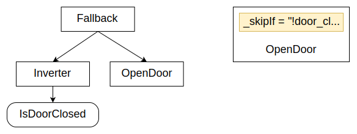
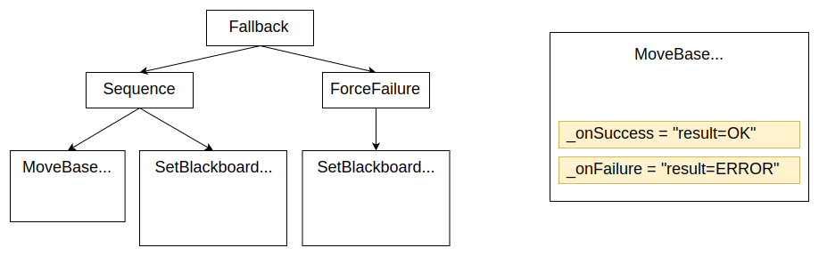
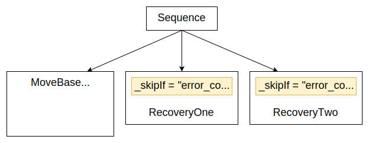
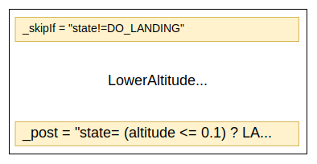
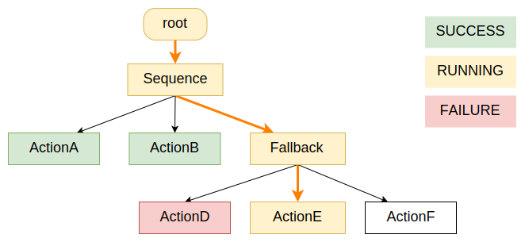
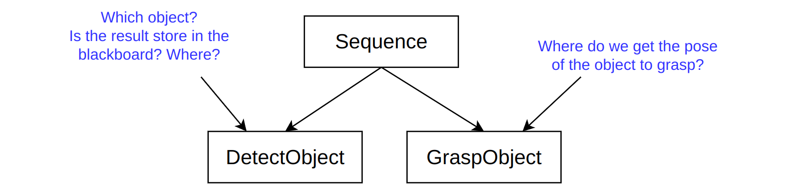
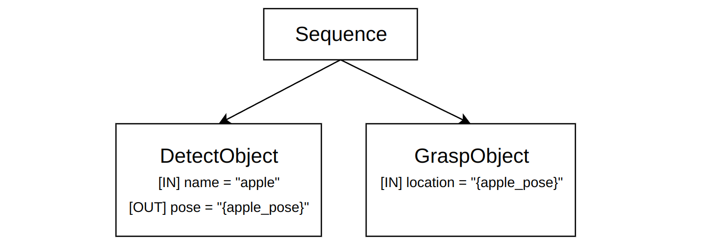

# Guides

成为行为树大师

## Introduction to Scripting

行为树 4.X 引入了一个简单但强大的新概念：在 XML 中使用脚本语言。

这个脚本语言的语法很熟悉；它允许用户快速读取和写入黑板中的变量。

学习脚本工作原理的最简单方法是使用内置的 **Script** 动作，这在第二个教程中已经介绍过。

### Assignment operators, strings and numbers

示例：

```
param_A := 42
param_B = 3.14
message = 'hello world'
```

- 第一行将数字 42 赋值给黑板条目 **param_A**。
- 第二行将数字 3.14 赋值给黑板条目 **param_B**。
- 第三行将字符串 "hello world" 赋值给黑板条目 **message**。

> TIP：
> 运算符 ":=" 与 "=" 的区别在于，前者如果黑板中不存在该条目，会创建一个新的条目；而后者如果黑板中不存在该条目，则会抛出异常。

你也可以使用**分号**在同一个脚本中添加多个命令。

```
A:= 42; B:=24
```

#### Arithmetic operators and parenthesis

示例：

```
param_A := 7
param_B := 5
param_B *= 2
param_C := (param_A * 3) + param_B
```

生成的值为 `param_B` 为 10，`param_C` 为 31。

支持以下运算符：

| Operator | Assign Operator | Description |
| - | - | - |
| + | += | Add |
| - | -= | Subtract |
| * | *= | Multiply |
| / | /= | Divide |

注意，加法运算符是唯一也可以用于字符串的运算符（用于连接两个字符串）。

### Bitwise operator and hexadecimal numbers

这些运算符仅在值可以被转换为整数时有效。

将它们用于字符串或实数将导致异常。

示例：

```
value:= 0x7F
val_A:= value & 0x0F
val_B:= value | 0xF0
```

`val_A` 的值是 0x0F（即 15）；`val_B` 的值是 0xFF（即 255）。

| Binary Operators | Description |
| - | - |
| \|	| Bitwise or |
| &	| Bitwise and |
| ^	| Bitwise xor |

| Unary Operators | Description |
| - | - |
| ~ | Negate |

### Logic and comparison operators

返回布尔值的运算符。

示例：

```
val_A := true
val_B := 5 > 3
val_C := (val_A == val_B)
val_D := (val_A && val_B) || !val_C
```

| Operators	| Description |
| - | - |
| true/false | Booleans. Castable to 1 and 0 respectively |
| && | Logic and |
| || | Logic or |
| !	| Negation |
| == | Equality |
| != | Inequality |
| <	| Less |
| <= | Less equal |
| >	| Greater |
| >= | Greater equal |

#### Ternary operator if-then-else

示例：

```
val_B = (val_A > 1) ? 42 : 24
```

### C++ example

脚本语言演示，包括如何使用枚举来表示整数值。

XML 示例：

```xml
<root >
    <BehaviorTree>
        <Sequence>
            <Script code=" msg:='hello world' " />
            <Script code=" A:=THE_ANSWER; B:=3.14; color:=RED " />
            <Precondition if="A>B && color!=BLUE" else="FAILURE">
                <Sequence>
                  <SaySomething message="{A}"/>
                  <SaySomething message="{B}"/>
                  <SaySomething message="{msg}"/>
                  <SaySomething message="{color}"/>
                </Sequence>
            </Precondition>
        </Sequence>
    </BehaviorTree>
</root>
```

用于注册节点和枚举的 C++ 代码：

```c++
int main()
{
  // Simple tree: a sequence of two asynchronous actions,
  // but the second will be halted because of the timeout.

  BehaviorTreeFactory factory;
  factory.registerNodeType<SaySomething>("SaySomething");

  enum Color { RED=1, BLUE=2, GREEN=3 };
  // We can add these enums to the scripting language
  factory.registerScriptingEnums<Color>();

  // Or we can do it manually
  factory.registerScriptingEnum("THE_ANSWER", 42);

  auto tree = factory.createTreeFromText(xml_text);
  tree.tickWhileRunning();
  return 0;
}
```

预期输出：

```
Robot says: 42.000000
Robot says: 3.140000
Robot says: hello world
Robot says: 1.000000
```

注意，在底层，ENUM 总是被解释为其数值。

## Pre and Post conditions

利用前一教程中介绍的脚本语言的能力，BT.CPP 4.x 引入了前置条件（Pre）和后置条件（Post）的概念，即可以在节点实际 `tick()` 调用之前或之后运行的脚本。

前置条件和后置条件被**所有**节点支持，不需要对你的 C++ 代码做任何修改。

> CAUTION：脚本的目标**不**是编写复杂的代码，而只是为了提高行为树的可读性，并在非常简单的用例中减少对自定义 C++ 节点的需求。
> 如果你的脚本变得太长，可能需要重新考虑是否应该使用脚本。

### Pre conditions

| Name | Description | |
| - | - | - |
| **_skipIf** | 如果条件为真，则跳过该节点的执行 | |
| **_failureIf** | 如果条件为真，则跳过并返回 FAILURE | |
| **_successIf** | 如果条件为真，则跳过并返回 SUCCESS ||
| **_while** | 与 _skipIf 相同，但如果条件变为 false，也可能中断处于 RUNNING 的节点 ||

#### Example

在之前的教程中，我们展示了如何使用 fallback 在树中构建 if-then-else 逻辑。

新的语法要紧凑得多：



之前的方法：

```xml
<Fallback>
    <Inverter>
        <IsDoorClosed/>
    </Inverter>
    <OpenDoor/>
</Fallback>
```

如果不是使用自定义的 ConditionNode `IsDoorOpen`，而是将一个布尔值存储在名为 `door_closed` 的条目中，则可以将 XML 重写为：

```xml
<OpenDoor _skipIf="!door_closed"/>
```

### Post conditions

| Name | Description | |
| - | - | - |
| **_onSuccess** | 如果该节点返回 SUCCESS，则执行此脚本 | |
| **_onFailure** | 如果该节点返回 FAILURE，则执行此脚本 | |
| **_post** | 如果该节点返回 SUCCESS 或 FAILURE，则执行此脚本 ||
| **_onHalted** | 如果一个处于 RUNNING 状态的节点被中断（halted），则执行此脚本 ||

#### Example

在关于 Subtree 的教程中，我们看到过一个基于 **MoveBase** 的结果来写入特定黑板变量的逻辑。

在左侧，你可以看到这个逻辑在 BT.CPP 3.x 中是如何实现的，而使用 post conditions 后会简单得多。此外，新语法还支持使用**枚举**（enum）。



旧版本：

```xml
<Fallback>
    <Sequence>
        <MoveBase  goal="{target}"/>
        <SetBlackboard output_key="result" value="0" />
    </Sequence>
    <ForceFailure>
        <SetBlackboard output_key="result" value="-1" />
    </ForceFailure>
</Fallback>
```

新实现：

```xml
<MoveBase goal="{target}" 
          _onSuccess="result:=OK"
          _onFailure="result:=ERROR"/>
```

### Design pattern: error codes

与有限状态机相比，行为树在某些模式下可能表现不佳，尤其是当需要根据某个动作的不同结果执行不同策略时。

由于行为树的返回值仅限于 SUCCESS 和 FAILURE，这可能会令人难以直观表达。

一种解决方法是将 **结果/错误码** 存入黑板，但在 3.X 版本中这很繁琐。

前置条件（Pre conditions）可以帮助我们实现更具可读性的代码，例如：



在上图的树中，我们向 **MoveBase** 添加了一个输出端口 **return**，并根据 `error_code` 的值有条件地选择 Sequence 的第二个或第三个分支。

### Design pattern: states and declarative trees

尽管行为树承诺让我们摆脱状态的束缚，但事实是有时在没有状态的情况下很难推理我们的应用程序。

使用状态可以让我们的树更简单。例如，只有当机器人（或某个子系统）处于特定状态时，我们才会走树中的某个分支。

考虑这个节点及其前置/后置条件：



该节点仅在 state 等于 **DO_LANDING** 时执行；一旦 `altitude` 的值足够小，state 将被更改为 **LANDED**。

注意 DO_LANDING 和 LANDED 是枚举（enums），不是字符串。

> TIP：
> 这种模式的一个意想不到的副作用是，我们的节点变得更加**声明式**，也就是说，更容易将这个特定的节点/子树移动到树的其他部分。

## Asynchronous Actions

在设计响应式行为树时，理解两个主要概念非常重要：

- 我们所说的“**异步**（Asynchronous）”动作与“**同步**（Synchronous）”动作之间的区别。
- 在 BT.CPP 环境下，**并发**（Concurrency）与**并行**（Parallelism）之间的差异。

### Concurrency vs Parallelism

如果你在谷歌上搜索这些词，你会找到许多关于这个主题的优秀文章。

> INFO：
> **并发**（Concurrency）是指两个或更多任务可以在时间上重叠地开始、执行和完成。这并不一定意味着它们会在同一时刻同时运行。
> **并行**（Parallelism）是指任务在不同线程上同时运行，例如在多核处理器上。

BT.CPP 会**并发**执行所有节点。换句话说：

- 树的执行引擎是**单线程**的。
- 所有的 `tick()` 方法是**按顺序**执行的。
- 如果某个 `tick()` 方法是阻塞的，整个执行流程都会被阻塞。

我们通过“并发”和异步执行来实现响应式行为。

换句话说，一个执行时间较长的 Action 应该尽快返回状态 RUNNING。

这会告诉树的执行器，该 Action 已经开始执行，需要更多时间才能返回 SUCCESS 或 FAILURE。我们需要再次对该节点进行 tick，以确定状态是否发生了变化（轮询）。

异步节点可以将这个长时间执行的任务委托给另一个进程（使用进程间通信）或另一个线程。

### Asynchronous vs Synchronous

一般来说，异步节点具有以下特性：

- 在被 tick 时，可能返回 RUNNING 而不是 SUCCESS 或 FAILURE。
- 当调用方法 `halt()` 时，可以尽可能快地被停止。

通常，开发者需要实现 `halt()` 方法。

当你的树执行一个返回 RUNNING 的异步动作时，该状态通常会**向上传播**，整个树被认为处于 RUNNING 状态。

在下面的示例中，"ActionE" 是异步的并处于 RUNNING；当一个节点处于 RUNNING 时，通常其父节点也会返回 RUNNING。



让我们来考虑一个简单的 `SleepNode`。一个很好的起始模板是 `StatefulActionNode`。

```c++

using namespace std::chrono;

// Example of Asynchronous node that uses StatefulActionNode as base class
class SleepNode : public BT::StatefulActionNode
{
  public:
    SleepNode(const std::string& name, const BT::NodeConfig& config)
      : BT::StatefulActionNode(name, config)
    {}

    static BT::PortsList providedPorts()
    {
      // amount of milliseconds that we want to sleep
      return{ BT::InputPort<int>("msec") };
    }

    NodeStatus onStart() override
    {
      int msec = 0;
      getInput("msec", msec);

      if( msec <= 0 ) {
        // No need to go into the RUNNING state
        return NodeStatus::SUCCESS;
      }
      else {
        // once the deadline is reached, we will return SUCCESS.
        deadline_ = system_clock::now() + milliseconds(msec);
        return NodeStatus::RUNNING;
      }
    }

    /// method invoked by an action in the RUNNING state.
    NodeStatus onRunning() override
    {
      if ( system_clock::now() >= deadline_ ) {
        return NodeStatus::SUCCESS;
      }
      else {
        return NodeStatus::RUNNING;
      }
    }

    void onHalted() override
    {
      // nothing to do here...
      std::cout << "SleepNode interrupted" << std::endl;
    }

  private:
    system_clock::time_point deadline_;
};
```

在上面的代码中：

当 `SleepNode` 第一次被 tick 时，会执行 `onStart()` 方法。如果 sleep 时间为 0，该方法可能会立即返回 `SUCCESS`；否则会返回 `RUNNING`。
我们应继续以循环方式对树进行 tick。这样会调用 `onRunning()` 方法，该方法可能再次返回 `RUNNING`，或最终返回 `SUCCESS`。
另一个节点可能触发 `halt()` 信号。在这种情况下，将调用 `onHalted()` 方法。

### Avoid blocking the execution of the tree

下面这种实现 `SleepNode` 的方式是**错误**的：

```c++
// This is the synchronous version of the Node. Probably not what we want.
class BadSleepNode : public BT::ActionNodeBase
{
  public:
    BadSleepNode(const std::string& name, const BT::NodeConfig& config)
      : BT::ActionNodeBase(name, config)
    {}

    static BT::PortsList providedPorts()
    {
      return{ BT::InputPort<int>("msec") };
    }

    NodeStatus tick() override
    {  
      int msec = 0;
      getInput("msec", msec);
      // This blocking function will FREEZE the entire tree :(
      std::this_thread::sleep_for( milliseconds(msec) );
      return NodeStatus::SUCCESS;
     }

    void halt() override
    {
      // No one can invoke this method because I froze the tree.
      // Even if this method COULD be executed, there is no way I can
      // interrupt std::this_thread::sleep_for()
    }
};
```

### The problem with multi-threading

在本库的早期（1.x 版本），创建新线程看起来是实现异步动作的一个好方法。

但这是一个坏主意，原因有多方面：

- 以线程安全的方式访问黑板更困难（后面会详细说明）。
- 你很可能并不需要这样做。
- 人们认为这会神奇地让动作“异步”，但他们忘记了，当调用 `halt()` 方法时，仍然**有责任**以某种方式并且**快速地**停止该线程。

因此，通常不建议用户将 `BT::ThreadedAction` 作为基类。让我们再次看看 `SleepNode`。

```c++
// This will spawn its own thread. But it still has problems when halted
class BadSleepNode : public BT::ThreadedAction
{
  public:
    BadSleepNode(const std::string& name, const BT::NodeConfig& config)
      : BT::ActionNodeBase(name, config)
    {}

    static BT::PortsList providedPorts()
    {
      return{ BT::InputPort<int>("msec") };
    }

    NodeStatus tick() override
    {  
      // This code runs in its own thread, therefore the Tree is still running.
      // This seems good but the thread still can't be aborted
      int msec = 0;
      getInput("msec", msec);
      std::this_thread::sleep_for( std::chrono::milliseconds(msec) );
      return NodeStatus::SUCCESS;
    }
    // The halt() method can not kill the spawned thread :(
};
```

正确的版本如下：

```c++
// I will create my own thread here, for no good reason
class ThreadedSleepNode : public BT::ThreadedAction
{
  public:
    ThreadedSleepNode(const std::string& name, const BT::NodeConfig& config)
      : BT::ActionNodeBase(name, config)
    {}

    static BT::PortsList providedPorts()
    {
      return{ BT::InputPort<int>("msec") };
    }

    NodeStatus tick() override
    {  
      // This code runs in its own thread, therefore the Tree is still running.
      int msec = 0;
      getInput("msec", msec);

      using namespace std::chrono;
      const auto deadline = system_clock::now() + milliseconds(msec);

      // Periodically check isHaltRequested() 
      // and sleep for a small amount of time only (1 millisecond)
      while( !isHaltRequested() && system_clock::now() < deadline )
      {
        std::this_thread::sleep_for( std::chrono::milliseconds(1) );
      }
      return NodeStatus::SUCCESS;
    }

    // The halt() method will set isHaltRequested() to true 
    // and stop the while loop in the spawned thread.
};
```

如你所见，这看起来比我们最初使用 `BT::StatefulActionNode` 实现的版本更复杂。该模式在某些情况下仍然有用，但你必须记住，引入多线程会使事情更复杂，**默认应尽量避免**。

### Advanced example: client / server communication

通常，使用 BT.CPP 的人会在不同的进程中执行实际任务。

在 ROS 中，一种典型（且推荐）的方法是使用 ActionLib。

ActionLib 提供了正是我们需要用来正确实现异步行为的那类 API：

1. 用于启动动作的非阻塞函数。
2. 用于监控动作当前执行状态的方法。
3. 用于检索结果或错误信息的方法。
4. 能够抢占/中止正在执行的动作。

上述操作都不是“阻塞”的，因此我们不需要自己创建线程。

更一般地，我们可以假设开发者拥有自己的进程间通信机制，在 BT 执行器与实际服务提供者之间建立客户端/服务器关系。

## Ports VS Blackboard

据我们所知，**BT.CPP** 是唯一引入**输入/输出端口**（Input/Output Ports）概念作为**黑板**（Blackboards）替代方案的行为树实现。

更具体地说，端口是一种接口，为黑板增加了一层间接性和额外的语义。

要理解为何推荐使用端口而**不**直接使用黑板，首先应了解 BehaviorTree.CPP 的一些核心原则。

### Goals of BT.CPP

#### Model Driven Development

本文的目的并不是解释什么是模型驱动开发（Model Driven Development）。简而言之，我们希望构建节点的“模型”，即某种元信息，用来说明节点如何与树的其余部分交互。

模型对开发者（具有自我文档化作用）和外部工具都很重要，例如可视化编辑器——Groot2 是一个显著的例子，或静态分析器。

我们认为**节点之间数据流的描述必须成为模型的一部分**。此外，我们希望明确指出某个黑板条目是被写入（output）、被读取（input）还是两者兼有。

考虑下面的示例：



在其他实现中（或者如果有人不恰当地使用这个库……），唯一能够知道这两个 Node 是否通信以及相互依赖的方法要么是：

- **检查代码**：这是我们想要避免的。
- 或者**阅读文档**：但文档并不能保证准确且与时俱进。

相反，如果输入/输出端口作为模型的一部分，那么 Node 的意图及其与其他 Node 的关系就会变得更加清晰：



#### Nodes composibility and Subtree scoping

理想情况下，我们希望提供一个平台，使行为设计者（Behavior Designers）能够构建由不同供应商/用户实现的树（即“组合 Nodes”）。

但是，当直接使用 Blackboard 时，名称冲突将立即成为一个问题。

想想常见的名字，例如 `goal`、`results`、`target`、`value` 等等。

例如，**Nodes GraspObject** 和 **MoveBase** 可能由不同的人开发，它们都从 blackboard 中读取条目 `target`。但不幸的是，它们的含义不同，并且类型本身也不同：前者期望一个三维姿态，而后者期望一个二维的。

**Ports** 提供了一个间接层，被称为“重映射（remapping）”，如教程 2 中所解释的那样。

这意味着，无论在定义 Port 时使用了什么名字（该名字在你的 C++ 实现中是“硬编码”的），你总是可以在 XML 中将其“重映射”到另一个 blackboard 条目，而无需修改源代码。

对于 Subtrees 的重映射同样如此，如教程 6 所解释的那样。由于 Blackboard 实际上就是一个强化版的全局变量映射（map），因此扩展性非常差。编程中为什么全局变量是禁忌，这是有原因的！

Ports 重映射为此问题提供了一个解决方案。

### Summary: never use the Blackboard directly

你应该这样做：

```c++
// example code in your tick()
getInput("goal", goal);
setOutput("result", result);
```

并尽可能避免这样做：

```c++
// example code in your tick()
config().blackboard->get("goal", goal);
config().blackboard->set("result", result);
```

这两段代码在技术上都可能工作，但后一种（直接访问黑板）被认为是糟糕的实践，**强烈不推荐**这样做：

直接访问黑板（第二种做法）存在的问题：

1. 名称“goal”和“result”被硬编码。如果要更改它们，必须重新编译应用程序。而端口（Port）可以在运行时通过修改 XML 进行重映射。
2. 只有检查代码才能知道一个节点是否读写某个黑板条目。保持文档同步是一种解决方案，但端口模型本身就具有自文档性。
3. `BehaviorTreeFactory` 无法察觉这些黑板条目正在被访问。相反，当使用端口时，我们可以内省端口之间的通信方式，并在部署时检查连接是否正确。
4. 在使用子树（SubTrees）时可能不会按预期工作。
5. `convertFromString()` 的模板特化无法正常工作。
