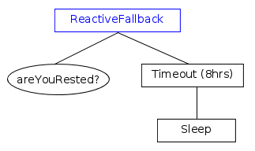

# Nodes Library

库原生实现的 TreeNodes 列表

## Decorators

Decorator（装饰器）是一种必须有单个子节点的节点。

由 Decorator 决定子节点何时、是否以及执行多少次 tick。

### Inverter

对子节点执行一次 tick，如果子节点失败则返回 SUCCESS，如果子节点成功则返回 FAILURE。

如果子节点返回 RUNNING，则该节点也返回 RUNNING。

### ForceSuccess

如果子节点返回 RUNNING，则该节点也返回 RUNNING。

否则，它总是返回 SUCCESS。

### ForceFailure

如果子节点返回 RUNNING，则该节点也返回 RUNNING。

否则，它总是返回 FAILURE。

### Repeat

对子节点执行最多 N 次（在其一次 tick 内），其中 N 通过输入端口 `num_cycles` 传入，只要子节点返回 SUCCESS 就继续。如果子节点在 N 次重复中始终返回 SUCCESS，则在完成 N 次后返回 SUCCESS。

如果子节点返回 FAILURE，则中断循环，并返回 FAILURE。

如果子节点返回 RUNNING，则该节点也返回 RUNNING，并且在下一个 Repeat 节点的 tick 中继续重复，但计数不增加。

### RetryUntilSuccessful

对子节点执行最多 N 次，其中 N 通过输入端口 `num_attempts` 传入，只要子节点返回 FAILURE 就继续。如果子节点在 N 次尝试中始终返回 FAILURE，则在完成 N 次后返回 FAILURE。

如果子节点返回 SUCCESS，则中断循环，并返回 SUCCESS。

如果子节点返回 RUNNING，则该节点也返回 RUNNING，并且在下一个 RetryUntilSuccessful 节点的 tick 中继续尝试，但计数不增加。

### KeepRunningUntilFailure

KeepRunningUntilFailure 节点始终返回 FAILURE（当子节点返回 FAILURE 时）或 RUNNING（当子节点返回 SUCCESS 或 RUNNING 时）。

### Delay

在指定时间间隔后触发子节点。时间间隔通过输入端口 `delay_msec` 指定。如果子节点返回 RUNNING，则该节点也返回 RUNNING，并将在 Delay 节点的下一个 tick 中再次触发子节点。否则，返回子节点的状态。

### RunOnce

RunOnce 节点用于仅执行子节点一次的情况。如果子节点是异步的，它会持续触发，直到返回 SUCCESS 或 FAILURE。

在首次执行之后，你可以通过输入端口 `then_skip` 设置节点行为：

- TRUE（默认）：该节点在未来将被跳过。
- FALSE：始终同步返回子节点第一次执行时的相同状态。

### PreCondition

参见 Introduction to the Scripting language

### SubTree

参见 Compose behaviors using Subtrees.

### Other decorators requiring registration in C++

#### ConsumeQueue

当队列非空时，持续执行子节点。在每次迭代中，从 "queue" 弹出一个类型为 T 的元素，并将其存入 "popped_item"。

如果队列为空，将返回 SUCCESS。

例如，可以通过 `factory.registerNodeType<ConsumeQueue<Pose2D>>("ConsumeQueue");` 注册。参见 ex04_waypoints.cpp。

#### SimpleDecoratorNode

使用 `void BehaviorTreeFactory::registerSimpleDecorator("MyDecorator", tick_function, ports)` 注册一个简单的装饰器节点。该方法内部使用 `SimpleDecoratorNode`，其中 `tick_function` 的签名为 `std::function<NodeStatus(NodeStatus, TreeNode&)>`，ports 的类型为 `PortsList`。

## Fallbacks

这一类节点在其他框架中被称为“Selector”或“Priority”。

它们的作用是尝试不同的策略，直到找到一个“可行”的。

目前框架提供了两种类型的节点：

- Fallback
- ReactiveFallback

它们遵循以下规则：

- 在对第一个子节点进行 tick 之前，节点状态变为 **RUNNING**。
- 如果某个子节点返回 **FAILURE**，Fallback 会对下一个子节点进行 tick。
- 如果**最后一个**子节点也返回 **FAILURE**，则所有子节点被停止，并且 Fallback 返回 **FAILURE**。
- 如果某个子节点返回 **SUCCESS**，它会停止并返回 **SUCCESS**，同时所有子节点被停止。

要理解这两种 ControlNode 的区别，请参考下表：

| Type of ControlNode | Child returns RUNNING |
| - | - |
| Fallback | Tick again |
| ReactiveFallback | Restart |

- “**Restart**” 意味着整个 Fallback 会从列表中的第一个子节点重新开始执行。
- “**Tick again**” 意味着下次对 Fallback 进行 tick 时，将再次对同一个子节点进行 tick。之前已经返回 FAILURE 的兄弟节点不会再次被 tick。

### Fallback

在这个例子中，我们尝试不同的策略来打开门。首先检查门是否已经打开（且只检查一次）。

### ReactiveFallback

当我们希望在某个先前的条件从 FAILURE 变为 SUCCESS 时中断一个**异步**子节点时，会使用这个 ControlNode。

在下面的例子中，角色*最多*会睡 8 小时。如果他/她已经完全休息，那么节点 `areYouRested?` 将返回 SUCCESS，异步节点 `Timeout (8 hrs)` 和 `Sleep` 将被中断。

## Sequences

**Sequence** 会依次 tick 它的所有子节点，只要它们返回 SUCCESS。如果有任何子节点返回 FAILURE，整个 sequence 将被中止。

目前框架提供三种类型的节点：

- Sequence
- SequenceWithMemory
- ReactiveSequence

它们共享以下规则：

- 在 tick 第一个子节点之前，节点状态变为 **RUNNING**。
- 如果子节点返回 **SUCCESS**，则 tick 下一个子节点。
- 如果**最后一个**子节点也返回 **SUCCESS**，所有子节点将被停止，sequence 返回 **SUCCESS**。

要理解这三种 ControlNode 的区别，请参考下表。

|Type of ControlNode|Child returns FAILURE|Child returns RUNNING|
|-|-|-|
|Sequence|Restart|Tick again|
|ReactiveSequence|Restart|Restart|
|SequenceWithMemory|Tick again|Tick again|

- “**Restart**” 意味着整个 sequence 从子节点列表的第一个子节点重新开始。
- “**Tick again**” 意味着下次对 sequence 进行 tick 时，将再次 tick 相同的子节点。之前已经返回 SUCCESS 的兄弟节点将不会再次被 tick。

### Sequence

这棵树表示电脑游戏中狙击手的行为。

### ReactiveSequence

这个节点在持续检查条件时尤其有用；但用户在使用异步子节点时也需要小心，以确保它们不会被过于频繁地 tick。

让我们看另一个例子：

`ApproachEnemy` 是一个**异步**动作，在最终完成之前会持续返回 RUNNING。

条件节点 `isEnemyVisible` 会被多次调用，如果其变为 false（即返回 FAILURE），则 `ApproachEnemy` 会被中止（halt）。

### SequenceWithMemory

当你不希望再次执行已经返回 SUCCESS 的子节点时，可以使用这个 ControlNode。

**示例**：

这是一个巡逻的代理/机器人，它必须只访问**一次**位置 A、B 和 C。如果动作 **GoTo(B)** 失败，**GoTo(A)** 不会再次被执行。

另一方面，**isBatteryOK** 必须在每次 tick 时检查，因此它的父节点必须是 `ReactiveSequence`。

