# About

## About this library

这个 **C++** 库提供了一个用于创建**行为树**（Behavior Trees）的框架。它被设计得灵活、易用且高效。

尽管我们的主要使用场景是**机器人**，但你也可以用这个库来为游戏构建 AI，或在你的应用中替代有限状态机（Finite State Machines）。

与其它实现相比，**BehaviorTree.CPP** 有许多有趣的特性：

- 将**异步动作**（即非阻塞例程）视为一等公民。
- 树在运行时创建，使用一种基于 XML 的**解释型语言**。
- 包含**日志/性能分析（profiling）**基础设施，允许用户可视化、记录、重放并分析状态转换。
- 你可以将自定义的 TreeNodes 静态链接进程序，或把它们转换为在运行时加载的插件。

## What is a Behavior Tree?

行为树（Behavior Tree，**BT**）是一种用于组织自治代理（例如机器人或电脑游戏中的虚拟实体）在不同任务之间切换的结构化方法。

行为树是创建既模块化又具有响应性的复杂系统的高效方式。这些特性在许多应用中至关重要，因此行为树已从电脑游戏编程扩展到人工智能和机器人学的多个领域。

如果你已经熟悉有限状态机（Finite State Machines，**FSM**），你会很容易掌握大部分概念，但希望你会发现行为树更具表达力，也更容易推理和理解。

把**树的节点（Nodes）**想象成一组构建模块。这些模块用 C++ 实现，并且是“可组合的”（composable）：换句话说，它们可以被“组装”在一起以构建行为。

在上方的图片中，你可以看到我们将这些动作排列成一个简单的 Sequence（顺序节点）；动作将按从左到右的顺序依次执行。要了解更多，请访问 Introduction to BTs 页面。

### Main Advantages of Behavior Trees

- **它们本质上是分层的**：我们可以将复杂行为*组合*起来，甚至把整个子树作为更大树的分支重用。例如，行为 "Fetch Beer"（取啤酒）可以重用子树 "Grasp Object"（抓取物体）。

- **它们的图形表示具有语义意义**：读取行为树并理解对应的工作流程要更容易。相比之下，有限状态机（FSM）的状态转换无论在文本还是图形表示上都更难以理解。

- **它们更具表达力**：现成可用的控制节点（ControlNodes）和装饰节点（DecoratorNodes）使表达更复杂的控制流成为可能。用户也可以用自己定义的节点扩展这种“词汇”。

## "Ok, but WHY do we need BehaviorTrees (or FSM)?"

许多软件系统（机器人学就是一个显著的例子）本质上非常复杂。

管理复杂性、异构性和可扩展性的常用方法是采用**组件化软件工程（Component Based Software Engineering）**的概念。

现有的任何机器人中间件都以这种方式（或正式或非正式）采用了该方法，ROS、YARP 和 SmartSoft 是一些著名的例子。

一个“良好”的软件架构应具备以下特性：

- 模块化（Modularity）。
- 组件的可重用性（Reusability of components）。
- 可组合性（Composability）。
- 良好的关注点分离（Good separation of concerns）。

如果我们从一开始不把这些概念牢记在心，就会产生高度耦合且难以重用的软件。

通常，软件系统的业务逻辑会“散落”在许多组件中，开发者**很难对其进行推理或调试错误**。

为了实现强的关注点分离，最好将业务逻辑集中到单一位置。

**有限状态机（Finite State Machines，FSM）**就是为此目标而设计的，但近年来**行为树（Behavior Trees）**越来越受欢迎，尤其是在游戏行业。
