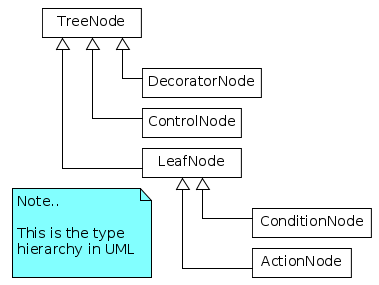
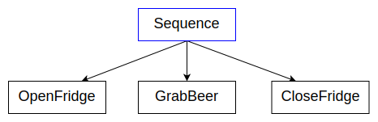
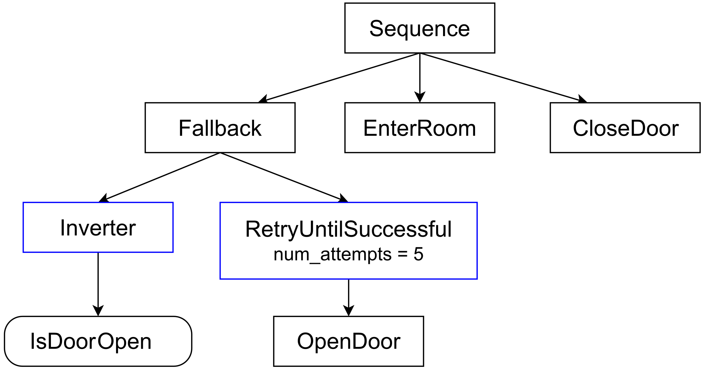
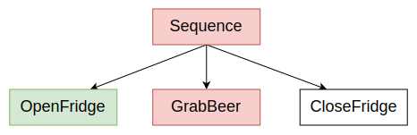
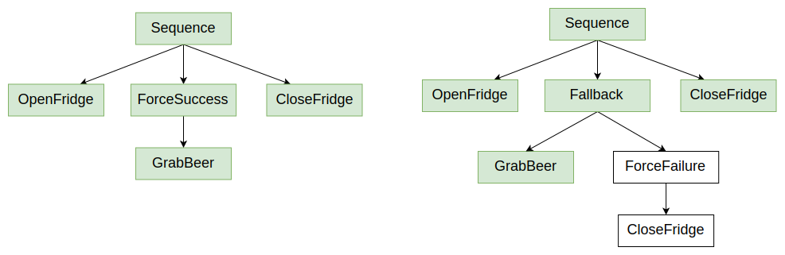
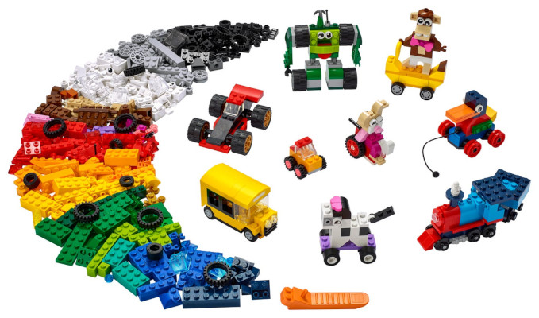

# Basic Concepts

了解行为树是什么以及如何使用它们。

## Introduction to BTs

与有限状态机不同，行为树（Behavior Tree）是一个由**分层节点**组成的树结构，用来控制“任务”执行的流程。

### Basic Concepts

- 向树的根节点发送一个名为 **“tick”** 的信号，该信号沿树向下传播，直到到达叶节点。
- 任何收到 **tick** 信号的 TreeNode 都会执行其回调函数。该回调必须返回以下三种状态之一：
  - **SUCCESS**
  - **FAILURE**
  - **RUNNING**
- RUNNING 表示该动作需要更多时间才能返回有效结果。
- 如果一个 TreeNode 拥有一个或多个子节点，则由该节点负责继续传播 tick；不同类型的节点在是否、何时以及对子节点 tick 的次数上可能有不同的规则。
- **叶节点**（LeafNodes，即没有子节点的 TreeNode）是真正执行命令的节点——行为树与系统其余部分交互的地方。**动作**节点（Action nodes）是最常见的叶节点类型。

Tip：单词 **“tick”** 常作为动词使用（to tick / to be ticked），其含义是：

```
"To invoke the callback `tick()` of a `TreeNode`".
```

在面向服务的架构（service-oriented architecture）中，叶节点包含与执行实际操作的“服务器”（server）通信的“客户端”（client）代码。

## How tick works

为了在脑海中形象化地理解对树进行 tick 操作的工作原理，请参见下面的示例。


**Sequence** 是最简单的**控制节点**（ControlNode）：它按顺序依次执行其子节点，如果所有子节点都返回 SUCCESS，则它也返回 SUCCESS。

1. 第一次 tick 会把 Sequence 节点设置为 RUNNING（橙色）。
2. Sequence 会对第一个子节点 "OpenDoor" 执行 tick，"OpenDoor" 最终返回 SUCCESS。
3. 因此接着会对第二个子节点 "Walk" 以及随后 "CloseDoor" 进行 tick。
4. 一旦最后一个子节点完成，整个 Sequence 就会从 RUNNING 切换为 SUCCESS。

## Types of nodes



| Type of TreeNode | Children Count | Notes |
| - | - | - |
| ControlNode | 1...N | 通常情况下，是否对某个子节点进行 tick，取决于它的兄弟节点的返回结果，和/或它自身的状态。 |
| DecoratorNode | 1 | 除此之外，它还可能修改子节点的返回结果，或者对其进行多次 tick。 |
| ConditionNode | 0 | 不应改变系统状态。不得返回 RUNNING。 |
| ActionNode | 0 | 这是那个真正“执行某些操作”的节点。 |

在 **ActionNodes** 的语境下，我们可以进一步区分为同步节点和异步节点。

同步节点以原子方式执行，会阻塞整棵树，直到返回 SUCCESS 或 FAILURE。

异步动作则可能返回 RUNNING，以表明该动作仍在执行中。

我们需要对异步动作反复 tick，直到最终返回 SUCCESS 或 FAILURE。

## Examples

为了更好地理解行为树的工作方式，让我们聚焦一些实际示例。为简化起见，我们暂不考虑动作返回 RUNNING 的情况。

在这里，我们假设每个动作都是以原子方式、同步执行的。

### First ControlNode: Sequence

让我们用最基本、最常用的控制节点 SequenceNode 来说明行为树（BT）的工作原理。

控制节点（ControlNode）的子节点总是**有序的**；在图形表示中，执行顺序是**从左到右**。



简而言之：

- 如果某个子节点返回 SUCCESS，则继续 tick 下一个子节点。
- 如果某个子节点返回 FAILURE，则不再对后续子节点执行 tick，并且 Sequence 返回 FAILURE。
- 如果**所有**子节点都返回 SUCCESS，则 Sequence 也返回 SUCCESS。

Find the BUG!：如果动作 **GrabBeer** 执行失败，那么冰箱门将保持打开状态，因为最后一个动作 **CloseFridge** 会被跳过。

### Decorators

根据 **DecoratorNode** 的类型不同，该节点的目的可能是：

- 转换它从子节点接收到的结果；
- 中止子节点的执行；
- 根据装饰器的类型，反复对其子节点执行 tick。



节点 **Inverter** 是一种 Decorator，它会将其子节点返回的结果取反；因此，一个 Inverter 节点紧跟着名为 **isDoorOpen** 的节点，相当于：

```
"Is the door closed?".
```

节点 **Retry** 会在子节点返回 FAILURE 时，最多重复对其 tick **num_attempts** 次（此例中为 5 次）。

**显然**，左侧的分支表示：

```
If the door is closed, then try to open it.
Try up to 5 times, otherwise give up and return FAILURE.
```

But...

Find the BUG!：如果 **isDoorOpen** 返回 FAILURE，我们就得到了期望的行为。
但如果它返回 SUCCESS，则左侧分支会失败，整个 Sequence 会被中断。

### Second ControlNode: Fallback

FallbackNodes（也称为 **Selectors**）是能够表达回退策略的节点，顾名思义，即当某个子节点返回 FAILURE 时，决定接下来该做什么。

它会依次对孩子节点执行 tick，并遵循以下规则：

- 如果某个子节点返回 FAILURE，则对下一个子节点执行 tick；
- 如果某个子节点返回 SUCCESS，则不再继续 tick 其他子节点，并且 Fallback 返回 SUCCESS；
- 如果所有子节点都返回 FAILURE，则 Fallback 也返回 FAILURE。

在下一个示例中，你将看到 Sequence 和 Fallback 如何组合使用：


    门开着吗？

    如果没有，尝试把门打开。

    否则，如果你有钥匙，先解锁并打开门。

    否则，砸开门。

    如果以上任一动作成功，则进入房间。

### "Fetch me a beer" revisited

现在我们可以改进之前的 “Fetch Me a Beer” 示例——在之前的版本中，如果冰箱里没有啤酒，冰箱门就会保持打开。

在这里，我们用 "绿色" 表示返回 SUCCESS 的节点，用 "红色" 表示返回 FAILURE 的节点。"黑色" 节点表示尚未被执行。



让我们创建一个改进版的行为树，即使 **GrabBeer** 返回 FAILURE，也会把冰箱门关上。


这两棵树最终都会把冰箱门关上，但：

- **左侧**的树无论是否真的拿到啤酒，都会始终返回 FAILURE。
- **右侧**的树在冰箱里有啤酒时返回 SUCCESS，否则返回 FAILURE。

如果 **GrabBeer** 返回 SUCCESS，一切按预期工作。



## Main Concepts

**BehaviorTree.CPP** 是一个 C++ 库，可以很容易地集成到你喜欢的分布式中间件中，例如 **ROS** 或 **SmartSoft**。

你也可以将它静态链接到你的应用程序中（例如游戏）。

以上就是你首先需要理解的主要概念。

### Nodes vs Trees

用户必须创建自己的 ActionNodes 和 ConditionNodes（即 LeafNodes）；该库能帮助你轻松地把它们组合成树。

可以把 LeafNodes 看作是构建复杂系统所需的基础模块。如果节点是**乐高积木**，那么你的行为树就是一套乐高模型。



从定义上来说，你的自定义节点是（或应该是）高度**可重用的**。

### Instantiate trees at run-time using the XML format

尽管该库是用 C++ 编写的，但行为树本身可以在*运行时*（更准确地说，是在*部署时*）创建和组合，使用基于 XML 的脚本语言。

XML 格式在这里有详细说明，但学习语法的最佳方式是通过教程实践。
