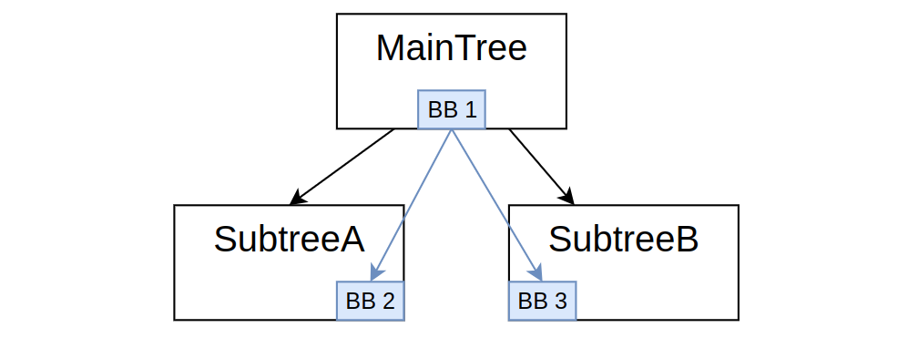

# Tutorials (Advanced)

5 分钟了解 Docusaurus 最重要的概念。

## 12. Default Port values

在定义一个 port 时，添加一个默认值可能会很方便，也就是说，如果在 XML 中未指定该 port 的值，它将使用默认值。

> Note：本教程中展示的一些示例需要 4.5.2 或更高版本。

### Default InputPorts

让我们来考虑一个初始化多个端口的节点。我们使用自定义类型 `Point2D`，但相同的说明也适用于简单类型，例如 `int`、`double` 或 `string`。

```c++
  static PortsList providedPorts()
  {
    return { 
      BT::InputPort<Point2D>("input"),
      BT::InputPort<Point2D>("pointA", Point2D{1, 2}, "default value is x=1, y=2"),
      BT::InputPort<Point2D>("pointB", "3,4",         "default value is x=3, y=4"),
      BT::InputPort<Point2D>("pointC", "{point}",     "point by default to BB entry {point}"),
      BT::InputPort<Point2D>("pointD", "{=}",         "point by default to BB entry {pointD}") 
    };
  }
```

第一个（`input`）没有默认值，必须在 XML 中提供一个值或指向 Blackboard 条目的键。

#### Default values

```c++
BT::InputPort<Point2D>("pointA", Point2D{1, 2}, "...");
```

如果实现了模板特化 `convertFromString<Point2D>()`，我们也可以使用它。

换句话说，如果我们的 `convertFromString` 期望两个以逗号分隔的值，那么下面的语法应当是等价的：

```c++
BT::InputPort<Point2D>("pointB", "3,4", "...");
// should be equivalent to:
BT::InputPort<Point2D>("pointB", Point2D{3, 4}, "...");
```

#### Default blackboard entry

或者，我们可以定义端口应指向的默认黑板条目。

```c++
BT::InputPort<Point2D>("pointC", "{point}", "...");
```

如果端口的名称与黑板条目的名称**相同**，你可以使用 "{=}"。

```c++
BT::InputPort<Point2D>("pointD", "{=}", "...");
// equivalent to:
BT::InputPort<Point2D>("pointD", "{pointD}", "...");
```

### Default OutputPorts

输出端口更受限，只能指向 Blackboard 条目。当两个名称相同时，仍然可以使用 "{=}"。

```c++
  static PortsList providedPorts()
  {
    return { 
      BT::OutputPort<Point2D>("result", "{target}", "point by default to BB entry {target}");
    };
  }
```

## 13. Zero-copy access to the blackboard

如果你按照教程操作，应该已经知道 Blackboard 使用**值语义**（value semantic），即方法 `getInput` 和 `setOutput` 会将值从/写入 blackboard 时进行拷贝。

在某些情况下，改为使用**引用语义**（reference semantic）可能更合适，即直接访问存储在 Blackboard 中的对象。 当对象为以下情况时，这一点尤为重要：

* 复杂的数据结构
* 拷贝代价高
* 不可拷贝

例如，建议对某些节点使用引用语义的情况是 `LoopNode` 装饰器，它会“就地”（in-place）修改一个对象向量。

### Method 1: Blackboard entries as Share pointers

为简化起见，我们将考虑一个拷贝代价高的对象，称为 **Pointcloud**。

假设我们有如下简单的行为树（BT）：

```xml
 <root BTCPP_format="4" >
    <BehaviorTree ID="SegmentCup">
       <Sequence>
           <AcquirePointCloud  cloud="{pointcloud}"/>
           <SegmentObject  obj_name="cup" cloud="{pointcloud}" obj_pose="{pose}"/>
       </Sequence>
    </BehaviorTree>
</root>
```

- **AcquirePointCloud** 会将数据写入 Blackboard 中名为 `pointcloud` 的条目。
- **SegmentObject** 将从该条目读取。

在这种情况下，推荐的端口类型是：

```c++
PortsList AcquirePointCloud::providedPorts()
{
    return { OutputPort<std::shared_ptr<Pointcloud>>("cloud") };
}

PortsList SegmentObject::providedPorts()
{
    return { InputPort<std::string>("obj_name"),
             InputPort<std::shared_ptr<Pointcloud>>("cloud"),
             OutputPort<Pose3D>("obj_pose") };
}
```

方法 `getInput` 和 `setOutput` 可以照常使用，并仍然具有值语义。但是，由于被拷贝的对象是一个 `shared_ptr`，我们实际上是通过引用访问 `pointcloud` 实例。

### Method 2: thread-safe castPtr (recommended since version 4.5.1)

使用 `shared_ptr` 方法时最显著的问题是它**不是线程安全的**。

如果一个自定义的异步节点有自己的线程，那么实际对象可能会被其他线程同时访问。

为防止此问题，我们提供了一个包含锁机制的不同 API。

首先，在创建端口时我们可以使用普通的 `Pointcloud`，无需将其包裹在 `std::shared_ptr` 中：

```c++
PortsList AcquirePointCloud::providedPorts()
{
    return { OutputPort<Pointcloud>("cloud") };
}

PortsList SegmentObject::providedPorts()
{
    return { InputPort<std::string>("obj_name"),
             InputPort<Pointcloud>("cloud"),
             OutputPort<Pose3D>("obj_pose") };
}
```

要通过指针/引用访问 `Pointcloud` 实例：

```c++
// inside the scope below, as long as "any_locked" exists, a mutex protecting 
// the instance of "cloud" will remain locked
if(auto any_locked = getLockedPortContent("cloud"))
{
  if(any_locked->empty())
  {
    // the entry in the blackboard hasn't been initialized yet.
    // You can initialize it doing:
    any_locked.assign(my_initial_pointcloud);
  }
  else if(Pointcloud* cloud_ptr = any_locked->castPtr<Pointcloud>())
  {
    // Succesful cast to Pointcloud* (original type).
    // Modify the pointcloud instance, using cloud_ptr
  }
}
```

## 14. Subtree Models and autoremap

子树重映射在教程 6 中引入。

不幸的是，当在多个位置使用相同的子树时，我们可能会发现需要复制粘贴相同的冗长 XML 标签。

例如，考虑如下情况：

```xml
<SubTree ID="MoveRobot" target="{move_goal}"  frame="world" result="{error_code}" />
```

我们不想每次都复制粘贴这三个 XML 属性 `target`、`frame` 和 `result`，除非它们的值确实不同。

为避免这种情况，我们可以在 `<TreeNodesModel>` 中定义它们的默认值。

```xml
  <TreeNodesModel>
    <SubTree ID="MoveRobot">
      <input_port  name="target"  default="{move_goal}"/>
      <input_port  name="frame"   default="world"/>
      <output_port name="result"  default="{error_code}"/>
    </SubTree>
  </TreeNodesModel>
```

从概念上讲，这与教程 12 中介绍的默认端口类似。

如果在 XML 中指定了这些重映射的黑板条目值，那么它们会被覆盖。
在下面的示例中，我们重写了 `"frame"` 的值，而保留了其他默认的重映射。

```xml
<SubTree ID="MoveRobot" frame="map" />
```

### Autoremap

当子树（SubTree）与父树中的条目名称**相同**时，可以使用属性 `_autoremap`。

例如：

```xml
<SubTree ID="MoveRobot" target="{target}"  frame="{frame}" result="{result}" />
```

可以被替换为：

```xml
<SubTree ID="MoveRobot" _autoremap="true" />
```

我们仍然可以覆写特定的值，而自动映射（autoremap）其他的值。

```xml
<SubTree ID="MoveRobot" _autoremap="true" frame="world" />
```

> CAUTION
> 属性 `_autoremap="true"` 将自动映射（remap）SubTree 中的**所有**条目，**除非**它们的名称以下划线（字符 “_”）开头。
> 这可以作为一种方便的方式，用于将 SubTree 中的某个条目标记为“private”。

## 15. Mock testing in BT.CPP

有时，特别是在实现集成测试（integration test）和单元测试（unit test）时，我们希望能够快速地将特定的 Node，或某一类 Node，替换为用于测试的版本（mock 版本）。

自 4.1 版本起，引入了一种称为“替换规则（substitution rules）”的新机制，使这一过程更加简便。

它由 `BehaviorTreeFactory` 类中的一些附加方法组成，这些方法应在注册节点**之后**、实际实例化树**之前**调用。

例如，给定以下 XML：

```xml
<SaySomething name="talk" message="hello world"/>
```

我们可能希望将此节点替换为另一个名为 **TestMessage** 的节点。

对应的替换操作可通过以下命令完成：

```c++
factory.addSubstitutionRule("talk", "TestMessage");
```

第一个参数包含通配符字符串，该字符串将与 `TreeNode::fullPath` 进行匹配。

有关 `fullPath` 的详细信息，请参阅前面的教程。

### The TestNode

`TestNode` 是一个 Action，可以配置为：

- 返回特定状态，即 SUCCESS 或 FAILURE
- 同步或异步；在异步情况下，应指定超时时间
- 一个后置条件脚本（post-condition script），通常用于模拟 OutputPort

这个简单的虚拟节点（dummy Node）不能覆盖所有情况，但可以作为许多替换规则的默认解决方案。

### Full example

在本例中，我们将学习：

- 如何使用替换规则将一个节点替换为另一个节点
- 如何使用内置的 `TestNode`
- 通配符匹配的示例
- 如何在运行时通过 JSON 文件传递这些规则

我们将使用以下 XML：

```xml
<root BTCPP_format="4">
  <BehaviorTree ID="MainTree">
    <Sequence>
      <SaySomething name="talk" message="hello world"/>
        <Fallback>
          <AlwaysFailure name="failing_action"/>
          <SubTree ID="MySub" name="mysub"/>
        </Fallback>
        <SaySomething message="before last_action"/>
        <Script code="msg:='after last_action'"/>
        <AlwaysSuccess name="last_action"/>
        <SaySomething message="{msg}"/>
    </Sequence>
  </BehaviorTree>

  <BehaviorTree ID="MySub">
    <Sequence>
      <AlwaysSuccess name="action_subA"/>
      <AlwaysSuccess name="action_subB"/>
    </Sequence>
  </BehaviorTree>
</root>
```

C++ 代码如下：

```c++
int main(int argc, char** argv)
{
  BT::BehaviorTreeFactory factory;
  factory.registerNodeType<SaySomething>("SaySomething");

  // We use lambdas and registerSimpleAction, to create
  // a "dummy" node, that we want to substitute to a given one.

  // Simple node that just prints its name and return SUCCESS
  factory.registerSimpleAction("DummyAction", [](BT::TreeNode& self){
    std::cout << "DummyAction substituting: "<< self.name() << std::endl;
    return BT::NodeStatus::SUCCESS;
  });

  // Action that is meant to substitute SaySomething.
  // It will try to use the input port "message"
  factory.registerSimpleAction("TestSaySomething", [](BT::TreeNode& self){
    auto msg = self.getInput<std::string>("message");
    if (!msg)
    {
      throw BT::RuntimeError( "missing required input [message]: ", msg.error() );
    }
    std::cout << "TestSaySomething: " << msg.value() << std::endl;
    return BT::NodeStatus::SUCCESS;
  });

  //----------------------------
  // pass "no_sub" as first argument to avoid adding rules
  bool skip_substitution = (argc == 2) && std::string(argv[1]) == "no_sub";

  if(!skip_substitution)
  {
    // we can use a JSON file to configure the substitution rules
    // or do it manually
    bool const USE_JSON = true;

    if(USE_JSON)
    {
      factory.loadSubstitutionRuleFromJSON(json_text);
    }
    else {
      // Substitute nodes which match this wildcard pattern with TestAction
      factory.addSubstitutionRule("mysub/action_*", "TestAction");

      // Substitute the node with name [talk] with TestSaySomething
      factory.addSubstitutionRule("talk", "TestSaySomething");

      // This configuration will be passed to a TestNode
      BT::TestNodeConfig test_config;
      // Convert the node in asynchronous and wait 2000 ms
      test_config.async_delay = std::chrono::milliseconds(2000);
      // Execute this postcondition, once completed
      test_config.post_script = "msg ='message SUBSTITUED'";

      // Substitute the node with name [last_action] with a TestNode,
      // configured using test_config
      factory.addSubstitutionRule("last_action", test_config);
    }
  }

  factory.registerBehaviorTreeFromText(xml_text);

  // During the construction phase of the tree, the substitution
  // rules will be used to instantiate the test nodes, instead of the
  // original ones.
  auto tree = factory.createTree("MainTree");
  tree.tickWhileRunning();

  return 0;
}
```

### The JSON format

JSON 文件，相当于在 `USE_JSON == false` 时执行的分支如下：

```json
{
  "TestNodeConfigs": {
    "MyTest": {
      "async_delay": 2000,
      "return_status": "SUCCESS",
      "post_script": "msg ='message SUBSTITUED'"
    }
  },

  "SubstitutionRules": {
    "mysub/action_*": "TestAction",
    "talk": "TestSaySomething",
    "last_action": "MyTest"
  }
}
```

如你所见，有两个主要部分：

- **TestNodeConfigs**：用于设置一个或多个 **TestNode** 的参数和名称
- **SubstitutionRules**：用于指定实际的替换规则

## 16. Why a "global blackboard"

> Note：
> 在 Bt.CPP 4.6.0 中引入

如前面的教程所述，BT.CPP 强调了“作用域黑板（scoped blackboards）”的重要性，以便将每个子树隔离开，就像在编程语言中独立的函数/例程一样。

然而，在某些情况下，可能希望拥有一个真正的“全局”黑板，可以直接从每个子树访问，而无需进行重映射。

这在以下场景下是合理的：

- 单例（Singletons）和无法按教程 8 所述共享的全局对象
- 机器人的全局状态
- 在行为树之外写入/读取的数据，例如在执行 tick 的主循环中

此外，由于黑板是一个通用的键/值存储，其值可以包含**任意**类型，因此它是实现文献中所称的“**世界模型**（World Model）”的理想数据结构，即用于与行为树共享环境状态、机器人状态及任务状态的场所。

### Blackboards hierarchy

考虑一个包含两个子树的简单行为树，如下所示：



这三个子树各自拥有自己的黑板；这些黑板之间的父子关系与行为树完全一致，即 BB1 是 BB2 和 BB3 的父黑板。

这些独立黑板的生命周期与各自的子树绑定。

我们可以这样实现一个外部的“全局黑板”：

```c++
auto global_bb = BT::Blackboard::create();
auto maintree_bb = BT::Blackboard::create(global_bb);
auto tree = factory.createTree("MainTree", maintree_bb);
```

这将创建如下的黑板层级结构：


实例 `global_bb` 存在于行为树“外部”，即使对象 `tree` 被销毁，它也会持续存在。

此外，可以通过 `set` 和 `get` 方法轻松访问它。

### How to access the top-level blackboard from the tree

所谓“顶层黑板”，是指位于根节点或整个层级结构最顶端的黑板。

在上面的代码中，`global_bb` 就成为了顶层黑板。

自 BT.CPP **4.6** 版本起，引入了一种新语法，可以在**不进行重映射**的情况下访问顶层黑板，只需在条目的名称前加上前缀 `@`。

例如：

```xml
<PrintNumber val="{@value}" />
```

端口 `val` 将在顶层黑板中查找条目 `value`，而不是在本地黑板中查找。

### Full example

考虑如下行为树：

```xml
  <BehaviorTree ID="MainTree">
    <Sequence>
      <PrintNumber name="main_print" val="{@value}" />
      <SubTree ID="MySub"/>
    </Sequence>
  </BehaviorTree>

  <BehaviorTree ID="MySub">
    <Sequence>
      <PrintNumber name="sub_print" val="{@value}" />
      <Script code="@value_sqr := @value * @value" />
    </Sequence>
  </BehaviorTree>
```

以及对应的 C++ 代码：

```c++
class PrintNumber : public BT::SyncActionNode
{
public:
  PrintNumber(const std::string& name, const BT::NodeConfig& config)
    : BT::SyncActionNode(name, config)
  {}
  
  static BT::PortsList providedPorts()
  {
    return { BT::InputPort<int>("val") };
  }

  NodeStatus tick() override
  {
    const int val = getInput<int>("val").value();
    std::cout << "[" << name() << "] val: " << val << std::endl;
    return NodeStatus::SUCCESS;
  }
};

int main()
{
  BehaviorTreeFactory factory;
  factory.registerNodeType<PrintNumber>("PrintNumber");
  factory.registerBehaviorTreeFromText(xml_main);

  // No one will take the ownership of this blackboard
  auto global_bb = BT::Blackboard::create();
  // "MainTree" will own maintree_bb
  auto maintree_bb = BT::Blackboard::create(global_bb);
  auto tree = factory.createTree("MainTree", maintree_bb);

  // we can interact directly with global_bb
  for(int i = 1; i <= 3; i++)
  {
    // write the entry "value"
    global_bb->set("value", i);
    // tick the tree
    tree.tickOnce();
    // read the entry "value_sqr"
    auto value_sqr = global_bb->get<int>("value_sqr");
    // print 
    std::cout << "[While loop] value: " << i 
              << " value_sqr: " << value_sqr << "\n\n";
  }
  return 0;
}
```

输出：

```
[main_print] val: 1
[sub_print] val: 1
[While loop] value: 1 value_sqr: 1

[main_print] val: 2
[sub_print] val: 2
[While loop] value: 2 value_sqr: 4

[main_print] val: 3
[sub_print] val: 3
[While loop] value: 3 value_sqr: 9
```

注意事项：

- 前缀 "@" 在输入/输出端口或脚本语言中都适用。
- 子树中无需进行重新映射。
- 在主循环中直接访问黑板时，不需要使用前缀 "@"。
