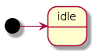
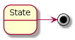
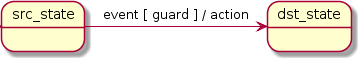
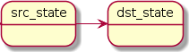

# [Boost::ext].SML

## Introduction

| [Boost::ext].SML (State Machine Language/Lite/Library) |
| - |
| 你的可扩展的 C++14 单头文件无依赖状态机库 |

### UML State Machine

- [State Machine](https://en.wikipedia.org/wiki/UML_state_machine)
- [UML2 Specification](https://www.omg.org/spec/UML/2.5)
- [Boost.MSM - eUML](https://www.boost.org/doc/libs/1_60_0/libs/msm/doc/HTML/ch03s04.html)

### Do I need a State Machine?

状态机设计模式能帮助您避免创建和维护"面条式代码"（代码逻辑混乱、结构不清晰）。

```c++
void some_function() {
    ...
    if ((is_running && !is_jumping) || just_started) {
        ...
    } else if (is_boss_level && extra_feature_enabled && !ab_test) {
        ...
    } else {
        ...
    }
}
```

若上述代码与您的代码库有相似之处，或您希望避免此类问题，[Boost].SML 可能会非常适合您！

### Why [Boost].SML?

- [Boost.MSM - eUML](https://www.boost.org/doc/libs/1_60_0/libs/msm/doc/HTML/ch03s04.html) 非常出色，但它有一些重大的限制，使其在大规模项目中无法使用；因此，[Boost].SML 试图解决这些问题。

### Problems with Boost.MSM - eUML

- 长编译时间（详见[Performance](https://boost-ext.github.io/sml/overview.html#performance)）
- 庞大的二进制文件（详见[Performance](https://boost-ext.github.io/sml/overview.html#performance)）
- 基于过多的宏
- 长错误信息（详见[Error Messages](https://boost-ext.github.io/sml/overview.html#error-messages)）
- 有时难以跟踪，因为并非所有动作都在转换表中可见（例如初始状态、状态进入/退出动作）
- 动作/守卫需要大量模板代码（需要 fsm、事件、源状态、目标状态）
- 状态中的数据使得共享和封装变得更加困难（尽管符合 UML 标准）
- 松耦合设计难以实现
- 函数式编程模拟
- 复杂度高，初学者可能会感到不知所措
- 大量依赖 Boost

### [Boost].SML design goals

- ### 保留 Boost.MSM - eUML 的优点

- 保留 Boost.MSM - eUML 的优点
    - 性能（详见[Performance](https://boost-ext.github.io/sml/overview.html#performance)）
    - 内存使用（详见[Performance](https://boost-ext.github.io/sml/overview.html#performance)）
    - eUML DSL（`src_state + event [guard] / action -> dst_state`）
    - 符合 UML 标准（尽可能符合）

- 消除 Boost.MSM - eUML 的问题
    - 编译时间（详见[Performance](https://boost-ext.github.io/sml/overview.html#performance)）
    - 二进制文件大小（详见[Performance](https://boost-ext.github.io/sml/overview.html#performance)）
    - 通过消除较少使用的功能减少复杂性
    - 简短且信息丰富的错误信息（详见[Error Messages](https://boost-ext.github.io/sml/overview.html#error-messages)）
    - 减少模板代码/不使用宏（详见 [Hello World](https://boost-ext.github.io/sml/examples.html#hello-world)）
    - 通过在转换表中包含所有动作来提高可见性（详见[状态](https://boost-ext.github.io/sml/examples.html#states)）
    - 允许松耦合设计（详见[依赖注入](https://boost-ext.github.io/sml/examples.html#dependency-injection)）
    - 使用 lambda 表达式支持函数式编程（详见[动作/守卫](https://boost-ext.github.io/sml/examples.html#action-guards)）
    - 无依赖项 / 一个头文件（2k LOC）

### What 'lite' implies?

- **保证快速编译时间**
- **最大化性能**
- **无依赖项**
- **易于使用/直观**

### Supported UML features

- 转换 / 匿名转换 / 内部转换 / 自转换 / 无转换（详见 [Transitions](https://boost-ext.github.io/sml/examples.html#transitions)，[Events](https://boost-ext.github.io/sml/examples.html#events)）
- 动作 / 守卫（详见 [Action/Guards](https://boost-ext.github.io/sml/examples.html#action-guards)）
- 状态进入 / 退出动作（详见 [States](https://boost-ext.github.io/sml/examples.html#states)）
- 正交区域（详见 [Orthogonal Regions](https://boost-ext.github.io/sml/examples.html#orthogonal-regions)）
- 子状态机 / 复合状态机（详见 [Composite](https://boost-ext.github.io/sml/examples.html#composite)）
- 历史（详见 [History](https://boost-ext.github.io/sml/examples.html#history)）
- 延迟 / 处理（详见 [Defer/Process](https://boost-ext.github.io/sml/examples.html#deferprocess)）

### Additional features

- 日志记录（详见 [Logging](https://boost-ext.github.io/sml/examples.html#logging)）
- 测试（详见 [Testing](https://boost-ext.github.io/sml/examples.html#testing)）
- 运行时调度器（详见 [Runtime Dispatcher](https://boost-ext.github.io/sml/examples.html#runtime-dispatcher)）
- 依赖注入集成（详见 [Dependency Injection](https://boost-ext.github.io/sml/examples.html#dependency-injection)）

## Overview

### Quick Start

- 获取 boost/sml.hpp 头文件

```c++
wget https://raw.githubusercontent.com/boost-ext/sml/master/include/boost/sml.hpp
```

- 包含该头文件并定义 `sml` 命令空间别名

```c++
#include "boost/sml.hpp"
namespace sml = boost::sml;
```

- 使用C++14标准进行编译

```shell
$CXX -std=c++14 ... | cl /std:c++14 ...
```

- 运行测试

```shell
git clone https://github.com/boost-ext/sml && cd sml && make test
```

### Dependencies

- 无需外部依赖项（既不需要 STL 也不需要 Boost）

### Supported/Tested compilers

- Clang-3.4+
- GCC-5.2+
- MSVC-2015
  - 已知限制

```c++
  "src_state"_s + event<e> = "dst_state"_s                                // Error on MSVC-2015, Ok on GCC-5+, Clang-3.4+
  state<class src_state> + event<e> = state<class dst_state>              // Ok on all supported compilers
```

```c++
  const auto guard1 = [] { return true; }
  state<class a> + event<e> [ guard1 ] / [](const auto& event) {}          // Error on MSVC-2015, Ok on GCC-5+, Clang-3.4+

  const auto guard2 = [] -> bool { return true; }
  state<class a> + event<e> [ guard2 ] / [](const auto& event) -> void {}  // Ok on all supported compilers
```

### Configuration

| Macro | 描述 |
| - | - |
| BOOST_SML_VERSION | [Boost].SML 的当前版本（例 1'0'0） |

### Exception Safety

- [Boost].SML 内部不使用异常，因此可以使用 `-fno-exceptions` 编译。
- 如果守卫抛出异常，状态机将保持在当前状态。
- 如果动作抛出异常，状态机将进入新的状态。
- 异常可以通过转换表中的 `exception` 事件捕获。详见 [Error handling](https://boost-ext.github.io/sml/tutorial.html#8-error-handling)。

### Thread Safety

- [Boost].SML 默认情况下不是线程安全的。
- 可以通过在创建状态机时定义 thread_safe 策略来启用线程安全性。需要提供锁类型。

```c++
sml::sm<example, sml::thread_safe<std::recursive_mutex>> sm;
sm.process_event(event{}); // thread safe call
```

- 见 [Thread Safe Policy](https://boost-ext.github.io/sml/user_guide.html#policies)

### Design


| 组件 | 描述 |
| - | - |
| [Front-End] | 转换表领域特定语言（DSL） |
| [Back-End] | 状态机实现细节 |

### Error messages

*不可配置*

```c++
// $CXX -std=c++14 not_configurable.cpp
#include <boost/sml.hpp>

namespace sml = boost::sml;

struct e1 {};

struct not_configurable {
  auto setup() const noexcept {  // should be configure
    using namespace sml;
    return make_transition_table(
        *"idle"_s + event<e1> = X
    );
  }
};

int main() {
  sml::sm<not_configurable> sm;
  (void)sm;
}
```

*不可调用*

```c++
// $CXX -std=c++14 not_callable.cpp
#include <boost/sml.hpp>

namespace sml = boost::sml;

struct e1 {};

struct im_not_callable {};

struct not_callable {
  auto operator()() const noexcept {
    using namespace sml;
    return make_transition_table(
        *"idle"_s + event<e1> / im_not_callable{} = X // not callable
    );
  }
};

int main() {}
```

*不可转换*

```c++
// $CXX -std=c++14 not_transitional.cpp
#include <boost/sml.hpp>

namespace sml = boost::sml;

struct e1 {};
struct im_not_a_transition {};

struct not_transitional {
  auto operator()() const noexcept {
    using namespace sml;
    return make_transition_table(
        *"idle"_s + event<e1> = X
      , im_not_a_transition{} // not transitional
    );
  }
};

int main() {}
```

*不可调度*

```c++
// $CXX -std=c++14 not_dispatchable.cpp
#include <boost/sml.hpp>

namespace sml = boost::sml;

struct runtime_event {};
struct e1 {};  // missing id

struct not_dispatchable {
  auto operator()() const noexcept {
    using namespace sml;
    return make_transition_table(
        *"idle"_s + event<e1> = X
    );
  }
};

int main() {
  sml::sm<not_dispatchable> sm;
  sml::make_dispatch_table<runtime_event, 1, 10>(sm);
}
```

## Features/Benchmarks

### Features

*Overview*

| 库 | [Boost].SML | Boost.MSM-eUML | Boost.Statechart |
| - | - | - | - |
| 标准 | C++14 | C++98/03 | C++98/03 |
| 版本 | 1.0.1 | 1.61 | 1.61 |
| 许可 | Boost 1.0 | Boost 1.0 | Boost 1.0 |
| 连接 | header only | header only | header only |

*细节*

| 库 | [Boost].SML | Boost.MSM-eUML | Boost.Statechart |
| - | - | - | - |
| UML | 2.0 | 2.0 | 1.5 |
| RTTI | - | - | ✓ |
| 异常 | - | - | ✓ |
| 内存分配 | - | - | ✓ |

*UML 特性*

| 库 | [Boost].SML | Boost.MSM-eUML | Boost.Statechart |
| - | - | - | - |
| 转换 | ✓ | ✓ | ✓ |
| 匿名转换 | ✓ | ✓ | ✓ |
| 内部转换 | ✓ | ✓ | ✓ |
| Local transitions | - | - | - |
| 状态进入/离开 | ✓ | ✓ | ✓ |
| 守卫 | ✓ | ✓ | ✓ |
| 动作 | ✓ | ✓ | ✓ |
| 事件推迟 | ~ | ✓ | ✓ |
| 错误处理 | ✓ | ✓ | ✓ |
| 初始化状态 | ✓ | ✓ | ✓ |
| 终止状态 | ✓ | ✓ | ✓ |
| 显式进入 | ✓ | ✓ | ✓ |
| 显式离开 | - | ✓ | ✓ |
| 分叉 | - | ✓ | - |
| 正交区域 | ✓ | ✓ | ✓ |
| 子状态机 / 复合状态机 | ✓ | ✓ | ✓ |
| 浅层历史 | ✓ | ✓ | ✓ |
| 深层历史 | ~ | ~ | ✓ |

*Non-UML 特性*

| 库 | [Boost].SML | Boost.MSM-eUML | Boost.Statechart |
| - | - | - | - |
| 任意事件 | - | ✓ | - |
| 标志位 | - | ✓ | - |
| 中断状态 | - | ✓ | - |
| 状态访问器 | ✓ | ✓ | ✓ |
| 序列化 | - | ✓ | - |
| 调度器 | ✓ | - | - |
| 异步状态机 | - | - | ✓ |

### Benchmarks

| 测试 | CXXFLAGS | 事件数 | 状态数 | 转换数 | 处理事件数 |
| - | - | - | - | - | - |
| [Simple Test](https://github.com/boost-ext/sml/tree/master/benchmark/simple) | -O2 -s, /Ox | 6 | 5 | 12 | 1'000'000 |

| Clang-3.7 | [Boost].SML | [Boost.MSM-eUML] | [Boost.MSM3-eUML2] | [Boost.Statechart] |
| - | - | - | - | - |
| 编译时间 | 0.144s | 3.855s | 8.699s | 1.028s |
| 运行时间 | 15ms | 17ms | 17ms | 1232ms |
| 内存占用 | 1b | 32b | 28b | 200b |
| 可执行文件大小 | 11K | 91K | 15K + boost_system | 59K

| GCC-5.2 | [Boost].SML | [Boost.MSM-eUML] | [Boost.MSM3-eUML2] | [Boost.Statechart] |
| - | - | - | - | - |
| 编译时间 | 0.175s | 7.879s | 17.101s | 1.790s |
| 运行时间 | 15ms | 19ms | 21ms | 929ms |
| 内存占用 | 1b | 32b | 28b | 224b |
| 可执行文件大小 | 11K | 67K | 15K + boost_system  | 63K |

| MSVC-2015 | [Boost].SML | [Boost.MSM-eUML] | [Boost.MSM3-eUML2] | [Boost.Statechart] |
| - | - | - | - | - |
| 编译时间 | 0.450s | | | |
| 运行时间 | 27ms | | | |
| 内存占用 | 16b | | | |
| 可执行文件大小 | 206K | | | |

| 测试 | CXXFLAGS | 事件数 | 状态数 | 转换数 | 处理事件数 |
| - | - | - | - | - | - |
| [Composite Test](https://github.com/boost-ext/sml/tree/master/benchmark/composite) | -O2 -s, /Ox | 8 | 5 + 3 | 12 + 4 | 1'000 * 1'000 |

| Clang-3.7 | [Boost].SML | [Boost.MSM-eUML] | [Boost.MSM3-eUML2] | [Boost.Statechart] |
| - | - | - | - | - |
| 编译时间 | 0.184s | 4.526s | 10.599s | 1.293s |
| 运行时间 | 10ms | 14ms | 10ms | 491ms |
| 内存占用 | 2b | 60b | 52b | 200b |
| 可执行文件大小 | 15K | 111K | 15K + boost_system | 83K |

| GCC-5.2   | [Boost].SML | [Boost.MSM-eUML] | [Boost.MSM3-eUML2] | [Boost.Statechart] |
| - | - | - | - | - |
| 编译时间 | 0.248s | 9.363s | 23.404s | 2.037s |
| 运行时间 | 9ms | 13ms | 12ms | 404ms
| 内存占用 | 2b | 60b | 52b | 224b
| 可执行文件大小 | 12K | 91K | 15K + boost_system  | 83K

| MSVC-2015 | [Boost].SML | [Boost.MSM-eUML] | [Boost.MSM3-eUML2] | [Boost.Statechart] |
| - | - | - | - | - |
| 编译时间 | 0.599s | | | |
| 运行时间 | 21ms | | | |
| 内存占用 | 23b | | | |
| 可执行文件大小 | 224K | | | |

| 测试 | CXXFLAGS | 事件数 | 状态数 | 转换数 | 处理事件数 |
| - | - | - | - | - | - |
| [Complex Test](https://github.com/boost-ext/sml/tree/master/benchmark/complex) | -O2 -s, /Ox | 50 | 50 | 50 | 1'000'000 |

| Clang-3.7 | [Boost].SML | [Boost.MSM-eUML] | [Boost.MSM3-eUML2] | [Boost.Statechart] |
| - | - | - | - | - |
| 编译时间 | 0.582s | 1m15.935s | 43.341s | 3.661s |
| 运行时间 | 69ms | 81ms | 78ms | 6221ms |
| 内存占用 | 1b | 120b | 72b | 200b |
| 可执行文件大小 | 35K | 611K  | 31K + boost_system | 343K |

| GCC-5.2   | [Boost].SML | [Boost.MSM-eUML] | [Boost.MSM3-eUML2] | [Boost.Statechart] |
| - | - | - | - | - |
| 编译时间 | 0.816s | 52.238s | 1m41.045s | 4.997s |
| 运行时间 | 72ms | 77ms | 91ms | 5520ms |
| 内存占用 | 1b | 120b | 72b | 224b |
| 可执行文件大小 | 35K | 271K |  47K + boost_system | 215K |

| MSVC-2015 | [Boost].SML | [Boost.MSM-eUML] | [Boost.MSM3-eUML2] | [Boost.Statechart] |
| - | - | - | - | - |
| 编译时间 | 0.891s | | | |
| 运行时间 | 166ms | | | |
| 内存占用 | 104b | | | |
| 可执行文件大小 | 224K | | | |

| Test | | ---- | |[Header Test](https://github.com/boost-ext/sml/tree/master/benchmark/header)|

| Clang-3.7 | [Boost].SML | [Boost.MSM-eUML] | [Boost.MSM3-eUML2] | [Boost.Statechart] |
| - | - | - | - | - |
| 编译时间 | 0.060s | 2.072s | 2.504s | 0.552s

| GCC-5.2   | [Boost].SML | [Boost.MSM-eUML] | [Boost.MSM3-eUML2] | [Boost.Statechart] |
| - | - | - | - | - |
| 编译时间 | 0.073s | 3.197s | 3.986s | 0.704s

| MSVC-2015 | [Boost].SML | [Boost.MSM-eUML] | [Boost.MSM3-eUML2] | [Boost.Statechart] |
| - | - | - | - | - |
| 编译时间 | 0.182s | | | |

- 运行基准测试

```shell
cd benchmark && make # make benchmark_simple benchmark_composite benchmark_complex
```

## Tutorial

### 0. Read Boost.MSM - eUML documentation

- [Boost.MSM - UML Short Guide](https://www.boost.org/doc/libs/1_60_0/libs/msm/doc/HTML/ch02.html)
- [Boost.MSM - eUML Documentation](https://www.boost.org/doc/libs/1_60_0/libs/msm/doc/HTML/ch03s04.html)

### 1. Create events and states

状态机由有限数量的状态和转换组成，这些转换通过事件触发。

事件只是一个唯一的类型，它将由状态机处理。

```c++
struct my_event { ... };
```

你也可以创建事件实例，以简化转换表的表示。

```c++
auto event = sml::event<my_event>;
```

如果你恰好有 Clang/GCC 编译器，你可以即时创建一个事件。

```c++
using namespace sml;
auto event  = "event"_e;
```

然而，这样的事件不会存储任何数据。

状态可以在状态机进入或离开状态时执行进入/退出行为，并表示状态机流程的当前位置。

可以使用如下代码片段来创建一个状态。

```c++
auto idle = sml::state<class idle>;
```

如果你恰好有Clang/GCC编译器，你可以即时创建一个状态。

```c++
using namespace sml;
auto state  = "idle"_s;
```

然而，请注意上述解决方案是 Clang/GCC 的非标准扩展。

`SML` 状态不能包含数据，因为数据是直接注入到守卫/动作中的。

一个状态机本身可能就是一个状态。

```c++
sml::state<state_machine> composite;
```

`SML` 支持终止状态，这会停止事件的处理。它由 `X` 定义。

```c++
"state"_s = X;
```

状态也可以被打印输出。

```c++
assert(string("idle") == "idle"_s.c_str());
```


### 2. Create guards and actions

守卫和动作是可调用对象，它们将由状态机执行，以验证是否应进行转换及后续的动作。

守卫必须返回布尔值。

```c++
auto guard1 = [] {
  return true;
};

auto guard2 = [](int, double) { // guard with dependencies
  return true;
};

auto guard3 = [](int, auto event, double) { // guard with an event and dependencies
  return true;
};

struct guard4 {
    bool operator()() const noexcept {
        return true;
    }
};
```

动作必须不返回值。

```c++
auto action1 = [] { };
auto action2 = [](int, double) { }; // action with dependencies
auto action3 = [](int, auto event, double) { }; // action with an event and dependencies
struct action4 {
    void operator()() noexcept { }
};
```

### 3. Create a transition table

当我们有了状态和事件后，我们最终可以创建一个表示转换的转换表。

`SML` 使用类似 eUML 的领域特定语言（DSL），以便尽可能接近 UML 设计。

#### 转换表 DSL

- 后缀表示法

| Expression | Description |
| - | - |
| state + event [ guard ] | internal transition on event e when guard |
| src_state / [] {} = dst_state | anonymous transition with action |
| src_state / [] {} = src_state | self transition (calls on_exit/on_entry) |
| src_state + event = dst_state | external transition on event e without guard or action |
| src_state + event [ guard ] / action = dst_state | transition from src_state to dst_state on event e with guard and action |
| src_state + event [ guard && (![]{return true;} && guard2) ] / (action, action2, []{}) = dst_state | transition from src_state to dst_state on event e with guard and action |

- 前缀表示法

| Expression | Description |
| - | - |
| state + event [ guard ] | internal transition on event e when guard |
| dst_state <= src_state / [] {} | anonymous transition with action |
| src_state <= src_state / [] {} | self transition (calls on_exit/on_entry) |
| dst_state <= src_state + event | external transition on event e without guard or action |
| dst_state <= src_state + event [ guard ] / action | transition from src_state to dst_state on event e with guard and action |
| dst_state <= src_state + event [ guard && (![]{return true;} && guard2) ] / (action, action2, []{}) | transition from src_state to dst_state on event e with guard and action |

#### 转换流程

```
src_state + event [ guard ] / action = dst_state
                                     ^
                                     |
                                     |
                                    1. src_state + on_exit
                                    2. dst_state + on_entry
```

为了创建一个转换表，提供了 `make_transition_table` 函数。

```c++
using namespace sml; // Postfix Notation

make_transition_table(
 *"src_state"_s + event<my_event> [ guard ] / action = "dst_state"_s
, "dst_state"_s + "other_event"_e = X
);
```

或

```c++
using namespace sml; // Prefix Notation

make_transition_table(
  "dst_state"_s <= *"src_state"_s + event<my_event> [ guard ] / action
, X             <= "dst_state"_s  + "other_event"_e
);
```

### 4. Set initial states

初始状态告诉状态机从哪里开始。可以通过在状态前加上 `*` 来设置初始状态。

```c++
using namespace sml;
make_transition_table(
 *"src_state"_s + event<my_event> [ guard ] / action = "dst_state"_s,
  "dst_state"_s + event<game_over> = X
);
```

初始/当前状态可以由状态机记住，这样每当它重新进入时，最后一个活动状态将被重新激活。为了启用历史功能，只需在声明初始状态时将 `*` 替换为带有后缀 `(H)`。

```c++
using namespace sml;
make_transition_table(
  "src_state"_s(H) + event<my_event> [ guard ] / action = "dst_state"_s,
  "dst_state"_s    + event<game_over>                   = X
);
```

你可以有多个初始状态。所有初始状态将以伪并行的方式执行。这种状态被称为 `Orthogonal regions`（正交区域）。

```c++
using namespace sml;
make_transition_table(
 *"region_1"_s   + event<my_event1> [ guard ] / action = "dst_state1"_s,
  "dst_state1"_s + event<game_over> = X,

 *"region_2"_s   + event<my_event2> [ guard ] / action = "dst_state2"_s,
  "dst_state2"_s + event<game_over> = X
);
```

### 5. Create a state machine

状态机是保存当前状态和处理事件的转换表的抽象。要创建一个状态机，我们必须添加一个转换表。

```c++
class example {
public:
  auto operator()() {
    using namespace sml;
    return make_transition_table(
     *"src_state"_s + event<my_event> [ guard ] / action = "dst_state"_s,
      "dst_state"_s + event<game_over> = X
    );
  }
};
```

配置好转换表后，我们可以创建一个状态机。

```c++
sml::sm<example> sm;
```

状态机构造函数为动作和守卫提供所需的依赖项。

```c++
                            /---- event (injected from process_event)
                            |
auto guard = [](double d, auto event) { return true; }
                   |
                   \--------\
                            |
auto action = [](int i){}   |
                  |         |
                  |         |
                  \-\   /---/
                    |   |
sml::sm<example> s{42, 87.0};

sml::sm<example> s{87.0, 42}; // order in which parameters have to passed is not specificied
```

传递和维护大量的依赖项可能会很繁琐，并且需要大量的模板代码。为了避免这种情况，可以使用依赖注入库来自动化这个过程。例如，我们可以使用 [ext Boost.DI](https://github.com/boost-ext/di)。

```c++
auto injector = di::make_injector(
    di::bind<>.to(42)
  , di::bind<interface>.to<implementation>()
);

auto sm = injector.create<sm<example>>();
sm.process_event(e1{});
```

### 6. Process events

状态机是一个简单的实体。它的主要目的是处理事件。为了实现这一点，可以使用 `process_event` 方法。

```c++
sml::sm<example> sm;

sm.process_event(my_event{}); // handled
sm.process_event(int{}); // not handled -> unexpected_event<int>
```

事件处理也可以在转换表中触发。

```c++
using namespace sml;
return make_transition_table(
 *"s1"_s + event<my_event> / process(other_event{}) = "s2"_s,
  "s2"_s + event<other_event> = X
);
```

`SML` 还提供了一种方法，可以将动态创建的事件分发到状态机中。

```c++
struct game_over {
  static constexpr auto id = SDL_QUIT;
  // explicit game_over(const SDL_Event&) noexcept; // optional, when defined runtime event will be passed
};
enum SDL_EventType { SDL_FIRSTEVENT = 0, SDL_QUIT, SDL_KEYUP, SDL_MOUSEBUTTONUP, SDL_LASTEVENT };
//create dispatcher from state machine and range of events
auto dispatch_event = sml::utility::make_dispatch_table<SDL_Event, SDL_FIRSTEVENT, SDL_LASTEVENT>(sm);
SDL_Event event{SDL_QUIT};
dispatch_event(event, event.type); // will call sm.process(game_over{});
```

### 8. Handle errors

当状态机无法处理给定事件时，会触发 `unexpected_event`。

```c++
make_transition_table(
 *"src_state"_s + event<my_event> [ guard ] / action = "dst_state"_s
, "src_state"_s + unexpected_event<some_event> = X
);
```

任何意外事件都可以通过使用 `unexpected_event<_>` 进行处理。

```c++
make_transition_table(
 *"src_state"_s + event<my_event> [ guard ] / action = "dst_state"_s
, "src_state"_s + unexpected_event<some_event> / [] { std::cout << "unexpected 'some_event' << '\n'; "}
, "src_state"_s + unexpected_event<_> = X // any event
);
```

在这种情况下...

```c++
sm.process_event(some_event{}); // "unexpected 'some_event'
sm.process_event(int{}); // terminate
assert(sm.is(X));
```

通常，创建一个额外的正交区域来覆盖这种情况是很有用的。这样，导致意外事件的状态就无关紧要了。

```c++
make_transition_table(
 *"idle"_s + event<my_event> [ guard ] / action = "s1"_s
, "s1"_s + event<other_event> [ guard ] / action = "s2"_s
, "s2"_s + event<yet_another_event> [ guard ] / action = X
// terminate (=X) the Machine or reset to another state
,*"error_handler"_s + unexpected_event<some_event> = X
);
```

我们可以通过某种方式检查状态机是否处于终止状态。

```c++
assert(sm.is(sml::X)); // doesn't matter how many regions there are
```

当启用异常（项目不是用 `-fno-exceptions` 编译的）时，可以使用 `exception<name>` 语法捕获异常。异常处理程序将按照它们定义的顺序进行处理，并且 `exception<>` 可以用于捕获任何异常（等同于 `catch (...)`）。请注意，如果在转换表中没有定义异常处理程序，状态机将不会处理该异常。

```c++
make_transition_table(
 *"idle"_s + event<event> / [] { throw std::runtime_error{"error"}; }
,*"error_handler"_s + exception<std::runtime_error> = X
, "error_handler"_s + exception<std::logic_error> = X
, "error_handler"_s + exception<> / [] { cleanup...; } = X // any exception
);
```

### 9. Test it

有时验证状态机是否处于特定状态非常有用，例如，检查我们是否处于终止状态。我们可以使用 `SML` 的 `is` 或 `visit_current_states` 功能来实现这一点。

```c++
sml::sm<example> sm;
sm.process_event(my_event{});
assert(sm.is(X)); // is(X, s1, ...) when you have orthogonal regions

//or

sm.visit_current_states([](auto state) { std::cout << state.c_str() << std::endl; });
```

除此之外，`SML` 提供了测试设施来整体检查状态机。可以使用 `testing::sm` 中的 `set_current_states` 方法将状态机设置为请求的状态。

```c++
sml::sm<example, sml::testing> sm{fake_data...};
sm.set_current_states("s3"_s); // set_current_states("s3"_s, "s1"_s, ...) for orthogonal regions
sm.process_event(event{});
assert(sm.is(X));
```

### 10. Debug it

`SML` 提供了日志记录功能以检查状态机的流程。要启用日志记录，可以使用（Logger Policy）（user_guide.md#policies）。

```c++
struct my_logger {
  template <class SM, class TEvent>
  void log_process_event(const TEvent&) {
    printf("[%s][process_event] %s\n", sml::aux::get_type_name<SM>(), sml::aux::get_type_name<TEvent>());
  }

  template <class SM, class TGuard, class TEvent>
  void log_guard(const TGuard&, const TEvent&, bool result) {
    printf("[%s][guard] %s %s %s\n", sml::aux::get_type_name<SM>(), sml::aux::get_type_name<TGuard>(),
           sml::aux::get_type_name<TEvent>(), (result ? "[OK]" : "[Reject]"));
  }

  template <class SM, class TAction, class TEvent>
  void log_action(const TAction&, const TEvent&) {
    printf("[%s][action] %s %s\n", sml::aux::get_type_name<SM>(), sml::aux::get_type_name<TAction>(),
           sml::aux::get_type_name<TEvent>());
  }

  template <class SM, class TSrcState, class TDstState>
  void log_state_change(const TSrcState& src, const TDstState& dst) {
    printf("[%s][transition] %s -> %s\n", sml::aux::get_type_name<SM>(), src.c_str(), dst.c_str());
  }
};

my_logger logger;
sml::sm<logging, sml::logger<my_logger>> sm{logger};
sm.process_event(my_event{}); // will call logger appropriately
```

## UML vs SML

### 初始伪状态（Initial Pseudostate）

- 一切开始的入口点

| UML | SML |
| - | - |
|  | `* "idle"_s` |

### 终止伪状态（Terminate Pseudostate）

- 终止状态机的状态（无法从中逃脱）

| UML | SML |
| - | - |
|  | `sml::X` |

### 外部转换（External Transition）

- 有条件地更新当前状态。

| UML | SML |
| - | - |
|  | `"src_state"_s + event [ guard ] / action = "dst_state"_s` |

### 匿名转换（Anonymous Transition）

- 没有触发器（事件）的转换。

| UML | SML |
| - | - |
|  | `"src_state"_s = "dst_state"_s` |

## User Guide

### transitional [concept]

***头文件***

```c++
#include <boost/sml.hpp>
```

***说明***

转换的要求。

***概要***

```c++
template <class T>
concept bool transitional() {
  return requires(T transition) {
    typename T::src_state;
    typename T::dst_state;
    typename T::event;
    typename T::deps;
    T::initial;
    T::history;
    { transition.execute() } -> bool;
  }
};
```

***语法***

```c++
transitional<T>
```

***示例***

```c++
using namespace sml;

{
auto transition = ("idle"_s = X); // Postfix Notation
static_assert(transitional<decltype(transition)>::value);
}

{
auto transition = (X <= "idle"_s); // Prefix Notation
static_assert(transitional<decltype(transition)>::value);
}
```

### configurable [concept]

***头文件***

```c++
#include <boost/sml.hpp>
```

***说明***

状态机的要求。

***概要***

```c++
template <class SM>
concept bool configurable() {
  return requires(SM sm) {
    { sm.operator()() };
  }
};
```

***语法***

```c++
configurable<SM>
```

***示例***

```c++
class example {
  auto operator()() const noexcept {
    return make_transition_table();
  }
};

static_assert(configurable<example>::value);
```

### callable [concept]

***头文件***

```c++
#include <boost/sml.hpp>
```

***说明***

动作和守卫的要求。

***概要***

```c++
template <class TResult, class T>
concept bool callable() {
  return requires(T object) {
    { object(...) } -> TResult;
  }
}
```

***语法***

```c++
callable<SM>
```

***示例***

```c++
auto guard = [] { return true; };
auto action = [] { };

static_assert(callable<bool, decltype(guard)>::value);
static_assert(callable<void, decltype(action)>::value);
```

### dispatchable [concept]

***头文件***

```c++
#include <boost/sml.hpp>
```

***说明***

调度表的要求。

***概要***

```c++
template <class TDynamicEvent, TEvent>
concept bool dispatchable() {
  return requires(T) {
    typename TEvent::id;
    { TEvent(declval<TDynamicEvent>()) };
  }
};
```

***语法***

```c++
dispatchable<SM>
```

***示例***

```c++
struct runtime_event { };

struct event1 {
  static constexpr auto id = 1;
};

struct event2 {
  static constexpr auto id = 2;
  explicit event2(const runtime_event&) {}
};

static_assert(dispatchable<runtime_event, event1>::value);
static_assert(dispatchable<runtime_event, event2>::value);
```

### state [core]

***头文件***

```c++
#include <boost/sml.hpp>
```

***说明***

表示状态机的状态。

***概要***

```c++
template<class TState> // no requirements, TState may be a state machine
class state {
public:
  initial operator*() const noexcept; // no requirements

  template <class T> // no requirements
  auto operator<=(const T &) const noexcept;

  template <class T> // no requirements
  auto operator=(const T &) const noexcept;

  template <class T> // no requirements
  auto operator+(const T &) const noexcept;

  template <class T> requires callable<bool, T>
  auto operator[](const T) const noexcept;

  template <class T> requires callable<void, T>
  auto operator/(const T &t) const noexcept;

  const char* c_str() noexcept;
};

template <class T, T... Chrs>
state<unspecified> operator""_s() noexcept;

// predefined states
state<unspecified> X;
```

***要求***

- callable

***语法***

```c++
state<T>{}
```

***示例***

```c++
auto idle = state<class idle>;
auto idle = "idle"_s;

auto initial_state = *idle;
auto history_state = idle(H);
auto terminate_state = X;
```

### event [core]

***头文件***

```c++
#include <boost/sml.hpp>
```

***说明***

表示状态机的事件。

***概要***

```c++
template<TEvent> // no requirements
class event {
public:
  template <class T> requires callable<bool, T>
  auto operator[](const T &) const noexcept;

  template <class T> requires callable<void, T>
  auto operator/(const T &t) const noexcept;
};

template<class TEvent>
event<TEvent> event{};

// predefined events
auto on_entry = event<unspecified>;
auto on_exit = event<unspecified>;

template<class TEvent> unexpected_event{};
template<class T> exception{};
```

***要求***

- callable

***语法***

```c++
event<T>
```

***示例***

```c++
auto my_int_event = event<int>;
```

### make_transition_table [state machine]

***头文件***

```c++
#include <boost/sml.hpp>
```

***说明***

创建一个转换表。

***概要***

```c++
template <class... Ts> requires transitional<Ts>...
auto make_transition_table(Ts...) noexcept;
```

***要求***

- transitional

***语法***

```c++
make_transition_table(transitions...);
```

***示例***

```c++
auto transition_table_postfix_notation = make_transition_table(
  *"idle_s" + event<int> / [] {} = X
);

auto transition_table_prefix_notation = make_transition_table(
  X <= *"idle_s" + event<int> / [] {}
);

class example {
public:
  auto operator()() const noexcept {
    return make_transition_table();
  }
};
```

### sm [state machine]

***头文件***

```c++
#include <boost/sml.hpp>
```

***说明***

创建一个状态机。

***概要***

```c++
template<class T> requires configurable<T>
class sm {
public:
  using states = unspecified; // unique list of states
  using events = unspecified; // unique list of events which can be handled by the State Machine
  using transitions = unspecified; // list of transitions

  sm(sm &&) = default;
  sm(const sm &) = delete;
  sm &operator=(const sm &) = delete;

  template <class... TDeps> requires is_base_of<TDeps, dependencies>...
  sm(TDeps&&...) noexcept;

  template<class TEvent> // no requirements
  bool process_event(const TEvent&)

  template <class TVisitor> requires callable<void, TVisitor>
  void visit_current_states(const TVisitor &) const noexcept(noexcept(visitor(state{})));

  template <class TState>
  bool is(const state<TState> &) const noexcept;

  template <class... TStates> requires sizeof...(TStates) == number_of_initial_states
  bool is(const state<TStates> &...) const noexcept;
};
```

| 表达式 | 要求 | 说明 | 返回值 |
| - | - | - | - |
| `TDeps...	` | is_base_of dependencies | 构造器 |  |
| `process_event<TEvent>	` | - | 处理事件 `TEvent` | 如果已处理则返回 true，否则返回 false |
| `visit_current_states<TVisitor>	` | callable | 访问当前状态 | - |
| `is<TState>	` | - | 验证当前状态中是否有任何一个等于 `TState` | 当任意当前状态匹配 `TState` 时返回 true，否则返回 false |
| `is<TStates...>	` | size of TStates... equals number of initial states | 验证所有当前状态是否都匹配 `TStates...` | 当所有状态都匹配 `TState...` 时返回 true，否则返回 false |

***语法***

```c++
sml::sm<T>{...};
sm.process_event(TEvent{});
sm.visit_current_states([](auto state){});
sm.is(X);
sm.is(s1, s2);
```

***示例***

```c++
struct my_event {};

class example {
public:
  auto operator()() const noexcept {
    using namespace sml;
    return make_transition_table(
      *"idle"_s + event<my_event> / [](int i) { std::cout << i << std::endl; } = X
    );
  }
};

sml::sm<example> sm{42};
assert(sm.is("idle"_s));
sm.process_event(int{}); // no handled, will call unexpected_event<int>
sm.process_event(my_event{}); // handled
assert(sm.is(X));

sm.visit_current_states([](auto state) { std::cout << state.c_str() << std::endl; });
```

### policies [state machine]

***头文件***

```c++
#include <boost/sml.hpp>
```

***说明***

额外的状态机配置。

***概要***

```c++
thread_safe<Lockable>
logger<Loggable>
```

| 表达式 | 要求 | 说明 | 示例 |
| - | - | - | - |
| `Lockable` | `lock/unlock` | Lockable type | `std::mutex`, `std::recursive_mutex` |
| `Loggable` | `log_process_event/log_state_change/log_action/log_guard` | Loggable type | - |

***示例***

```c++
sml::sm<example, sml::thread_safe<std::recursive_mutex>> sm; // thread safe policy
sml::sm<example, sml::logger<my_logger>> sm; // logger policy
sml::sm<example, sml::thread_safe<std::recursive_mutex>, sml::logger<my_logger>> sm; // thread safe and logger policy
sml::sm<example, sml::logger<my_logger>, sml::thread_safe<std::recursive_mutex>> sm; // thread safe and logger policy
```

### testing::sm [testing]

***头文件***

```c++
#include <boost/sml/testing/state_machine.hpp>
```

***说明***

创建一个具有测试能力的状态机。

***概要***

```c++
namespace testing {
  template <class T>
  class sm : public sml::sm<T> {
   public:
    using sml::sm<T>::sm;

    template <class... TStates>
    void set_current_states(const detail::state<TStates> &...) noexcept;
  };
}
```

| 表达式 | 要求 | 说明 | 返回值 |
| - | - | - | - |
| `set_current_states<TStates...>` | - | 设置当前状态 |  |

***语法***

```c++
sml::testing::sm<T>{...};
sm.set_current_states("s1"_s);
```

***示例***

```c++
sml::testing::sm<T>{inject_fake_data...};
sm.set_current_states("s1"_s);
sm.process_event(TEvent{});
sm.is(X);
```

### make_dispatch_table [utility]

***头文件***

```c++
#include <boost/sml/utility/dispatch_table.hpp>
```

***说明***

创建一个调度表以处理运行时事件。

***概要***

```c++
namespace utility {
  template<class TEvent, int EventRangeBegin, int EventRangeBegin, class SM> requires dispatchable<TEvent, typename SM::events>
  callable<bool, (TEvent, int)> make_dispatch_table(sm<SM>&) noexcept;
}
```

***要求***

- dispatchable

***语法***

```c++
sml::utility::make_dispatch_table<T, 0, 10>(sm);
```

***示例***

```c++
struct runtime_event {
  int id = 0;
};
struct event1 {
  static constexpr auto id = 1;
  event1(const runtime_event &) {}
};

auto dispatch_event = sml::utility::make_dispatch_table<runtime_event, 1 /*min*/, 5 /*max*/>(sm);
dispatch_event(event, event.id);
```
