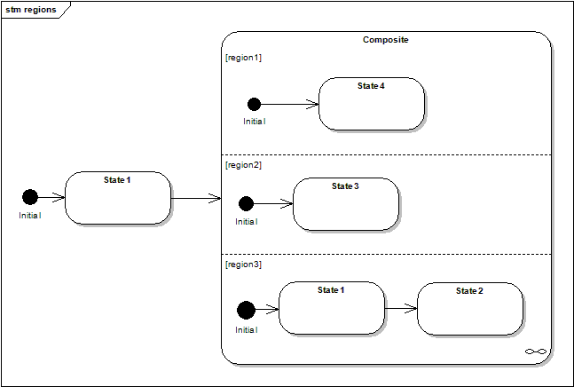
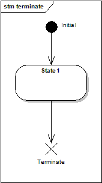
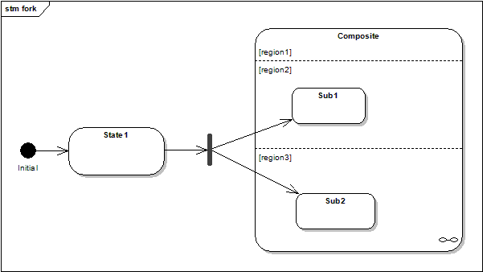
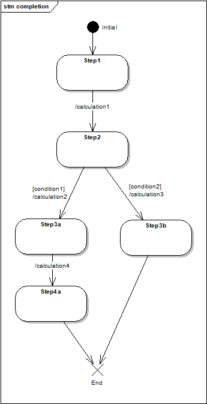

# UML Short Guide

## What are state machines?

状态机是一个事物生命周期的描述。它们描述了生命周期中的不同阶段、影响它的事件，以及当在特定阶段检测到特定事件时它会执行什么操作。状态机提供了事物动态行为的完整规范。

## Concepts

刚开始用状态机的方式思考可能会有点出乎意料，所以让我们快速浏览一下这些概念。

### State machine, state, transition, event

状态机是一个描述系统行为的具体模型。它由有限数量的状态和转换组成。

简单状态没有子状态。它可以包含数据、进入和退出行为以及延迟事件。可以为状态（或状态机）提供进入和退出行为（也称为动作），这些行为在每次进入或离开状态时都会执行，无论通过何种方式。状态还可以拥有内部转换，这些转换不会触发进入或退出行为。状态可以将事件标记为延迟处理。这意味着如果该状态处于激活状态，则该事件不能被处理，但必须保留下来。当下一次一个不延迟该事件的状态变为激活状态时，该事件将会被处理，就像它刚刚被触发一样。

转换是活动状态之间的切换，由事件触发。可以将动作和监护条件附加到转换上。当转换触发时执行动作，监护是一个首先执行的布尔操作，它可以通过返回 false 来阻止转换的发生。

初始状态标记状态机的第一个活动状态。它没有实际的存在，从它出发的转换也没有。

### Submachines, orthogonal regions, pseudostates

复合状态是一个包含一个区域或分解为两个或多个区域的状态。复合状态包含其自身的一组状态和区域。

子状态机是作为一个状态插入到另一个状态机中的状态机。同一个子状态机可以被多次插入。

正交区域是复合状态或子状态机的一部分，每个部分都有其自己的一组互斥的状态和转换。

UML 还定义了一些伪状态，这些被认为是建模的重要概念，但还不足以使其成为一级公民。终止伪状态会终止状态机的执行（MSM 对此处理略有不同。状态机不会被销毁，但不再进行进一步的事件处理）。

退出点伪状态会退出一个复合状态或子状态机，并强制终止所有包含区域中的执行。

入口点伪状态允许一种受控方式进入复合状态。具体来说，它将复合外部的转换连接到复合内部的转换。一个重要点是，此机制仅允许单个区域被进入。在上述图示中，在 region1 中，初始状态将会变为激活状态。

进入子状态机还有两种方法（除了显而易见且更常见的情况，即转换终止于子状态机，如在区域案例中所示）。显式进入意味着一个内部状态是转换的目标。与直接进入不同，不会进行尝试性的封装，并且只执行一个转换。显式退出是从子状态机内的一个状态到外部状态的转换（MSM不支持此功能）。我不建议使用显式进入或退出。

最后一个进入的可能性是使用分支（fork）。分支是进入一个或多个区域的显式进入方式。其他区域则再次通过其初始状态激活。

### History

UML定义了两种历史状态：浅历史（shallow history）和深历史（deep history）。浅历史是一个伪状态，代表子状态机最近的子状态。一个子状态机最多只能有一个浅历史。以历史伪状态为目标的转换等同于以最近的子状态为目标的转换。非常重要的是，只允许有一个转换从历史状态发出。深历史是递归重新激活最近子状态的子状态的浅历史。它用一个星号表示（圆圈内的 H*）。

历史状态并不是一个完全令人满意的概念。首先，只能有一个历史伪状态，并且只允许有一个转换从它发出。因此，它们与正交区域的兼容性不好，因为只有一个区域可以被“记住”。深历史状态甚至更糟糕，看起来像是最后一刻的添加。历史状态必须由一个转换激活，并且只允许有一个转换从它发出，那么如何为从深历史伪状态出发并指向子状态机最近子状态的转换建模呢？此外，它还不灵活，不接受新的历史类型。坦率地说，历史听起来很棒，在理论上也很有用，但UML版本并没有完全达到要求。因此，MSM提供了这个有用概念的不同实现版本。

### Completion transitions / anonymous transitions

完成事件（或转换），也称为匿名转换，定义为没有定义触发事件的转换。这意味着当作为匿名转换源的状态变为激活状态时，如果监护条件允许，这种转换将立即触发。它们在建模算法时非常有用，就像活动图通常做的那样。在实时世界中，它们的优点是更容易估计周期性执行的动作将持续多长时间。例如，考虑以下图示。

设计师现在可以知道在任何时刻他最多需要 4 个转换。如果能够估计每个转换所需的时间，他就可以估算出需要多长的时间框架（实时任务通常以固定的间隔执行）。如果他还能估计动作的持续时间，他甚至可以使用图算法来更好地估算他的时间要求。

### Internal transitions

内部转换是在活动状态（无论是简单状态还是子状态机）范围内执行的转换。可以将它们视为该状态的自转换，不调用进入或退出动作。

### Conflicting transitions

如果对于一个给定事件，有多个转换被启用，它们被称为处于冲突状态。冲突有两种类型：

- 对于一个给定的源状态，定义了多个由相同事件触发的转换。通常，每个转换中的监护条件定义了哪个转换会被触发。

- 源状态是一个子状态机或简单状态，并且冲突发生在该状态内部的一个转换和另一个由相同事件触发且目标为另一个状态的转换之间。

第一种情况比较简单；只需要在转换表中定义两行或多行，具有相同的源状态和触发事件，但有不同的监护条件。然而，需要注意的是，UML标准要求这些条件不重叠。如果它们重叠了，标准没有说明具体应该如何处理，只是指出这是不正确的，因此实现者可以自由选择他们认为合适的方式来实现。在MSM中，转换表中最后出现的转换会被优先选择，如果它返回 `false`（意味着禁用），库会尝试前一个转换，依此类推。

在第二种情况下，UML 定义了最内部的转换会被优先选择，这是有道理的，否则不可能有退出点伪状态（内部转换将我们带到退出点，从那里包含的状态机可以接管）。这种机制确保了即使在存在冲突的情况下，内部转换也能正确地引导到退出点，从而使包含的状态机能够继续处理。

MSM 自行处理这两种情况，因此设计者只需专注于其状态机和 UML 的细节（如不重叠的条件），而无需自己实现这种行为。

### Added concepts

- 中断状态：一个可以被退出的终止状态，如果触发了定义的事件。

- 克林（任意）事件：带有克林事件的转换将接受任何事件作为触发器。与完成转换不同，必须触发一个事件，并且原始事件在克林事件中保持可访问。

### State machine glossary

- 状态机：事物的生命周期。它由状态、区域、转换和处理传入事件组成。

- 状态：状态机生命周期中的一个阶段。一个状态（如子状态机）可以有进入和退出行为。

- 事件：引发（或不引发）状态机反应的一个事件。

- 转换：规定状态机如何对事件作出反应。它指定源状态、触发转换的事件、目标状态（如果转换被触发，则将成为新的活动状态）、监护条件和动作。

- 动作：在触发转换期间执行的操作。

- 监护条件：一个布尔操作，能够阻止原本会触发的转换。

- 转换表：状态机的表示形式。状态机图是图形化的但不完整的模型表示。另一方面，转换表是一个完整的表示形式。

- 初始状态：状态机开始时的状态。如果有多个正交区域，则意味着有多个初始状态。

- 子状态机：子状态机是作为另一个状态机中的状态插入的状态机，并且可以在同一状态机中多次出现。

- 正交区域：状态机的（逻辑）并行执行流。状态机的每个区域都有机会处理传入事件。

- 终止伪状态：当此状态变为激活状态时，它终止整个状态机的执行。MSM不会像UML标准要求的那样销毁状态机，这样您可以保留状态机的所有数据。

- 入口/出口伪状态：为子状态机定义，定义为子状态机外部转换与内部转换之间的连接。这是通过预定义点进入或离开子状态机的一种方式。

- 分支（fork）：允许显式进入子状态机的多个正交区域。

- 历史状态：一种记住子状态机活动状态的方式，以便下次子状态机变为活动状态时可以从上次活动的状态继续进行。

- 完成事件（也称为匿名转换）：当一个转换没有命名事件触发时，它会在源状态变为活动状态时自动触发，除非监护条件禁止它。

- 转换冲突：如果对于给定的源状态和传入事件，存在多个可能的转换，则存在冲突。UML规定必须通过监护条件解决冲突。

- 内部转换：从一个状态到自身的转换，而不调用退出和进入动作。
