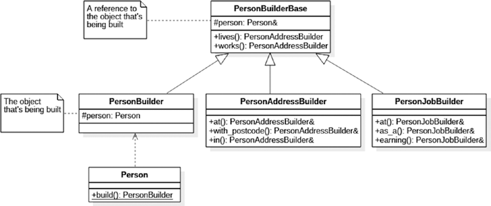

# Builder

构建器（Builder）模式关注的是复杂对象的创建，即那些无法通过单行构造函数调用就能构建的对象。这类对象可能由其他对象组成，并且其构建过程可能涉及不那么直观的逻辑，因此需要一个专门的组件来负责对象的构建。

我猜事先值得一提的是，虽然我说构建器模式关注的是复杂对象，但我们将通过一个相当简单的例子来探讨它。这样做纯粹是为了空间优化，使得领域逻辑的复杂性不会干扰读者对模式实际实现的理解。

## 场景

让我们想象一下，我们正在构建一个渲染网页的组件。首先，我们将输出一个包含两个项目（内容为“hello”和“world”）的简单无序列表。一个非常简化的实现可能如下所示：

```c++
string words[] = { "hello", "world" };
ostringstream oss;
oss << "<ul>";
for (auto w : words)
  oss << " <li>" << w << "</li>";
oss << "</ul>";
printf(oss.str().c_str());
```

这确实给了我们想要的结果，但这种方法不够灵活。我们如何将这个无序列表改为有序列表呢？我们如何在列表创建后添加另一个项目呢？显然，在我们这种僵化的方案中，这是不可能的。

因此，我们可能会选择面向对象编程（OOP）的方法，并定义一个 `HtmlElement` 类来存储每个标签的信息：

```c++
struct HtmlElement
{
  string name;
  string text;
  vector<HtmlElement> elements;

  HtmlElement() {}
  HtmlElement(const string& name, const string& text)
    : name(name), text(text) { }

  string str(int indent = 0) const
  {
    // pretty-print the contents
  }
};
```

借助这种方法，我们现在可以以更合理的方式创建我们的列表：

```c++
string words[] = { "hello", "world" };
HtmlElement list{"ul", ""};
for (auto w : words)
  list.elements.emplace_back{HtmlElement{"li", w}};
printf(list.str().c_str());
```

这种方法工作得很好，给我们提供了一个更可控的、面向对象驱动的项目列表表示。但是，构建每个 `HtmlElement` 的过程并不非常方便，我们可以通过实现构建器（Builder）模式来改进它。

## Simple Builder

构建器（Builder）模式仅仅试图将对象的分步构建外包给一个单独的类。我们的第一次尝试可能会得到如下结果：

```c++
struct HtmlBuilder
{
  HtmlElement root;

  HtmlElement(string root_name) { root.name = root_name; }

  void add_child(string child_name, string child_text)
  {
    HtmlElement e{ child_name, chile_text };
    root.elements.emplace_back(e);
  }

  string str() { return root.str(); }
};
```

这是一个专门用于构建 HTML 元素的组件。`add_child()` 方法是用来向当前元素添加额外子元素的方法，每个子元素是一个名称-文本对。它可以如下使用：

```c++
HtmlBuilder builder{ "ul" };
builder.add_child("li", "hello");
builder.add_child("li", "world");
cout << builder.str() << endl;
```

您会注意到，目前 `add_child()` 函数是返回 `void` 的。我们可以利用返回值做很多事情，但返回值的一个最常见用途是帮助我们构建一个流畅接口（fluent interface）。

## Fluent Builder

让我们将 `add_child()` 的定义更改为如下：

```c++
HtmlBuilder& add_child(string child_name, string child_text)
{
  HtmlElement e{ child_name, child_text };
  root.elements.emplace_back(e);
  return *this;
}
```

通过返回构建器本身的引用，现在可以将构建器调用链式连接。这被称为流畅接口（fluent interface）：

```c++
HtmlBuilder builder{ "ul" };
builder.add_child("li", "hello").add_child("li", "world");
cout << builder.str() << endl;
```

选择引用或指针完全取决于您。如果您想使用 `->` 操作符链式调用，您可以如下定义 `add_child()`：

```c++
HtmlBuilder* add_child(string child_name, string child_text)
{
  HtmlElement e{ child_name, child_text };
  root.elements.emplace_back(e);
  return this;
}
```

然后可以像这样使用它：

```c++
HtmlBuilder builder{"ul"};
builder->add_child("li", "hello")->add_child("li", "world");
cout << builder << endl;
```

## Communicating Intent

我们已经为 HTML 元素实现了一个专门的构建器，但我们的类用户将如何知道如何使用它呢？一个想法是，在他们构造对象时，简单地强制他们使用构建器。您需要做的是：

```c++
struct HtmlElement
{
  string name;
  string text;
  vector<HtmlElement> elements;
  const size_t indent_size = 2;

  static unique_ptr<HtmlBuilder> build(const string& root_name)
  {
    return make_unique<HtmlBuilder>(root_name);
  }

protected: // hide all constructors
  HtmlElement() {}
  HtmlElement(const string& name, const string& text)
    : name{name}, text{text}
  {
  }
};
```

我们的方法是双管齐下的。首先，我们隐藏了所有构造函数，因此它们不再可用。然而，我们创建了一个工厂方法（这是一种我们稍后会讨论的设计模式），可以直接从 HtmlElement 创建构建器。而且这个方法是静态的。以下是使用它的方法：

```c++
auto builder = HtmlElement::build("ul");
builder.add_child("li", "hello").add_child("li", "world");
cout << builder.str() << endl;
```

但不要忘了我们最终的目标是构建一个 `HtmlElement`，而不仅仅是一个构建器！因此，锦上添花的做法是在构建器上实现 `operator HtmlElement`，以得出最终值：

```c++
struct HtmlBuilder
{
  operator HtmlBuilder() const { return root; }
  HtmlBuilder root;
  // other operations omitted
};
```

对前述内容的一个变体是返回 `std::move(root)`，但是否这样做完全取决于您。

无论如何，添加该操作符后，我们可以编写如下代码：

```c++
HtmlElement e = HtmlElement::build("ul")
  .add_child("li", "hello")
  .add_child("li", "world");
cout << e.str() << endl;
```

遗憾的是，没有明确的方法告诉其他用户以这种方式使用 API。希望构造函数的限制以及静态 `build()` 函数的存在能够引导用户使用构建器，但除了该操作符之外，在 `HtmlBuilder` 本身中添加一个对应的 `build()` 函数也可能是一个明智的选择：

```c++
HtmlElement HtmlBuilder::build() const
{
  return root; // again, std::move possible here
}
```

## Groovy-Style Builder

这个例子稍微偏离了专门的构建器，因为实际上这里并没有显式的构建器。它只是对象构造的一种替代方法。

像 Groovy、Kotlin 等编程语言都试图通过支持使 DSL（领域特定语言）构建过程更佳的语法结构来展示它们的优势。但为什么 C++ 应该有所不同呢？借助初始化列表，我们可以有效地使用普通类构建一个 HTML-compatible DSL（领域特定语言）。

首先，我们将定义一个 HTML 标签：

```c++
struct Tag{
  std::string name;
  std::string text;
  std::vector<Tag> children;
  std::vector<std::pair<std::string, std::string>> attributes;  

  friend std::ostream& operator<<(std::ostream& os, const Tag& tag)
  {
    // implementation omitted
  }
};
```

到目前为止，我们已经有一个可以存储其名称、文本、子元素（内部标签）甚至 HTML 属性的 `Tag` 类。我们还有一些美化输出的代码，但这些代码过于枯燥，在此不予展示。

现在我们可以为它添加几个 `protected` 的构造函数（因为我们不希望任何人直接实例化这个类）。之前的实验告诉我们至少有两种情况：

- 通过名称和文本初始化的标签（例如，列表项）
- 通过名称和一系列子元素初始化的标签

第二种情况更有趣；我们将使用类型为 `std::vector` 的参数：

```c++
struct Tag
{
  ...
  protected:
    Tag(const std::string& name, const std::string& text)
      : name{name}, text{text} {}

    Tag(const std::string& name, const std::vector<Tag>& children)
      : name{name}, children{children} {}
};
```

现在我们可以从这个 `Tag` 类继承，但仅用于有效的 HTML 标签（从而约束我们的 DSL）。让我们定义两个标签：一个用于段落，另一个用于图像：

```c++
struct P : Tag
{
  explicit P(const std::string& text)
    : Tag{"p", text} {}

  p(std::initializer_list<Tag> children)
    : Tag("p", children) {}

};

struct IMG : Tag
{
  explicit IMG(const std::string& url)
    : Tag{"img", ""}
  {
    attributes.emplace_back({"src", utl});
  }
};
```

上述构造函数进一步约束了我们的 API。根据这些构造函数，一个段落只能包含文本或一组子元素。而图像不能包含其他标签，但必须有一个名为 img 的属性，并带有提供的地址。

现在，借助统一初始化以及我们创建的所有构造函数，我们可以编写如下代码：

```c++
std::cout << 

  P {
    IMG { "http://pokemon.com/pikachu.png" }
  }

  << std::endl;
```

这不是很棒吗？我们为段落和图像构建了一个小型 DSL，并且这个模型可以很容易地扩展以支持其他标签。而且，完全不需要使用 `add_child()` 调用！

## Composite Builder

我们将以一个使用多个构建器来构建单个对象的例子来结束对构建器模式的讨论。假设我们决定记录一些关于一个人的信息：

```c++
class Person
{
  // address
  std::string street_address, post_code, city;

  // employment
  std::string company_name, position;
  int annual_income = 0;

  Person() {}
};
```

`Person` 有两个方面：地址和就业信息。如果我们希望为每个方面都有单独的构建器——我们如何提供最便捷的 API 呢？为了实现这一点，我们将构建一个复合构建器。这个构造并不简单，所以请留意——即使我们想要为工作和地址信息分别创建构建器，我们也至少会创建四个不同的类。

我在本书中完全避免使用 UML，但这是唯一一个类图有帮助的情况，所以这就是我们实际上将要构建的内容：



我们将第一个类命名为 `PersonBuilderBase`：

```c++
class PersonBuildBase
{
protected:
  Person& person;
  explicit PersonBuildBase(Person& person)
    : person{ person }
  {
  }
public:
  operator Person()
  {
    return std::move(person);
  }

  // builder facets

  PersonAddBuilder lives() const;
  PersonJobBuilder works() const;
};
```

这比我们之前简单的构建器复杂得多，因此让我们逐一讨论每个成员：

- `person` 引用是正在构建的对象的引用。这看起来可能非常奇怪，但这是故意为子构建器设计的。请注意，`Person` 的实际存储并不在这个类中。这一点至关重要！根类只持有一个引用，而不是构造的对象本身。
- reference-assigning constructor 是 `protected`，以便只有继承者（如 `PersonAddressBuilder` 和 `PersonJobBuilder`）可以使用它。
- `operator Person` 是我们之前用过的技巧。这里假设 `Person` 有一个正确定义的移动构造函数——像 `ReSharper` 这样的工具可以轻松生成一个。
- `lives()` 和 `works()` 是返回构建器不同方面的函数：这些子构建器分别初始化地址和就业信息。

现在，前面的基础类中唯一缺失的是实际被构建的对象。它在哪里呢？实际上，它存储在一个我们将称之为 `PersonBuilder` 的继承者中。这就是我们期望用户实际使用的类：

```c++
class PersonBuilder : public PersonBuilderBase
{
  Person p; // object being built
public:
  PersonBuilder() : PersonBuilderBase{p} {}
};
```

所以，这里是实际构建对象的地方。这个类并不是为了被继承：它只是一个工具类，用于让我们启动设置构建器的过程。

为了了解我们为什么最终会有不同的 `public` 和 `protected` 的构造函数，让我们来看看其中一个子构建器的实现：

```c++
class PersonAddressBuilder : public PersonBuilderBase
{
  typedef PersonAddressBuilder self;
public:
  explicit PersonAddressBuilder(Person& person)
    : PersonBuilderBase{ person } {}

  self& at(std::string street_address)
  {
    person.street_address = street_address;
    return *this;
  }

  self& with_postcode(std::string post_code) { ... }

  self& in(std::string city) { ... }
};
```

如您所见，`PersonAddressBuilder` 为构建一个人的地址提供了一个流畅接口。请注意，它实际上继承自 `PersonBuilderBase`（这意味着它已经获得了 `lives()` 和 `works()`成员函数），并调用基类构造函数，传递一个引用。但它并不继承自 `PersonBuilder` ——如果这样做的话，我们将创建过多的 `Person` 实例，而事实上我们只需要一个。

如您所料，`PersonJobBuilder` 以相同的方式实现。这两个类以及 `PersonBuilder` 都在 `Person` 类内部被声明为友元类，以便能够访问其私有成员。

现在，到了您期待的时刻：这些构建器的实际使用示例：

```c++
Person p = Person::create()
  .lives().at("123 London Road")
           .with_postcode("SW1 1GB")
           .in("London")
  .works().at("ProgramSoft")
          .as_a("Consultant")
          .earning(10e6);
```

您能看出来这里发生了什么吗？我们使用 `create()` 函数获取一个构建器，并使用 `lives()` 函数来获取一个 `PersonAddressBuilder`，但在完成地址信息的初始化后，我们只需调用 `works()` 并切换到使用 `PersonJobBuilder`。

当我们完成构建过程时，我们使用与之前相同的技巧将正在构建的对象转换为 `Person`。请注意，一旦这样做，构建器就不可再用了，因为我们已经使用 `std::move()` 移动了 `Person` 对象。

## 总结

Builder 模式的目标是定义一个完全致力于复杂对象或对象集的分步构建的组件。我们观察到了一个 Builder 的以下关键特性：

- Builder 可以拥有一个流畅接口，可用于通过单个调用链进行复杂的构建。为了支持这一点，构建器函数应当返回 `this` 或 `*this`。
- 为了强制 API 用户使用 Builder，我们可以使目标对象的构造函数不可访问，然后定义一个静态的 `create()` 函数，该函数返回 builder。
- 通过定义适当的转换操作符，builder 可以被隐式转换为目标对象本身。
- 借助统一初始化语法，C++ 中也可以实现 Groovy 风格的 builder。这种方法非常通用，允许创建多样化的 DSL（领域特定语言）。
- 单个 builder 接口可以暴露多个 subbuilder 。通过巧妙地使用继承和流畅接口，可以从一个 builder 轻松跳转到另一个。

再次重申我之前提到的一点，当对象的构建过程非同寻常时，使用构建器模式是有意义的。对于那些可以通过有限数量且命名合理的构造函数参数无歧义地构建的简单对象来说，应该直接使用构造函数（或依赖注入），而不必特意使用 Builder。