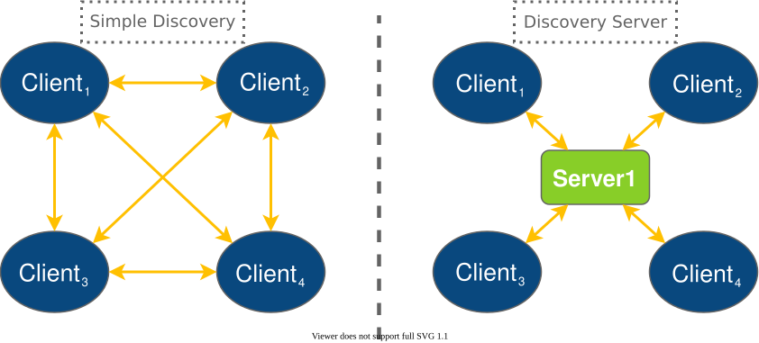

# ROS 2 using Fast DDS middleware

在 Open Source Robotic Fundation (OSRF) 的 Robot Operating System ROS 2 中，Fast DDS 是每个长期支持（LTS）版本以及大多数非 LTS 版本的默认中间件实现。

**ROS 2** 是面向机器人工程的先进软件，包含一套用于构建机器人应用的自由软件库和工具。本节展示若干用例，并说明如何在 ROS 2 项目中充分利用 Fast DDS 的丰富功能。

ROS 2 栈与 Fast DDS 之间的接口由 ROS 2 包 `rmw_fastrtps` 提供。该包在所有 ROS 2 发行版中均可获得（既有二进制包也有源码）。`rmw_fastrtps` 实际上提供了两个不同的 ROS 2 中间件实现，且两者都使用 Fast DDS 作为中间件层：`rmw_fastrtps_cpp` 与 `rmw_fastrtps_dynamic_cpp`。两者的主要区别在于：`rmw_fastrtps_dynamic_cpp` 在运行时使用 introspection 类型支持（introspection type support）来决定序列化/反序列化机制，而 `rmw_fastrtps_cpp` 则使用其在构建时为每个消息类型生成映射的类型支持。除已到生命周期末（EOL）的 Galactic 发行版外，所有 ROS 2 发行版的默认 RMW 实现为 `rmw_fastrtps_cpp`。对于 EOL Galactic，需设置环境变量 `RMW_IMPLEMENTATION` 来选择 `rmw_fastrtps_cpp` 以使用 Fast DDS 作为中间件层。该环境变量也可用于选择 `rmw_fastrtps_dynamic_cpp` 实现：

1. Exporting RMW_IMPLEMENTATION environment variable:

```bash
export RMW_IMPLEMENTATION=rmw_fastrtps_cpp
```

或

```bash
export RMW_IMPLEMENTATION=rmw_fastrtps_dynamic_cpp
```

2. 在启动你的 ROS 2 应用程序时：

```bash
RMW_IMPLEMENTATION=rmw_fastrtps_cpp ros2 run <package> <application>
```

或

```bash
RMW_IMPLEMENTATION=rmw_fastrtps_dynamic_cpp ros2 run <package> <application>
```

> Note：在已结束生命周期（EOL）的 Galactic 版本中，你可能需要安装 `rmw_fastrtps_cpp` 软件包：
> `sudo apt install ros-galactic-rmw-fastrtps-cpp`

## 16.1. Configuring Fast DDS in ROS 2

ROS 2 只允许配置部分中间件 QoS（参见 ROS 2 QoS policies）。不过，`rmw_fastrtps` 提供了扩展配置能力，以充分利用 Fast DDS 的功能。本节将说明如何指定这些扩展配置。

### 16.1.1. Changing publication mode

### 16.1.2. XML configuration

### 16.1.3. Example

## 16.2. Use ROS 2 with Fast-DDS Discovery Server

本节说明如何使用 Discovery Server 作为发现通信机制来运行一些 ROS 2 示例。若要了解该配置的具体使用方式，请参阅 Discovery Server 文档，或阅读该配置的常见使用场景。

以下教程汇总了验证该功能并学习如何在 ROS 2 中使用它的步骤。

Simple Discovery Protocol 是 DDS 标准中定义的标准发现协议。然而，在某些场景下它存在一些已知缺点，主要包括：

* **扩展性**不足：随着新节点的加入，交换的数据包数量会显著增加。
* 依赖**组播**（Multicast）能力，而在某些环境中（例如 WiFi）组播可能无法可靠工作。

**Discovery Server** 提供了一种客户端—服务器（Client–Server）架构，使节点能够通过一个中间服务器进行连接。每个节点作为*客户端*运行，将自身信息发送给 *Discovery Server*，并从其接收发现信息。这种方式在大型系统中能够显著减少网络流量，同时也不再依赖*组播*。



这些 **Discovery Server** 可以彼此独立运行、进行复制（duplicated），或者相互连接，从而在网络中实现冗余，避免出现 *Single-Point-Of-Failure（单点故障）*。

### 16.2.1. Discovery Server v2

### 16.2.2. Prerequisites

### 16.2.3. Run the demo

### 16.2.4. Advance user cases

### 16.2.5. ROS 2 Introspection

### 16.2.6. Compare Discovery Server with Simple Discovery
