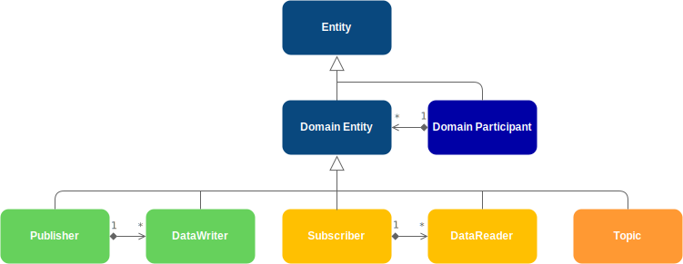
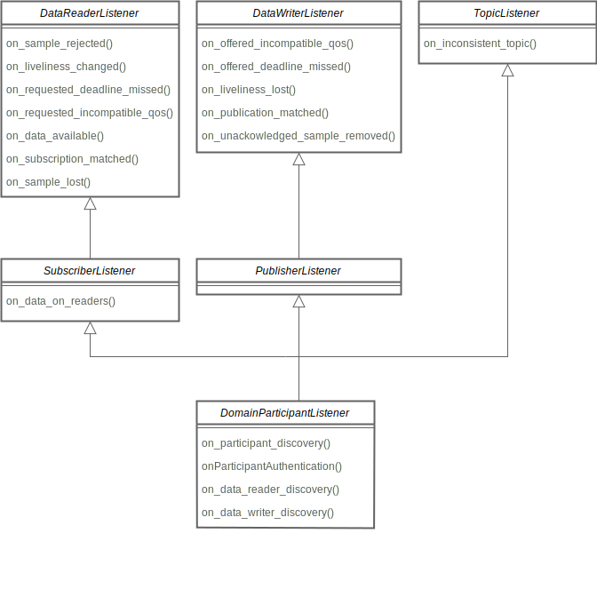
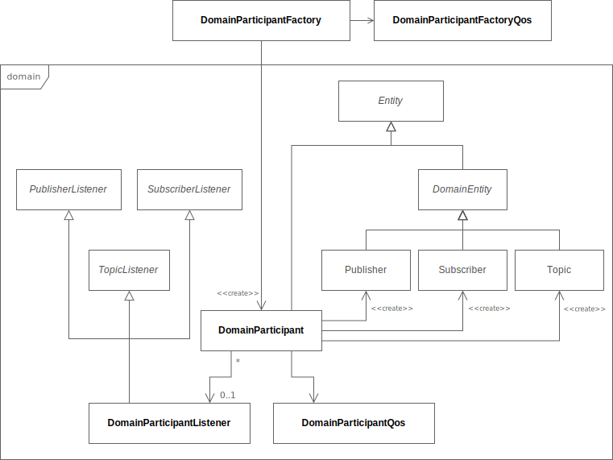
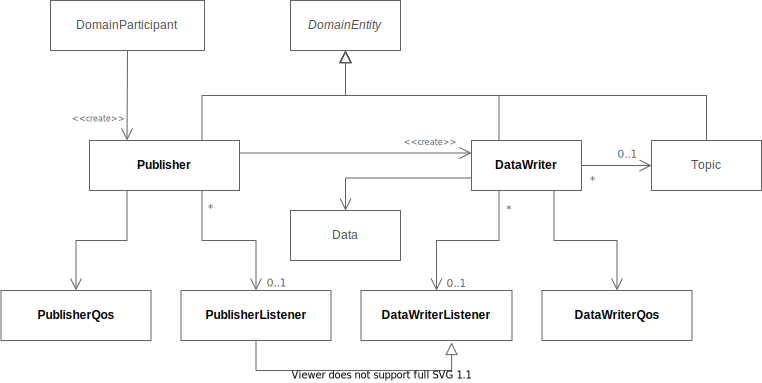
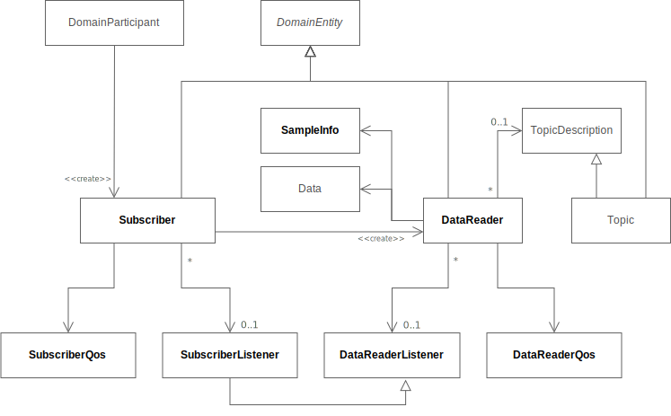
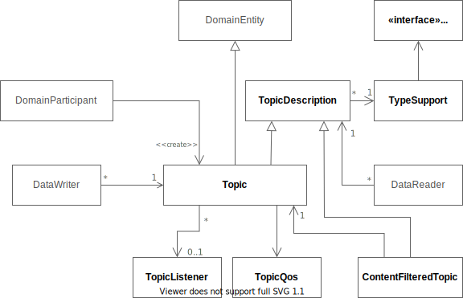

# DDS Layer

eProsima Fast DDS 提供两种不同的 API，以不同层次与通信服务进行交互。主要的 API 是由 Data Distribution Service (DDS) 1.4 规范定义的 Data-Centric Publish-Subscribe (DCPS) Platform Independent Model (PIM) API，简称 DDS DCPS PIM，Fast DDS 遵循该规范。本节用于说明在 Fast DDS 下该 API 的主要特性和使用模式，并对其划分的五个模块进行深入解释：

- **Core**：定义了其他模块所细化的抽象类和接口。它还提供了服务质量（Quality of Service，QoS）的定义，以及对基于通知的与中间件交互风格的支持。

- **Domain**：包含作为服务入口点并充当许多类工厂的 `DomainParticipant` 类。`DomainParticipant` 同时也作为构成服务的其他对象的容器。

- **Publisher**：描述发布端使用的类，包括 `Publisher` 和 `DataWriter` 类，以及 `PublisherListener` 和 `DataWriterListener` 接口。

- **Subscriber**：描述订阅端使用的类，包括 `Subscriber` 和 `DataReader` 类，以及 `SubscriberListener` 和 `DataReaderListener` 接口。

- **Topic**：描述用于定义通信 topic 和数据类型的类，包括 `Topic` 和 `TopicDescription` 类，以及 `TypeSupport` 和 `TopicListener` 接口。

## 3.1 Core

本模块定义将被其他模块使用的基础设施类与类型。它包含 Entity 类的定义、服务质量（Quality of Service，QoS）策略，以及 Status 的定义。

- **Entity**：*Entity* 是一个具有 *Status* 并且可以通过 *Policy* 配置的 DDS 通信对象。

- **Policy**：用于管理 *Entity* 行为的各类配置对象。

- **Status**：与 *Entity* 关联的对象，其值表示该 *Entity* 的通信状态。

### 3.1.1. Entity

`Entity` 是所有 DDS 实体的抽象基类，即支持 QoS 策略、监听器（listener）和 Status 的对象。

#### 3.1.1.1. Types of Entities

`DomainParticipant`：该实体是服务的入口点，并作为工厂用于创建 `Publisher`、`Subscriber` 和 `Topic`。更多细节参见 `DomainParticipant`。

`Publisher`：作为工厂，可以创建任意数量的 `DataWriter`。更多细节参见 `Publisher`。

`Subscriber`：作为工厂，可以创建任意数量的 `DataReader`。更多细节参见 `Subscriber`。

`Topic`：该实体位于发布和订阅实体之间，充当通道。更多细节参见 `Topic`。

`DataWriter`：负责数据分发的对象。更多细节参见 `DataWriter`。

`DataReader`：用于访问接收数据的对象。更多细节参见 `DataReader`。

下图展示了所有 DDS 实体之间的层次关系：



#### 3.1.1.2. Common Entity Characteristics

所有实体类型都共享一些与“实体”这一概念通用的特性。这些特性包括：

##### 3.1.1.2.1. Entity Identifier

每个实体都由一个唯一的 ID 标识，如果存在对应的 RTPS 实体，则该 ID 在 DDS 实体与其对应的 RTPS 实体之间共享。该 ID 存储在 `Entity` 基类中声明的 Instance Handle 对象中，可以通过 `get_instance_handle()` 这个 getter 函数访问。

##### 3.1.1.2.2. QoS policy

每个实体的行为都可以通过一组配置策略进行设置。对于每种实体类型，都有一个对应的服务质量（Quality of Service，QoS）类，它将影响该实体类型的所有策略归纳在一起。用户可以创建这些 QoS 类的实例，根据需要修改其中包含的策略，并使用它们来配置实体 —— 无论是在实体创建时，还是在之后通过每个实体提供的 `set_qos()` 函数进行配置（`DomainParticipant::set_qos()`、`Publisher::set_qos()`、`Subscriber::set_qos()`、`Topic::set_qos()`、`DataWriter::set_qos()`、`DataReader::set_qos()`）。关于可用策略及其说明，请参阅 Policy。QoS 类及其包含的策略会在各实体类型的文档中详细说明。

##### 3.1.1.2.3. Listener

监听器（listener）是一个对象，其中包含的函数会在实体响应事件时被调用。因此，监听器充当一种异步通知机制，使实体能够将自身的 Status 变化通知给应用程序。

所有实体类型都定义了一个抽象的监听器接口，其中包含回调函数，实体会通过触发这些回调函数将 Status 的变化传递给应用程序。用户可以通过继承这些接口并实现应用程序所需的回调来编写自己的监听器。然后，他们可以将这些监听器关联到每个实体上，无论是在实体创建时，还是在之后通过每个实体提供的 `set_listener()` 函数（`DomainParticipant::set_listener()`、`Publisher::set_listener()`、`Subscriber::set_listener()`、`Topic::set_listener()`、`DataWriter::set_listener()`、`DataReader::set_listener()`）。

各实体类型的监听器接口及其回调函数，会在对应实体类型的文档中详细说明。当事件发生时，它会由拥有非空监听器且在其 `StatusMask` 中启用了相应回调的最低层级实体来处理。高层级的监听器会继承低层级监听器的行为，如下图所示：



监听器继承关系图。

Note：`on_data_on_readers()` 回调会在 `on_data_available()` 之前拦截消息。这意味着如果启用了 `DomainParticipantListener`，用户需要注意默认情况下监听器使用的是 `StatusMask::all()`。由于回调的实体层级关系会被保持，因此在这种情况下会调用 `on_data_on_readers()`。如果应用程序希望改为使用 `on_data_available()`，则需要在 `StatusMask` 中禁用对应的标志位。

Important：在创建 `Entity` 时使用 `StatusMask::none()` 仅会禁用 DDS 标准的回调函数：

* `on_sample_rejected()`
* `on_liveliness_changed()`
* `on_requested_deadline_missed()`
* `on_requested_incompatible_qos()`
* `on_data_available()`
* `on_subscription_matched()`
* `on_sample_lost()`
* `on_offered_incompatible_qos()`
* `on_offered_deadline_missed()`
* `on_liveliness_lost()`
* `on_publication_matched()`
* `on_inconsistent_topic()`
* `on_data_on_readers()`

任何 *Fast DDS* 特有的回调始终启用：

* `on_participant_discovery()`
* `onParticipantAuthentication()`
* `on_data_reader_discovery()`
* `on_data_writer_discovery()`
* `on_unacknowledged_sample_removed()`

Warning：系统只会创建一个线程来监听所有已实现的监听器，因此建议保持监听器函数的逻辑简洁，把这些信息的处理工作交由合适的类去完成。

Warning：不要在监听器成员函数的作用域内创建或删除任何实体（Entity），因为这可能导致未定义行为。推荐的做法是将监听器类作为信息通道使用，而由上层的实体类封装具体的行为逻辑。

##### 3.1.1.2.4. Status

每个实体都关联一组状态对象，其值表示该实体的通信状态。状态值的变化会触发相应的监听器回调，以异步方式通知应用程序。有关所有状态对象及其内容的说明，请参见 Status，其中还列出了每种状态适用于哪种实体类型。

##### 3.1.1.2.5. StatusCondition

每个实体都拥有一个 StatusCondition，当其已启用的状态发生变化时会收到通知。StatusCondition 提供了实体与等待集（Wait-set）之间的关联。更多信息请参见“Conditions and Wait-sets”章节。

##### 3.1.1.2.6. Enabling Entities

所有实体在创建时都可以选择启用或未启用。默认情况下，工厂配置为创建已启用的实体，但可以通过在启用的工厂上设置 EntityFactoryQosPolicy 来更改此行为。一个未启用的工厂无论其 QoS 如何，都会创建未启用的实体。未启用实体的操作仅限于以下几类：

* 设置/获取实体的 QoS 策略
* 设置/获取实体的监听器（Listener）
* 创建/删除子实体
* 获取实体的状态，即使状态不会发生变化
* 查找操作

在未启用状态下调用其他任何函数都会返回 `NOT_ENABLED`。

### 3.1.2. Policy

服务质量（Quality of Service，QoS）用于指定服务的行为，使用户能够定义每个实体的行为方式。为了提高系统的灵活性，QoS 被分解为多个可独立配置的 QoS Policy。然而，在某些情况下，不同策略之间可能存在冲突。这些冲突会通过 QoS 设置函数返回的 *ReturnCodes* 通知给用户。

每个 QoS Policy 都有一个在 `QosPolicyId_t` 枚举中定义的唯一 ID。该 ID 会在某些 Status 实例中使用，用于标识该状态所对应的特定 QoS Policy。

有些 QoS Policy 是不可变的，这意味着只能在实体创建时或调用 enable 操作之前指定。

每个 DDS 实体都有一组特定的 QoS Policy，可以是标准 QoS Policy、XTypes 扩展或 eProsima 扩展的混合。

#### 3.1.2.1. Standard QoS Policies

本节解释每个 DDS 标准的 QoS 策略（QoS Policies）：

##### 3.1.2.1.1. DeadlineQosPolicy

该 QoS 策略会在新样本的频率低于某个阈值时触发警报。它适用于数据预期周期性更新的情况（参见 DeadlineQosPolicy）。

在发布端，该 deadline 定义了应用程序提供新样本的最长周期。在订阅端，它定义了应接收新样本的最长周期。

对于带 key 的 Topic，该 QoS 会按 key 应用。例如，假设某些车辆的位置需要周期性发布，则可以将车辆的 ID 设置为数据类型的 key，并将 deadline QoS 设置为期望的发布周期。

QoS Policy 数据成员列表：

| Data Member Name | Type | Default Value |
| - | - | - |
| `period` | `Duration_t` | `c_TimeInfinite` |

Note：该 QoS 策略适用于 Topic、DataReader 和 DataWriter 实体。
它可以在已启用的实体上进行修改。

Warning：为了使 DataWriter 和 DataReader 匹配，它们必须遵循兼容性规则。更多细节请参见 Compatibility Rule。

###### Compatibility Rule

为了保持 DataReader 和 DataWriter 间的 DeadlineQosPolicy 兼容性，DataWriter 配置的提供（offered）deadline 周期必须小于或等于 DataReader 配置的请求（requested）deadline 周期，否则实体会被视为不兼容。

DeadlineQosPolicy 的设置必须与 TimeBasedFilterQosPolicy 保持一致，这意味着 deadline 周期必须大于或等于最小分隔时间（minimum separation）。

###### Example

```c++
// This example uses a DataWriter, but it can also be applied to DataReader and Topic entities
DataWriterQos writer_qos;
// The DeadlineQosPolicy is constructed with an infinite period by default
// Change the period to 1 second
writer_qos.deadline().period.seconds = 1;
writer_qos.deadline().period.nanosec = 0;
// Use modified QoS in the creation of the corresponding entity
writer_ = publisher_->create_datawriter(topic_, writer_qos);
```

```xml
<data_writer profile_name="writer_xml_conf_deadline_profile">
    <qos>
        <deadline>
            <period>
                <sec>1</sec>
            </period>
        </deadline>
    </qos>
</data_writer>

<data_reader profile_name="reader_xml_conf_deadline_profile">
    <qos>
        <deadline>
            <period>
                <sec>1</sec>
            </period>
        </deadline>
    </qos>
</data_reader>
```

## 3.2. Domain

域（Domain）表示一个独立的通信平面。它在共享同一通信基础设施的实体之间创建逻辑隔离。从概念上看，它可以被视为连接同一域中所有应用程序的虚拟网络，同时将它们与运行在不同域中的应用程序隔离开来。通过这种方式，多个独立的分布式应用可以在同一物理网络中共存，而不会相互干扰，甚至互不知晓。

每个域都有一个唯一标识符，称为 domainId，其实现为 `uint32` 类型。共享相同 domainId 的应用属于同一域，并能够进行通信。

为了将应用添加到某个域中，必须使用适当的 domainId 创建一个 DomainParticipant 实例。DomainParticipant 的实例通过 DomainParticipantFactory 单例创建。

分区（Partitions）在域内引入了另一种实体隔离级别。虽然在同一域中的 DomainParticipant 可以相互通信，但仍可以通过将它们的 Publisher 和 Subscriber 分配到不同的分区来实现隔离。



Domain 类图。

## 3.3. Publisher

发布（Publication）由 DataWriter 与 Publisher 的关联定义。为了开始发布数据实例的值，应用程序需要在 Publisher 中创建一个新的 DataWriter。该 DataWriter 会绑定到描述所传输数据类型的 Topic。与该 Topic 匹配的远程订阅将能够接收来自 DataWriter 的数据值更新。



## 3.4. Subscriber

订阅（Subscription）由 DataReader 与 Subscriber 的关联定义。为了开始接收发布的更新，应用程序需要在 Subscriber 中创建一个新的 DataReader。该 DataReader 会绑定到描述将要接收的数据类型的 Topic。随后，DataReader 会开始接收与该 Topic 匹配的远程发布的数据更新。

当 Subscriber 接收到数据时，它会通知应用程序有新数据可用。然后，应用程序可以使用 DataReader 获取接收到的数据。



Subscriber 类图。

## 3.5. Topic

Topic 在概念上位于发布与订阅之间。每个发布通道必须被订阅方明确识别，这样订阅方才能只接收它们感兴趣的数据流，而不会收到来自其他发布的数据。Topic 正是为此而设，允许共享相同 Topic 的发布与订阅相互匹配并开始通信。从这个意义上说，Topic 充当数据流的描述。

发布始终关联到单个 Topic，而订阅则关联到更广义的 TopicDescription 概念。



Topic 类图。
