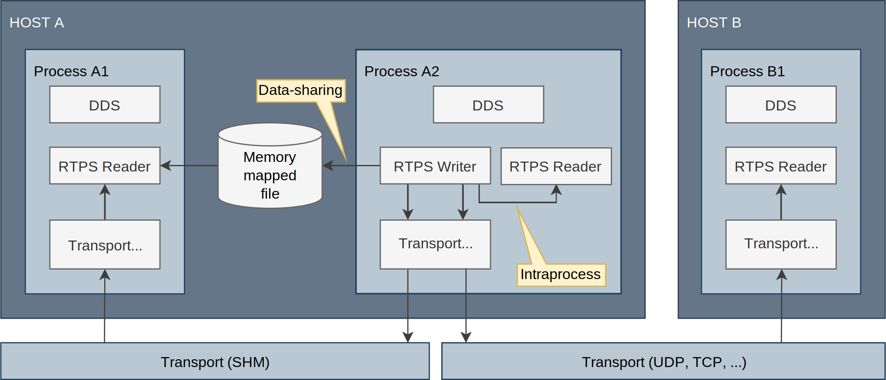
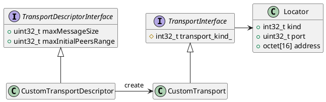

# 6. Transport Layer

传输层为 DDS 实体之间提供通信服务，负责在物理传输介质上实际发送和接收消息。DDS 层使用该服务来传输用户数据和发现流量。然而，DDS 层本身与具体传输方式无关，它定义了一套传输 API，并且可以运行在任何实现了该 API 的传输插件之上。这样一来，它不受限于特定的传输方式，应用程序可以选择最适合其需求的传输，甚至可以自行实现传输插件。

*eProsima Fast DDS* 已经内置了五种传输方式：

* **UDPv4**：基于 IPv4 的 UDP 数据报通信。如果没有提供特定的传输配置，在新建 `DomainParticipant` 时会默认创建此传输（参见 UDP Transport）。
* **UDPv6**：基于 IPv6 的 UDP 数据报通信（参见 UDP Transport）。
* **TCPv4**：基于 IPv4 的 TCP 通信（参见 TCP Transport）。
* **TCPv6**：基于 IPv6 的 TCP 通信（参见 TCP Transport）。
* **SHM**：在同一主机上运行的实体之间的共享内存通信。如果没有提供特定的传输配置，在新建 `DomainParticipant` 时会默认创建此传输（参见 Shared Memory Transport）。

尽管它不属于传输模块的一部分，但在某些配置下，进程内数据传递（intraprocess data delivery）和数据共享传递（data sharing delivery）也可用于实体之间的消息传输。下图展示了 *Fast DDS* 中可用的不同传输方式的对比。



## 6.1. Transport API

下图展示了 *eProsima Fast DDS* 传输 API 中定义的类。该图显示了抽象的 API 接口，以及实现一个传输所需的类。



Transport API 图

## 6.2. UDP Transport

UDP 是一种无连接传输方式，其中接收端的 `DomainParticipant` 必须打开一个 UDP 端口来监听传入的消息，而发送端的 `DomainParticipant` 则将消息发送到该端口。

Warning：本说明假定读者具有基本的 UDP/IP 知识，因为诸如生存时间（Time To Live，TTL）、套接字缓冲区和端口编号等术语不会作详细解释。然而，即便缺乏这些知识，也可以在 *Fast DDS* 上配置一个基本的 UDP 传输。

## 6.3. TCP Transport

TCP 是面向连接的传输，因此 `DomainParticipant` 在发送数据消息之前必须与远端对端建立 TCP 连接。因此，通信双方中的一方（作为服务器）必须打开一个用于监听传入连接的 TCP 端口，而另一方（作为*客户端*）必须连接到该端口。

Note：*服务器*和*客户端*的概念与 DDS 的 `Publisher`、`Subscriber`、`DataWriter` 和 `DataReader` 概念无关。同时，这些概念也与 *eProsima Discovery Server* 的*服务器*/*客户端*（Discovery Server Settings）是独立的。在建立连接时，任一方都可以充当 TCP 服务器或 TCP 客户端，DDS 通信将在该连接上正常工作。

Warning：本说明假定读者具有基本的 TCP/IP 知识，因为诸如生存时间（Time To Live，TTL）、循环冗余校验（Cyclic Redundancy Check，CRC）、传输层安全（Transport Layer Security，TLS）、套接字缓冲区和端口编号等术语不会作详细解释。然而，即便缺乏这些知识，也可以在 Fast DDS 上配置一个基本的 TCP 传输。

## 6.4. Shared Memory Transport

共享内存（SHM）传输使运行在同一处理单元/机器上的实体之间能够进行快速通信，依赖主机操作系统提供的共享内存机制。

Note：Fast DDS 使用 `DomainParticipant` 的 `GuidPrefix_t` 来识别运行在同一主机上的对端。若两个 Participant 的 `GuidPrefix_t` 的前 4 个字节相同，则认为它们运行在同一主机上。提供了 `is_on_same_host_as()` API 用于检查此条件。另请注意 “GUID Prefix considerations for intra-process delivery” 一节中列出的注意事项。

SHM 传输相比其他网络传输（如 UDP/TCP），即便这些传输使用回环接口（loopback），也能提供更好的性能。这主要归因于以下几点：

- 大消息支持：网络协议通常需要对数据进行分片以满足协议和网络栈的要求，从而增加通信开销。SHM 传输允许拷贝完整消息，其唯一的大小限制是机器的内存容量。
- 减少内存拷贝次数：向多个端点发送相同消息时，SHM 传输可以直接将相同的内存缓冲区共享给所有目标端点；而其他协议通常需要为每个端点执行一次消息拷贝。
- 更少的操作系统开销：完成初始设置后，共享内存传输所需的系统调用远少于其它协议。因此，使用 SHM 能在性能和时间开销上获得显著提升。

## 6.5. Data-sharing delivery

*Fast DDS* 允许通过共享内存将 `DataWriter` 的 history 与 `DataReader` 共享，从而加速同一主机内实体之间的通信。这样可以避免传输层引入的任何开销，实质上消除了 `DataWriter` 与 `DataReader` 之间的数据拷贝。

Note：*Fast DDS* 使用 `DomainParticipant` 的 `GuidPrefix_t` 来识别运行在同一主机上的对端。当两个 participant 的 `GuidPrefix_t` 的前 4 个字节相同时，认为它们运行在同一主机上。提供了 `is_on_same_host_as()` API 用于检查此条件。另请注意 “GUID Prefix considerations for intra-process delivery” 一节中列出的注意事项。

使用数据共享传递并不能避免应用程序与 `DataReader` 和 `DataWriter` 之间发生数据拷贝。在某些情况下，可以使用零拷贝（Zero-Copy）通信来避免这些拷贝。

Note：尽管数据共享传递（Data-sharing delivery）使用了共享内存，但它与共享内存传输（Shared Memory Transport）有所不同：共享内存传输是一种完全符合标准的传输方式。这意味着，在共享内存传输中，传输的数据必须从 `DataWriter` 的历史记录（History）拷贝到传输层，再从传输层拷贝到 `DataReader`。而在数据共享传递中，这些拷贝是可以避免的。

## 6.6 Intra-process delivery

eProsima Fast DDS 允许通过避免传输层的各种开销来加速同一进程内实体之间的通信。相反，`Publisher` 会直接调用 `Subscriber` 的接收函数。这样不仅避免了传输的拷贝或发送操作，还能确保消息被 `Subscriber` 接收，从而免去确认（acknowledgement）机制。

此特性默认启用，可通过 XML 配置文件进行配置（参见 Intra-process delivery profiles）。当前可用选项如下：

- `INTRAPROCESS_OFF`：该特性被禁用。
- `INTRAPROCESS_USER_DATA_ONLY`：仅用户数据使用进程内传输，发现元数据仍使用普通传输。
- `INTRAPROCESS_FULL`：默认值。用户数据和发现元数据均使用进程内传输。

```xml
<library_settings>
    <intraprocess_delivery>FULL</intraprocess_delivery> <!-- OFF | USER_DATA_ONLY | FULL -->
</library_settings>
```

## 6.7. TLS over TCP

> Warning：
> 本说明假定读者具备 TLS 概念的基本知识，因为诸如证书颁发机构（Certificate Authority，CA）、私钥（Private Key）、*Rivest–Shamir–Adleman*（RSA）密码系统以及 Diffie–Hellman 密钥交换协议等术语不会作详细解释。

Fast DDS 允许将 TCP 传输配置为使用 TLS（传输层安全）。要设置 TLS，必须在 `TCPTransportDescriptor` 上将其数据成员 `apply_security` 设为 `true`，并在同一 `TCPTransportDescriptor` 的 `tls_config` 数据成员中填写所需的配置。下面给出在 TCP 服务器上配置 TLS 的示例：

```c++
DomainParticipantQos qos;

// Create a descriptor for the new transport.
auto tls_transport = std::make_shared<TCPv4TransportDescriptor>();
tls_transport->sendBufferSize = 9216;
tls_transport->receiveBufferSize = 9216;
tls_transport->add_listener_port(5100);

// Create the TLS configuration
using TLSOptions = eprosima::fastdds::rtps::TCPTransportDescriptor::TLSConfig::TLSOptions;
tls_transport->apply_security = true;
tls_transport->tls_config.password = "test";
tls_transport->tls_config.cert_chain_file = "server.pem";
tls_transport->tls_config.private_key_file = "serverkey.pem";
tls_transport->tls_config.tmp_dh_file = "dh2048.pem";
tls_transport->tls_config.add_option(TLSOptions::DEFAULT_WORKAROUNDS);
tls_transport->tls_config.add_option(TLSOptions::SINGLE_DH_USE);
tls_transport->tls_config.add_option(TLSOptions::NO_SSLV2);

// Link the Transport Layer to the Participant.
qos.transport().user_transports.push_back(tls_transport);
```

```xml
<?xml version="1.0" encoding="UTF-8" ?>
<profiles xmlns="http://www.eprosima.com">
    <transport_descriptors>
        <transport_descriptor>
            <transport_id>tls_transport_server</transport_id>
            <type>TCPv4</type>
            <tls>
                <password>test</password>
                <private_key_file>serverkey.pem</private_key_file>
                <cert_chain_file>server.pem</cert_chain_file>
                <tmp_dh_file>dh2048.pem</tmp_dh_file>
                <options>
                    <option>DEFAULT_WORKAROUNDS</option>
                    <option>SINGLE_DH_USE</option>
                    <option>NO_SSLV2</option>
                </options>
            </tls>
            <sendBufferSize>9216</sendBufferSize>
            <receiveBufferSize>9216</receiveBufferSize>
            <listening_ports>
                <port>5100</port>
            </listening_ports>
        </transport_descriptor>
    </transport_descriptors>

    <participant profile_name="TLSServerParticipant">
        <rtps>
            <userTransports>
                <transport_id>tls_transport_server</transport_id>
            </userTransports>
        </rtps>
    </participant>
</profiles>
```

下面的示例展示了在 TCP 客户端上的相应配置。

```c++
DomainParticipantQos qos;

// Set initial peers.
Locator_t initial_peer_locator;
initial_peer_locator.kind = LOCATOR_KIND_TCPv4;
IPLocator::setIPv4(initial_peer_locator, "192.168.1.10");
initial_peer_locator.port = 5100;
qos.wire_protocol().builtin.initialPeersList.push_back(initial_peer_locator);

// Create a descriptor for the new transport.
auto tls_transport = std::make_shared<TCPv4TransportDescriptor>();

// Create the TLS configuration
using TLSOptions = eprosima::fastdds::rtps::TCPTransportDescriptor::TLSConfig::TLSOptions;
using TLSVerifyMode = eprosima::fastdds::rtps::TCPTransportDescriptor::TLSConfig::TLSVerifyMode;
tls_transport->apply_security = true;
tls_transport->tls_config.verify_file = "ca.pem";
tls_transport->tls_config.add_verify_mode(TLSVerifyMode::VERIFY_PEER);
tls_transport->tls_config.add_verify_mode(TLSVerifyMode::VERIFY_FAIL_IF_NO_PEER_CERT);
tls_transport->tls_config.add_option(TLSOptions::DEFAULT_WORKAROUNDS);
tls_transport->tls_config.add_option(TLSOptions::SINGLE_DH_USE);
tls_transport->tls_config.add_option(TLSOptions::NO_SSLV2);
tls_transport->tls_config.server_name = "my_server.com";

// Link the Transport Layer to the Participant.
qos.transport().user_transports.push_back(tls_transport);
```

```xml
<?xml version="1.0" encoding="UTF-8" ?>
<profiles xmlns="http://www.eprosima.com">
    <transport_descriptors>
        <transport_descriptor>
            <transport_id>tls_transport_client</transport_id>
            <type>TCPv4</type>
            <tls>
                <verify_file>ca.pem</verify_file>
                <verify_mode>
                    <verify>VERIFY_PEER</verify>
                    <verify>VERIFY_FAIL_IF_NO_PEER_CERT</verify>
                </verify_mode>
                <options>
                    <option>DEFAULT_WORKAROUNDS</option>
                    <option>SINGLE_DH_USE</option>
                    <option>NO_SSLV2</option>
                </options>
                <server_name>my_server.com</server_name>
            </tls>
        </transport_descriptor>
    </transport_descriptors>

    <participant profile_name="TLSClientParticipant">
        <rtps>
            <userTransports>
                <transport_id>tls_transport_client</transport_id>
            </userTransports>
            <builtin>
                <initialPeersList>
                    <locator>
                        <tcpv4>
                            <address>192.168.1.10</address>
                            <physical_port>5100</physical_port>
                        </tcpv4>
                    </locator>
                </initialPeersList>
            </builtin>
        </rtps>
    </participant>
</profiles>
```

下面的表格描述了 `TLSConfig` 上可配置的数据成员：

| Member | Data type | Default | Description |
| - | - | - | - |
| `password` | `string` | `""` | `private_key_file` 或 `rsa_private_key_file` 的密码 |
