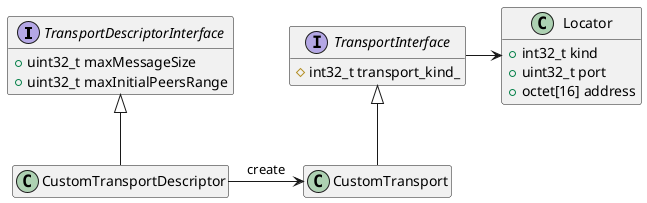

# 6. Transport Layer

传输层为 DDS 实体之间提供通信服务，负责在物理传输介质上实际发送和接收消息。DDS 层使用该服务来传输用户数据和发现流量。然而，DDS 层本身与具体传输方式无关，它定义了一套传输 API，并且可以运行在任何实现了该 API 的传输插件之上。这样一来，它不受限于特定的传输方式，应用程序可以选择最适合其需求的传输，甚至可以自行实现传输插件。

*eProsima Fast DDS* 已经内置了五种传输方式：

* **UDPv4**：基于 IPv4 的 UDP 数据报通信。如果没有提供特定的传输配置，在新建 `DomainParticipant` 时会默认创建此传输（参见 UDP Transport）。
* **UDPv6**：基于 IPv6 的 UDP 数据报通信（参见 UDP Transport）。
* **TCPv4**：基于 IPv4 的 TCP 通信（参见 TCP Transport）。
* **TCPv6**：基于 IPv6 的 TCP 通信（参见 TCP Transport）。
* **SHM**：在同一主机上运行的实体之间的共享内存通信。如果没有提供特定的传输配置，在新建 `DomainParticipant` 时会默认创建此传输（参见 Shared Memory Transport）。

尽管它不属于传输模块的一部分，但在某些配置下，进程内数据传递（intraprocess data delivery）和数据共享传递（data sharing delivery）也可用于实体之间的消息传输。下图展示了 *Fast DDS* 中可用的不同传输方式的对比。

## 6.1. Transport API

下图展示了 *eProsima Fast DDS* 传输 API 中定义的类。该图显示了抽象的 API 接口，以及实现一个传输所需的类。

Transport API 图
