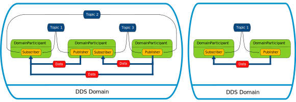

# Introduction

## What is Fast DDS?

*eProsima Fast DDS* 是 DDS（数据分发服务）规范的 C++ 实现，该规范由对象管理组织（OMG）定义。*eProsima Fast DDS* 库提供了应用程序编程接口（API）和通信协议，采用以数据为中心的发布-订阅（DCPS）模型，旨在实现实时系统之间高效且可靠的信息分发。

## Commercial support

寻求商业支持？请联系我们：info@eprosima.com

了解更多关于我们的信息，请访问 eProsima 官网。

## Key features

*eProsima Fast DDS* 是一种可预测、可扩展、灵活且高效的资源处理方案。为了满足这些需求，它使用了类型化接口，并依赖于一种多对多的分布式网络范式，从而能够巧妙地将发布者和订阅者的通信部分分离开来。*eProsima Fast DDS* 包括：

- DDS API 实现。
- Fast DDS-Gen，一种用于将类型化接口与中间件实现连接的生成工具。
- 底层 RTPS wire 协议实现。

对于上述所有内容，*eProsima Fast DDS* 被选为机器人操作系统 2（ROS 2）在每个长期支持（LTS）版本和大多数非 LTS 版本中支持的默认中间件。

## DDS API

DDS 采用的通信模型是多对多的单向数据交换模式，其中产生数据的应用程序将数据发布到属于消费数据的应用程序的本地缓存中。信息流的传递通过在数据交换实体之间建立的服务质量（QoS）策略来进行调控。

作为一种以数据为中心的模型，DDS 基于“全局数据空间”的概念，所有感兴趣的应用程序都可以访问该空间。希望提供信息的应用程序声明其成为发布者的意图，而希望访问数据空间某些部分的应用程序声明其成为订阅者的意图。每当发布者将新数据发布到此空间时，中间件会将信息传播给所有感兴趣的订阅者。

通信发生在不同的域之间，即连接所有可以相互通信的分布式应用程序的孤立抽象平面。只有属于同一域的实体才能进行交互，订阅数据的实体和发布数据的实体之间的匹配是通过主题进行调解的。主题是明确的标识符，它将一个在域中唯一的名称与数据类型及其相关的特定数据 QoS 设置关联起来。

DDS 实体可以被建模为类或类型化接口。后者意味着更高效的资源处理，因为在执行之前已经了解数据类型，可以预先分配内存，而不是动态分配。

概念图展示了信息在 DDS 域内的流动方式。只有属于同一域的实体才能通过匹配主题来发现彼此，从而在发布者和订阅者之间交换数据。

## Fast DDS-Gen

依赖接口意味着需要一个生成工具，将类型描述转换为适当的实现，填补接口和中间件之间的空白。这个任务由专门的生成工具 Fast DDS-Gen 完成，它是一个 Java 应用程序，使用在接口定义语言（IDL）文件中定义的数据类型生成源代码。

## RTPS Wire Protocol

*eProsima Fast DDS* 用于通过标准网络交换消息的协议是实时发布-订阅协议（RTPS），这是由 OMG 联盟定义并维护的 DDS 互操作性协议。该协议提供了通过 TCP/UDP/IP 等传输方式进行发布者-订阅者通信，并保证不同 DDS 实现之间的兼容性。

由于其发布-订阅的基础和为满足 DDS 应用领域相同需求而设计的规范，RTPS 协议映射到许多 DDS 概念，因此是 DDS 实现的自然选择。所有 RTPS 核心实体都与 RTPS 域相关联，RTPS 域代表一个隔离的通信平面，在该平面中，端点之间可以进行匹配。RTPS 协议中指定的实体与 DDS 实体一一对应，从而实现了通信的发生。

## Main Features

**两个 API 层次。** *eProsima Fast DDS* 包含一个专注于可用性的高层 DDS 合规层和一个较低层的 RTPS 合规层，后者提供对 RTPS 协议的更细粒度访问。

**实时行为。***eProsima Fast DDS* 可以配置为提供实时功能，保证在指定的时间约束内响应。

**内置发现服务器。** *eProsima Fast DDS* 基于动态发现现有的发布者和订阅者，并持续执行此任务，无需联系或设置任何服务器。然而，也可以配置客户端-服务器发现以及其他发现范式。

**同步和异步发布模式。** *eProsima Fast DDS* 支持同步和异步数据发布。

**最佳努力和可靠通信。** *eProsima Fast DDS* 支持在如 UDP 等 *Best Effort* 通信协议上提供可选的可靠通信范式。此外，另一种设置可靠通信的方法是使用我们的 TCP 传输协议。

**传输层。** *eProsima Fast DDS* 实现了可插拔传输架构。当前版本实现了五种传输协议：UDPv4、UDPv6、TCPv4、TCPv6 和 SHM（共享内存）。

**安全性。** *eProsima Fast DDS* 可以配置为提供安全通信。为此，它在三个层面实现了可插拔的安全性：远程参与者的身份验证、实体的访问控制和数据加密。

**统计模块。** *eProsima Fast DDS* 可以配置为收集并提供关于用户应用程序交换数据的信息。

**流量控制器。** 我们支持用户可配置的流量控制器，可用于在特定条件下限制发送的数据量。

**即插即用连接。** 新应用程序和服务会自动发现，并且可以随时加入或离开网络，无需重新配置。

**可扩展性和灵活性。** DDS 基于全局数据空间的概念构建。中间件负责在发布者和订阅者之间传播信息。这保证了分布式网络可以适应重新配置并扩展到大量实体。

**应用程序可移植性。** DDS 规范包括到 IDL 的平台特定映射，允许使用 DDS 的应用程序仅通过重新编译在不同 DDS 实现之间切换。

**扩展性。** *eProsima Fast DDS* 允许协议进行扩展和增强，添加新服务时不会破坏向后兼容性和互操作性。

**可配置性和模块化。** *eProsima Fast DDS* 提供了一种直观的配置方式，可以通过代码或 XML 配置文件进行配置。模块化使得简单设备能够实现协议的子集，并仍然参与网络。

**高性能。** *eProsima Fast DDS* 使用静态低级序列化库 Fast CDR，这是一种 C++ 库，按照 RTPS 规范中定义的标准 CDR 序列化机制进行序列化（参见数据封装章节作为参考）。

**易于使用。** 该项目提供了一个开箱即用的示例，*DDSHelloWorld*（参见入门指南），该示例使发布者和订阅者进行通信，展示了 *eProsima Fast DDS* 的部署方式。此外，用户可以通过交互式演示 *ShapesDemo* 进入 DDS 世界。DDS 层和 RTPS 层在相关章节中有详细说明。

**低资源消耗。** *eProsima Fast DDS*：

- 允许预分配资源，以最小化动态资源分配。
- 避免使用无界资源。
- 最小化数据复制的需求。

**多平台支持**  
操作系统依赖性被处理为可插拔模块。用户可以使用 *eProsima Fast DDS* 库在目标平台上轻松实现平台模块。默认情况下，该项目可以在 Linux、Windows 和 MacOS 上运行。

**免费和开源**  
Fast DDS 库、底层的 RTPS 库、生成工具、内部依赖（如 *eProsima Fast CDR*）和外部依赖（如 *foonathan* 库）都是免费和开源的。

## Dependencies and compatibilities

*eProsima Fast DDS* 正在不断发展和改进。这意味着，作为 Fast DDS 生态系统一部分的不同软件产品也会随着 Fast DDS 一起发展和改进。

Fast DDS 有一些库依赖，例如前面提到的用于数据序列化的 Fast CDR，或用于安全通信的 OpenSSL。根据不同的平台支持级别，它还具有不同的构建依赖。

最后，还有一些其他 eProsima 产品使用 Fast DDS 作为中间件，如 *Micro XRCE-DDS*、*DDS Router* 和 *Fast DDS python* 包装器。那些与每个 Fast DDS 支持的版本紧密关联的产品，在此产品兼容性表中进行了描述。

## Contributing to the documentation

*Fast DDS-Docs* 是一个开源项目，因此欢迎所有形式的贡献，包括反馈和内容生成。如需进行贡献，请参考我们 GitHub 仓库中的贡献指南。

## Structure of the documentation

本 documentation 被组织为以下几个部分：

- 安装手册
- Fast DDS
- Fast DDS-Gen
- 发布说明

文档中还包括一个常见问题解答（FAQ）部分，供快速浏览参考。