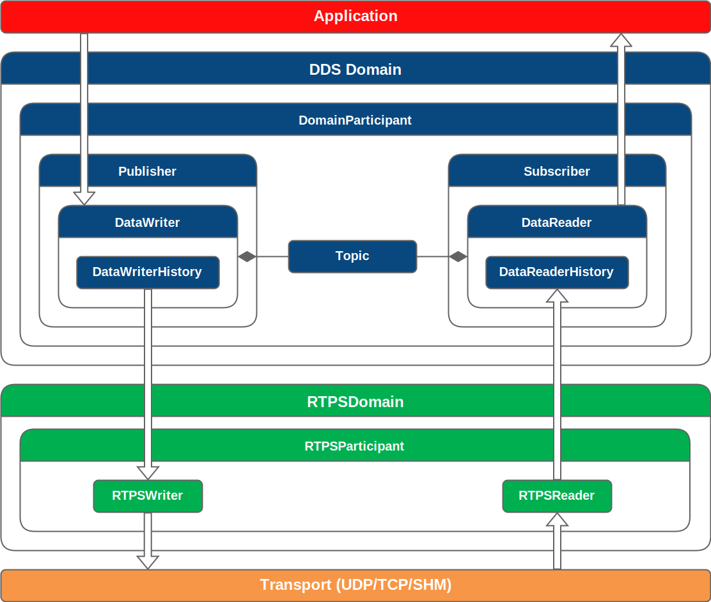

# Library Overview

Fast DDS（前称为 Fast RTPS）是对 DDS 规范的一种高效且高性能的实现。DDS（数据分发服务）是一种面向数据的通信中间件（DCPS），用于分布式应用软件。本节将介绍 Fast DDS 的架构、运行机制及其主要特性。

## 架构

*Fast DDS* 的架构如下图所示，该图展示了一个分层模型，包含以下几个不同的环境：

- **应用层（Application layer）** 用户应用程序位于该层，使用 *Fast DDS* 提供的 API 来实现分布式系统中的通信。
- **Fast DDS 层（Fast DDS layer）** 这是 DDS 通信中间件的稳健实现。该层允许部署一个或多个 DDS 域（Domain），在同一域内的参与者（DomainParticipants）可以通过在特定主题（topic）下发布/订阅消息进行通信。
- **RTPS 层（RTPS layer）** 该层实现了 RTPS（实时发布-订阅）协议，用于与 DDS 应用程序的互操作。它作为传输层的抽象层存在。
- **传输层（Transport Layer）** *Fast DDS* 可运行于多种传输协议之上，包括不可靠的传输协议（如 UDP）、可靠的传输协议（如 TCP），或共享内存传输协议（SHM）。

Fast DDS layer model architecture

### DDS Layer

在 Fast DDS 的 DDS 层中定义了多个通信的关键要素。用户将在其应用程序中创建这些要素，从而构建出一个以数据为中心的通信系统。Fast DDS 遵循 DDS 规范，将这些参与通信的要素称为 **实体（Entities）**。DDS **实体**是指任何支持服务质量（QoS）配置并实现了监听器（Listener）机制的对象。

* **QoS（服务质量）**：用于定义每个实体行为的机制。
* **Listener（监听器）**：用于在应用执行过程中，通知实体发生的可能事件的机制。

以下是 DDS 实体的列表及其功能简介。关于每个实体的详细说明、其 QoS 配置和监听器机制，请参考文档中的 “DDS 层” 章节。

### DDS 实体及其功能说明：

* **Domain（域）**
  表示一个正整数，用于标识 DDS 域。每个 `DomainParticipant` 都会被分配一个 DDS 域编号，属于同一域的 `DomainParticipant` 可以相互通信，不同域之间则实现通信隔离。该值在创建 `DomainParticipant` 时由应用开发者指定。

* **DomainParticipant（域参与者）**
  包含其他 DDS 实体的对象，例如 `Publisher`、`Subscriber`、`Topic` 和 `MultiTopic`。它负责创建并管理其包含的实体，同时配置其行为。

* **Publisher（发布者）**
  使用 `DataWriter` 向某个主题（Topic）发布数据。它是创建并配置一个或多个 `DataWriter` 实体的实体。

* **DataWriter（数据写入者）**
  负责发布消息的实体。用户在创建该实体时必须指定一个 `Topic`，即用于发布数据的主题。实际的数据发布通过将数据对象作为变更记录写入 `DataWriterHistory` 来实现。

* **DataWriterHistory（写入历史）**
  是数据对象变更的列表。当 `DataWriter` 向某个 `Topic` 发布数据时，实际上是创建了一个数据变更，这个变更被记录在历史中。随后，这些变更被发送给订阅了该 `Topic` 的 `DataReader`。

* **Subscriber（订阅者）**
  使用 `DataReader` 订阅某个主题，从传输层读取数据。它是创建并配置一个或多个 `DataReader` 实体的实体。

* **DataReader（数据读取者）**
  负责订阅主题并接收发布数据的实体。用户在创建该实体时必须指定一个用于订阅的 `Topic`。`DataReader` 接收到的数据以变更形式存储在其 `DataReaderHistory` 中。

* **DataReaderHistory（读取历史）**
  保存 `DataReader` 接收到的、某个主题下的数据对象的变更记录。

* **Topic（主题）**
  用于将 `Publisher` 的 `DataWriter` 和 `Subscriber` 的 `DataReader` 关联起来的实体。是发布与订阅的逻辑桥梁。

### RTPS layer

如上所述，Fast DDS 中的 RTPS 协议实现了对 DDS 应用实体与传输层之间的抽象。根据前文所示的架构图，RTPS 层包含以下四个主要**实体**：

### RTPS 层的实体及其说明：

* **RTPSDomain**
  是 DDS 域在 RTPS 协议中的扩展表示。

* **RTPSParticipant**
  包含其他 RTPS 实体的对象。它负责对其包含的实体进行配置与创建。

* **RTPSWriter**
  消息的来源实体。它读取 `DataWriterHistory` 中记录的变更，并将这些变更发送给之前已匹配的所有 `RTPSReader`。

* **RTPSReader**
  消息的接收实体。它将 `RTPSWriter` 传递的变更写入 `DataReaderHistory` 中。

关于每个实体的详细说明、其属性和监听器机制，请参阅文档中的 “RTPS 层” 章节。

### Transport layer

Fast DDS 支持基于多种传输协议的应用程序实现。这些协议包括：UDPv4、UDPv6、TCPv4、TCPv6、共享内存传输（Shared Memory Transport，SHM）。默认情况下，一个 `DomainParticipant` 会启用 UDPv4 和 SHM 两种传输协议。关于所有支持的传输协议的详细配置方法，请参阅文档中的 “传输层（Transport Layer）” 章节。

## Programming and execution model

Fast DDS 是一个并发且基于事件驱动的系统。
下面将介绍 Fast DDS 的多线程模型以及其在运行过程中可能触发的各类事件。

### Concurrency and multithreading

Fast DDS 实现了一个并发的多线程系统。每个 `DomainParticipant` 都会启动一组线程，用于处理后台任务，如日志记录、消息接收以及异步通信等。这种多线程机制不会影响你使用该库的方式——Fast DDS 的 API 是线程安全的，因此你可以放心地在多个线程中同时调用同一个 `DomainParticipant` 的方法。不过，在某些情况下仍需注意线程并发问题，尤其是当外部函数访问那些由 Fast DDS 内部线程修改的资源时。例如，在实体的监听器（listener）回调函数中访问被修改的资源时，就需要特别小心。

Fast DDS 启动的线程集合如下所示。与传输协议相关的线程（标记为 UDP、TCP 和 SHM 类型）只有在实际启用了相应的传输协议时才会创建。

| Name | Type | Cardinality | OS thread name | Description |
| - | - | - | - | - |
| Event | General | One per DomainParticipant | `dds.ev.<participant_id>` | 处理周期性和触发式的定时事件。请参阅 DomainParticipantQos 获取详细信息。 |
| Discovery Server Event | General | One per DomainParticipant | `dds.ds_ev.<participant_id>` | 用于同步对发现服务器（Discovery Server）数据库的访问。详细信息请参阅 DomainParticipantQos。 |
| Asynchronous Writer | General | One per enabled asynchronous flow controller. Minimum 1. | `dds.asyn.<participant_id>.` `<async_flow_controller_index>` | 负责管理异步写操作。即使是同步写入器（synchronous writers），某些类型的通信也必须在后台发起。请参阅 DomainParticipantQos 和 FlowControllersQos 获取详细信息。 |
| Datasharing Listener | General | One per DataReader | `dds.dsha.<reader_id>` | 用于处理通过 DataSharing 接收消息的监听线程。详细信息请参阅 `DataReaderQos`。 |
| Reception | UDP | One per port | `dds.udp.<port>` | 用于处理传入 UDP 消息的监听线程。请参阅 TransportConfigQos 和 UDPTransportDescriptor 获取详细信息。 |
| Reception | TCP | One per TCP connection | `dds.tcp.<port>` | 用于处理传入 TCP 消息的监听线程。详细信息请参阅 TCPTransportDescriptor。 |
| Accept | TCP | One per TCP transport | `dds.tcp_accept` | 用于处理传入 TCP 连接请求的线程。详细信息请参阅 `TCPTransportDescriptor`。 |
| Keep Alive | TCP | One per TCP transport | `dds.tcp_keep` | 用于维护 TCP 连接存活状态的保活线程（Keep Alive Thread）。详细信息请参阅 `TCPTransportDescriptor`。 |
| Reception | SHM | One per port | `dds.shm.<port>` | 用于处理通过共享内存（SHM）段接收的消息的监听线程。详细信息请参阅 TransportConfigQos 和 SharedMemTransportDescriptor。 |
| Logging | SHM | One per port | `dds.shmd.<port>` | 用于将传输的数据包存储并导出到文件的线程。详细信息请参阅 TransportConfigQos 和 SharedMemTransportDescriptor。 |
| Watchdog | SHM | One | `dds.shm.wdog` | 用于监控已打开的共享内存段的运行状态（健康状况）的线程。详细信息请参阅 TransportConfigQos 和 SharedMemTransportDescriptor。 |
| General Logging | Log | One | `dds.log` | 负责收集并将日志条目写入相应的日志消费者的线程。请参阅 Logging Thread 获取详细信息。 |
| Security Logging | Log | One per DomainParticipant | `dds.slog.<participant_id>` | 负责收集并写入安全日志条目的线程。详细信息请参阅 DomainParticipantQos。 |
| Watchdog | Filewatch | One | `dds.fwatch` | 用于监视指定文件的状态变更（如修改）的线程。详细信息请参阅 DomainParticipantFactoryQos。 |
| Callback | Filewatch | One | `dds.fwatch.cb` | 当被监视的文件发生变更时，执行已注册的回调函数的线程。详细信息请参阅 DomainParticipantFactoryQos。 |
| Reception | TypeLookup Service | Two per DomainParticipant | `dds.tls.replies.` `<participant_id>` `dds.tls.requests.` `<participant_id>` | 当接收到包含未知数据类型的远程端点发现信息时运行的线程。 |

其中一些线程仅在特定条件满足时才会创建，具体说明如下：

- Datasharing 监听线程：仅在启用了 Datasharing 时创建。
- Discovery Server 事件线程：仅在 DomainParticipant 被配置为 Discovery Server 的 SERVER 模式时创建。
- TCP 保活线程：仅在配置了保活周期（keep alive period）且该值大于零时才会启用。
- 安全日志线程和共享内存数据包日志线程：需要启用相关配置选项才会创建。
- 文件监视（Filewatch）线程：仅在使用了 FASTDDS_ENVIRONMENT_FILE 环境变量时才会创建。

关于传输线程，Fast DDS 默认启用 UDP 和 共享内存（Shared Memory）两种传输协议。端口配置可根据部署需求进行调整，但默认设置是始终使用：一个 metatraffic（元通信）端口和一个 unicast user traffic（单播用户数据）端口。这适用于 UDP 和共享内存传输，因为 TCP 不支持多播通信。更多相关内容可参考文档中的 “Default Listening Locators” 页面。

此外，Fast DDS 提供了配置其所创建线程属性的能力，相关配置可以通过 ThreadSettings 进行设置。

### Event-driven architecture

Fast DDS 有一个时间事件系统，能够响应特定条件，并调度周期性操作。
其中很少有事件对用户可见，因为大多数与 DDS 和 RTPS 元数据相关。
然而，用户可以通过继承 `TimedEvent` 类，在其应用中定义周期性时间事件。

## Functionalities

Fast DDS 具有一些可由用户在其应用中实现和配置的附加功能。如下所示。

### Discovery Protocols

发现协议定义了 DataWriter 在某个 Topic 上发布数据与 DataReader 在同一 Topic 上订阅数据时的匹配机制，以便它们开始共享数据。这一过程在通信的任何阶段都适用。Fast DDS 提供以下发现机制：

* **Simple Discovery**：这是默认的发现机制，定义于 RTPS 标准中，并提供与其他 DDS 实现的兼容性。在该机制中，`DomainParticipants` 会在早期阶段被单独发现，随后其所包含的 `DataWriter` 和 `DataReader` 才会进行匹配。

* **Discovery Server**：该机制采用集中式发现架构，服务器作为元通信发现的中心节点。

* **Static Discovery**：该机制实现了 `DomainParticipant` 之间的发现，但如果远程的 DomainParticipant 预先知道某些实体（如 `DataReader`/`DataWriter`），则可以跳过对这些实体的发现过程。

* **Manual Discovery**：此机制仅兼容 RTPS 层，允许用户使用任何外部元信息通道手动匹配或取消匹配 `RTPSParticipant`、`RTPSWriter` 和 `RTPSReader`。

关于 Fast DDS 中所有发现协议的详细说明与配置方式，请参见文档的 Discovery 章节。

### Security

Fast DDS 可通过在三个层级上实现可插拔的安全机制来配置安全通信：

- 远程 DomainParticipant 的身份验证：**DDS:Auth:PKI-DH** 插件使用受信任的证书颁发机构（CA）和 ECDSA 数字签名算法执行双向身份验证。它还使用椭圆曲线 Diffie-Hellman（ECDH）或 MODP-2048 Diffie-Hellman（DH）作为密钥协商协议建立共享密钥。

- 实体的访问控制：**DDS:Access:Permissions** 插件提供对 DDS 域和 Topic 层级的 DomainParticipant 访问控制。

- 数据加密：**DDS:Crypto:AES-GCM-GMAC** 插件使用 Galois 计数器模式（AES-GCM）的高级加密标准（AES）提供认证加密。

关于 Fast DDS 安全配置的更多信息，请参见文档的 Security 章节。

### Logging

Fast DDS 提供了一个可扩展的日志系统。`Log` 类是日志系统的入口点。它通过三个宏定义简化使用：`EPROSIMA_LOG_INFO`、`EPROSIMA_LOG_WARNING` 和 `EPROSIMA_LOG_ERROR`。此外，除了已有的类别（`INFO_MSG`、`WARN_MSG` 和 `ERROR_MSG`），还允许定义新的日志类别。该系统支持使用正则表达式按类别进行日志过滤，并可控制日志系统的详细程度（verbosity）。有关日志系统所有可用配置的详细信息，请参见文档的 Logging 章节。

### XML profiles configuration

Fast DDS 提供了使用 XML 配置文件修改默认设置的功能。因此，用户无需编写任何程序源代码或重新构建已有应用，即可修改 DDS 实体的行为。

用户可以使用针对各个 API 功能的 XML 标签。例如，可以通过 `<participant>` 标签构建和配置 `DomainParticipant` 配置文件，或者分别使用 `<data_writer>` 和 `<data_reader>` 标签配置 `DataWriter` 和 `DataReader` 配置文件。

若需进一步了解如何编写和使用这些 XML 配置文件，请参阅文档的 XML profiles 章节。

### Environment variables

环境变量是通过操作系统功能在程序作用域之外定义的变量。Fast DDS 依赖环境变量，使用户可以轻松自定义 DDS 应用程序的默认设置。有关影响 Fast DDS 的环境变量的完整列表和说明，请参阅文档的 Environment variables 章节。
